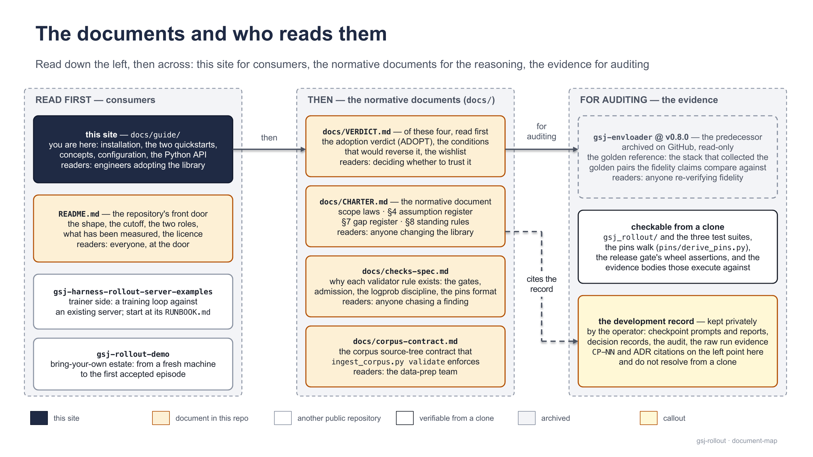

# docs/ — the shelf map

`docs/` holds two things — the **user guide** ([`guide/`](https://github.com/MHGanainy/gsj-harness-rollout-server/blob/main/docs/guide/README.md), six pages, written for people adopting the library) and the **evaluation record** (everything else, written while the library was built); the product itself is [`gsj_rollout/`](https://github.com/MHGanainy/gsj-harness-rollout-server/tree/main/gsj_rollout) — 2,034 lines, eight files, `pip install gsj-harness-rollout-server` for the trainer role.

> [!IMPORTANT]
> **Most of this directory is private since CP-48.** The operator untracked the development record: `reports/`, `prompts/` (all of them since CP-49a; `CP-48.md` was the last tracked), `decisions/`, `AUDIT-2026-08-24.md`, `CLASSIFICATION.md`, the shelf README under `polar/`, and every `golden/`/`polar/` file except the seven bodies that CI, the release gate, the test suites, and the pins walk read.
>
> The record survives unchanged only in the operator's working tree — the shelf table below describes **that** copy, not a clone. The three Mac-golden files moved, still tracked, to `../tests/fixtures/golden-mac/` at CP-49.
>
> From a clone, every surviving `CP-NN`/ADR citation — here, in the charter, the spec, the consumer repos, and the wheel-shipped `pins.gsj.json` provenance — is a footnote resolving only in the private record: the checkable part ends at the code, the suites, and the evidence bodies they execute against.

## Read this first

1. [`VERDICT.md`](https://github.com/MHGanainy/gsj-harness-rollout-server/blob/main/docs/VERDICT.md) — the adoption verdict, its reversing conditions, the consolidated wishlist. Standalone: read it, then stop.
2. [`CHARTER.md`](https://github.com/MHGanainy/gsj-harness-rollout-server/blob/main/docs/CHARTER.md) — normative: scope laws, the assumption register (§4), the gap register (§7), the standing rules (§8).
3. [`checks-spec.md`](https://github.com/MHGanainy/gsj-harness-rollout-server/blob/main/docs/checks-spec.md) — why each validator rule exists: the gates, admission, the logprob discipline.
4. [`corpus-contract.md`](https://github.com/MHGanainy/gsj-harness-rollout-server/blob/main/docs/corpus-contract.md) — the corpus tree contract behind the estate tool's `validate` verb (`estate.py validate`; formerly `ingest_corpus.py validate`).
5. [`decisions-surface.md`](https://github.com/MHGanainy/gsj-harness-rollout-server/blob/main/docs/decisions-surface.md) — the decisions tool's surface, specified (v1, CP-78): source format, the Randnummer unit, the wire shape adopted from `gsj-next`, the `dec:` citation grammar and its degradation rule; its conformance fixture (three published BGH decisions + expected output) is [`decisions-surface/`](https://github.com/MHGanainy/gsj-harness-rollout-server/tree/main/docs/decisions-surface) — not to be confused with `decisions/`, the private ADR shelf.
6. `AUDIT-2026-08-24.md` — *private, operator's copy only*: the 24-agent adversarial audit of the whole record; zero of 91 findings refuted.

Three shelves, read top-down: what you open to run the library, the one document that settles whether to trust it, and the three that bind anyone changing it.

## The shelves

| Shelf | What it is | Who opens it | In a clone |
| --- | --- | --- | --- |
| [`guide/`](https://github.com/MHGanainy/gsj-harness-rollout-server/blob/main/docs/guide/README.md) | **The user documentation** — six pages, `guide/README.md` the index, diagrams as PNGs under `guide/img/` (sources: PowerPoint decks outside the repo); not part of the record | anyone adopting the library | tracked |
| `VERDICT.md`, `CHARTER.md`, `checks-spec.md`, `corpus-contract.md` | The four normative documents, described above | see above | tracked |
| `decisions-surface.md`, `decisions-surface/` | The decisions surface specification (v1, CP-78; implemented by this repository's service at level 2 since CP-79) and its conformance fixture — the one document written for a reader outside this repository (`gsj-next`, by permalink) | both implementers of `search_decisions`, and whoever grades a `dec:` citation | tracked |
| `polar/` | Real Polar run artifacts — fidelity, the training loops, thinking, the adversarial probe | anyone re-verifying an episode claim | seven bodies tracked, rest private |
| CP-06 spike (off the tree) | The feasibility spike — stub backend, spike harness, the only observation of pi 0.83.0's true request body, the P1/G3 proofs | anyone re-verifying a wire-dialect fact in `checks-spec.md` or charter A-2/A-12/A-15, rows 11/31 | frozen at tag [`spike-cp06`](https://github.com/MHGanainy/gsj-harness-rollout-server/tree/spike-cp06/spike) since CP-68 (commit `a769771`, tree `2082a24f`); `git checkout spike-cp06 -- spike` |
| `golden/` | The golden-pair evidence (`mac/`, `h200/`, `COMPARISON.md`) — the A-1 fidelity proof against the archived predecessor | anyone re-verifying the `loss_mask`/`prompt_ids` claims | private; Mac fixtures tracked at `../tests/fixtures/golden-mac/` |
| `reports/` | One report per checkpoint (CP-00 → present, plus CP-04′, CP-09′, CP-11b, CP-13a) — the primary evidence behind every number in the root README and the verdict | an auditor chasing a claim | private |
| `prompts/` | Every checkpoint's instructions, verbatim — compare with the same-numbered report | an auditor verifying process | private |
| `decisions/` | The ADRs, append-only, Context → Decision → Consequence (ADR-0001–0026 at CP-46; ADR-0027–0035 since) | anyone asking "why is it built this way" | private |
| `AUDIT-2026-08-24.md`, `CLASSIFICATION.md` | The adversarial audit, and the CP-47 census that classified every tracked file — the basis of the CP-48 untracking | an auditor | private |

## Who needs what

- **Training against a server**: [`guide/README.md`](https://github.com/MHGanainy/gsj-harness-rollout-server/blob/main/docs/guide/README.md) → [`trainer-guide.md`](https://github.com/MHGanainy/gsj-harness-rollout-server/blob/main/docs/guide/trainer-guide.md), then `checks-spec.md` for the reasoning behind a finding.
- **Operating an estate**: [`server-guide.md`](https://github.com/MHGanainy/gsj-harness-rollout-server/blob/main/docs/guide/server-guide.md); beyond the guide, [`../estate/`](https://github.com/MHGanainy/gsj-harness-rollout-server/blob/main/estate/README.md) (its README is the recipe, `estate.sh` the front door) and [`../pins/`](https://github.com/MHGanainy/gsj-harness-rollout-server/tree/main/pins) are the operator's directories.
- **Trusting or auditing**: the [root README](https://github.com/MHGanainy/gsj-harness-rollout-server/blob/main/README.md), then `VERDICT.md`, then the audit if you hold the private copy — from a clone, a claim ends at the code, the suites, the pins walk, and the bodies below.
- **Changing the library**: `CHARTER.md` binds you, so do the ADRs (private); [`../CLAUDE.md`](https://github.com/MHGanainy/gsj-harness-rollout-server/blob/main/CLAUDE.md) is the process contract.

## Load-bearing paths

Read by code — moving them breaks the build. The seven `polar/` bodies are exactly the negated rows of the repository's `.gitignore`; the Mac fixtures are ordinary tracked files.

- `polar/h200-fidelity/callback_session_result.json` — the install proof in [`ci.yml`](https://github.com/MHGanainy/gsj-harness-rollout-server/blob/main/.github/workflows/ci.yml) and [`release.yml`](https://github.com/MHGanainy/gsj-harness-rollout-server/blob/main/.github/workflows/release.yml) (the built wheel validates it from outside the checkout), and `tests/test_checks.py`
- `polar/pi-corpus/callback_session_result.json`, `polar/fidelity/callback_session_result.json` — `tests/conftest.py` and `estate/corpus/tests/test_taskbank.py`
- `polar/pi-corpus/trace.json`, `polar/fidelity/trace.json` — [`pins/derive_pins.py`](https://github.com/MHGanainy/gsj-harness-rollout-server/blob/main/pins/derive_pins.py) re-derives the approved tool-roster and system-prompt hashes from each trace's `tools[]` and `prompt_messages[0]`; the wheel-shipped `pins.gsj.json` names these paths in its provenance; `fidelity/trace.json` also feeds `tests/conftest.py`
- `polar/h200-stitch/attempt5.accepted.json`, `polar/thinking/episode-on.quarantined.json` — `tests/test_checks.py`
- `../tests/fixtures/golden-mac/` (`tokens.npz`, `record.json`, `MANIFEST.md`) — `tests/conftest.py`; the A-1 provenance chain, under `golden/` until CP-49

## Provenance

- This shelf map: CP-46, its mechanism from `polar/README.md` (CP-41). "The record is citable at its current paths by design, and stays put" — CP-46.
- "Nothing in this directory is dead" — `AUDIT-2026-08-24.md` §RESIDUE catalogued every suspicion of a stale file and disproved each one.
