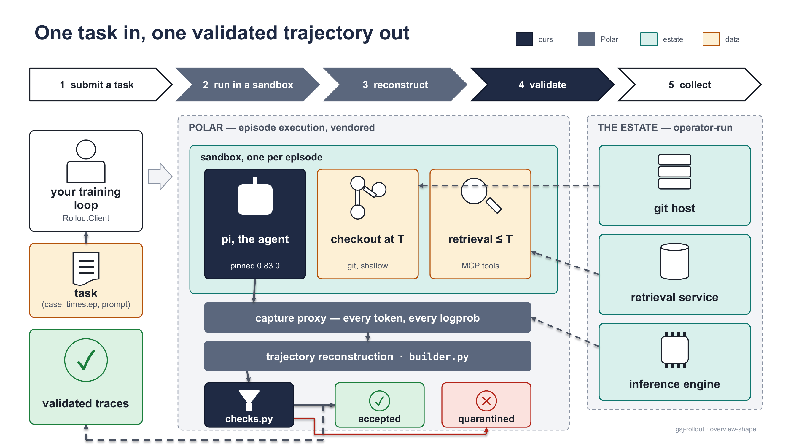

# gsj-harness-rollout-server

This page tells you what the rollout server does and refuses to do, which of its two roles you are about to play, what has actually been measured, and where to read next.

## What it does

Given a task `(case, timestep, prompt)`, the server runs a pinned coding agent (pi 0.83.0) in an isolated sandbox in which everything the agent can see — the git checkout and the retrieval service — is truncated at `timestep`, captures every token and logprob the model produced, and emits one validated, training-ready trace. That is the whole job: **task → sandbox → agent → trace**. It deliberately does nothing else. It does not store traces, schedule work, compute rewards (every callback carries `reward: null`), manage weights, version policies, or train — those belong to the trainer that calls it. Episode execution and trajectory reconstruction come from NVIDIA's Polar, vendored by SHA with three carried patches; our code is the thin shell — harness, builder, receiver, config, CLI, checks, **1,999 lines** — that points Polar at our corpus, our retrieval service, our agent, and our checks.



<sub>One task triple in, one validated trace out; everything around the sandbox is either Polar's, the operator's estate, or the trainer's.</sub>

The property the server exists for is the cutoff: `timestep` is a boundary the agent cannot cross, enforced twice (a shallow checkout of branch `timestep-T`, and a signed token the retrieval service verifies before filtering to pages `≤ T`) and audited once, after the fact, from the trace alone. See [The timestep cutoff](concepts/timestep-cutoff.md).

## The two roles

Newcomers confuse these on first contact, so decide now which one you are.


<sub>Left, the server: an estate you operate, the two Polar processes, and this checkout's receiver. Right, the trainer: a wheel, a client, and the same `checks.py`. Between them, HTTP only: one task JSON in, `SessionResult`s back, nothing else.</sub>

| | Server role | Trainer role |
| --- | --- | --- |
| What you need | A machine you operate, running the four estate services: an inference engine (vLLM, with the pinned chat template), a Forgejo git host (one repository per case, one branch per timestep), the MCP retrieval service (the signed-token page cutoff), and the ingested corpus (`ingest_corpus.py`) — plus this repository checked out, with Polar's venv built under `vendor/polar/` | Python ≥ 3.12, anywhere: `pip install gsj-harness-rollout-server` (0.1.2, wheel-only; pydantic, httpx, pyyaml). The wheel ships `gsj_rollout/`, both pins sets, and `ingest_corpus.py` — no `vendor/`, no Polar |
| What you run | `gsj-rollout serve --config <yaml>` renders `topology.rendered.yaml`, prints the two Polar commands, then runs the receiver (`receiver.py` + `checks.py`). You start the two Polar processes yourself: `serve_rollout` is the rollout API and scheduler (`POST /rollout/task/submit`, `GET /rollout/task/{id}` — the trainer's `base_url`); `serve_gateway` is the gateway and capture proxy, one sandbox per episode, loading our `pi_harness.py` and `builder.py` by import path. Every callback lands in `traces/` if clean, in `quarantine/` with its findings if not | `RolloutClient` (`gsj_rollout.client`): `submit`, `wait`, `collect` — `collect(...)` submits, polls `GET /rollout/task/{id}`, re-runs `checks` on every result, and returns the `Trace`s of clean sessions. `checks` (`gsj_rollout.checks`): `validate_session_result(result)` returns findings — the same validators the receiver ran, because nothing upstream is trusted |
| Start here | [Server quickstart](getting-started/server-quickstart.md), then [The estate](guides/estate.md) | [Installation](getting-started/installation.md), then [Trainer quickstart](getting-started/trainer-quickstart.md) |

What crosses the wire between the two — and what does not:

- HTTP only, in both directions. The trainer talks to Polar's rollout API, never to the receiver.
- Trainer → server: one task JSON per `submit`.
- Server → trainer: `SessionResult`s, verbatim, re-checked on arrival by the same `checks.py` the receiver already ran.
- Never: weights, rewards, trajectory storage, or anything of the estate. The server keeps none of the trainer's state, and the trainer never touches the server's machines.

The trainer side, end to end, is a handful of lines against the real signatures:

```python
from gsj_rollout import RolloutClient, load_config
from gsj_rollout.config import render_task_request

cfg = load_config("rollout.yaml")                       # the one YAML the server side also uses
request = render_task_request(cfg, task_id="demo", case_id="case_0001",
                              timestep=12, instruction="Fix the failing test.")
client = RolloutClient(cfg.polar.rollout.base_url)      # Polar's rollout API, not the receiver
traces = client.collect([request])                      # only checks-clean sessions come back
```

> [!WARNING]
> **The wheel ships this estate's pins**
>
> `checks` validates traces against pinned approved sets (tool rosters, system prompts, skill cards, settings), and the wheel carries the pins of the estate it was built for — `gsj_rollout/pins/pins.gsj.json`, plus the `thinking-on/` set — so the trainer leg works on install. On any other estate every hash gate fails `*_not_approved` — loudly, by design. Point `GSJ_PINS_PATH` at your own pins file before the first import of `gsj_rollout.checks`; an unreadable or malformed file raises `PinsConfigurationError` at the first gate rather than falling through to the packaged pins. See [Pins and approved sets](concepts/pins.md).

> [!NOTE]
> **The wheel alone runs no episodes**
>
> `pip install` gives you the client and the validators. It contains no `vendor/`, no Polar, and no way to start a sandbox — it talks to a server somebody operates. To bring up an estate from nothing, start from [`gsj-rollout-demo`](https://github.com/MHGanainy/gsj-rollout-demo); to drive an existing server from a training loop, start from [`gsj-harness-rollout-server-examples`](https://github.com/MHGanainy/gsj-harness-rollout-server-examples).

## What has been proven

Measured as of **2026-08-24**; the reasoning and the reversing conditions are in [`docs/VERDICT.md`](https://github.com/MHGanainy/gsj-harness-rollout-server/blob/main/docs/VERDICT.md).

| Claim | Measured |
| --- | --- |
| Traces match the predecessor's golden reference | `loss_mask` exact at zero tolerance, `prompt_ids` byte-identical (2965/2965), on the Mac pair and again on the H200 pair |
| The logprobs are real captures | H200 replay-vs-replay bit-deterministic (0.000000); capture-vs-replay floor mean ≈ 0.005–0.007 on both traces symmetrically; Mac identical-context agreement mean \|Δ\| = 0.000114 |
| The cutoff holds under a forged claim | Tampered token (timestep 12→18, original signature) rejected HTTP 401 from inside the sandbox; valid token 200; live episode retrieved pages [1, 5, 7, 9, 11], all ≤ 12 |
| Two trainers, two loops, zero server changes | slime: 27 qualifying traces → one optimizer step → weight sync (logprobs moved at 5623/5782 positions) → 8/8 re-collect. verl: 110 qualifying → one step → sync (310/310 tensors, exactly one AdamW step) → 8/8. `gsj_rollout/` untouched both times |
| Two model families, no code change | Qwen3-0.6B (both golden pairs); Llama-3.1-8B: 8 completions merged into one full chain, quarantine empty, gates green |
| The shell stays thin, the suites stay green | Ours 1,999/2,000 lines against Polar's ~14,200 driven; fixture suites root 161 + corpus 58 + mcp-service 89, all green by execution |

> [!NOTE]
> **What that does not claim**
>
> Each loop above is exactly one optimizer step bracketed by two collections; nothing here was trained to competence, and concurrent collect-and-train has no data points. The CI badge covers the fixture suites only — an episode needs an estate and GPU time, so green means the fixtures pass, not that the harness runs. Sampling parameters and codec identity are the estate's: pi sends no sampling parameters (only a `max_tokens` cap), so the engine's configuration *is* the sampling policy.

## Where next

The complete table of contents of this documentation.

**Getting started**

- **[Installation](getting-started/installation.md)** — the wheel for trainers; the checkout, Polar's venv, and an estate for operators.
- **[Trainer quickstart](getting-started/trainer-quickstart.md)** — from `pip install` to a list of validated `Trace`s.
- **[Server quickstart](getting-started/server-quickstart.md)** — `serve`, the two Polar processes, and the first accepted episode.

**Concepts**

- **[Architecture](concepts/architecture.md)** — what is ours, what is Polar's, what is the estate's, and how the pieces are wired.
- **[The timestep cutoff](concepts/timestep-cutoff.md)** — the filesystem wall, the retrieval wall, and the audit that follows.
- **[Traces](concepts/traces.md)** — `prompt_ids`, `response_ids`, `loss_mask`, `response_logprobs`, and the metadata that rides with them.
- **[Validation](concepts/validation.md)** — admission, the gates, and why the same `checks.py` runs on both sides of the wire.
- **[Pins and approved sets](concepts/pins.md)** — what the hash gates compare against and how to point them at your estate.

**Guides**

- **[Configuration](guides/configuration.md)** — the one YAML: every section, field, and default, and what each side renders from it.
- **[Command line](guides/cli.md)** — `gsj-rollout serve` and `submit`, every flag, and the exit-code contract.
- **[The receiver](guides/receiver.md)** — the callback endpoint, its responses, and where accepted and quarantined results land.
- **[The corpus](guides/corpus.md)** — the directory tree you hand to `ingest_corpus.py`, its phases, and the taskbank it produces.
- **[The retrieval service](guides/retrieval-service.md)** — the MCP server behind the cutoff: tokens, page filtering, index, and its compatibility contract.
- **[The estate](guides/estate.md)** — standing up the inference engine, git host, retrieval service, and corpus with `estate.sh`.
- **[Running a training loop](guides/training-loop.md)** — the loop shape, what "collect N" promises, weight sync, and the slime and verl bridges.
- **[Troubleshooting](guides/troubleshooting.md)** — every failure by where it surfaces, with the exact message and the fix.

**Reference**

- **[Python API](reference/api.md)** — every export of `gsj_rollout`, with signatures read from the installed code.
- **[Finding vocabulary](reference/findings.md)** — every string `checks` can emit, what fires it, and what to do about it.
- **[Wire formats](reference/wire-formats.md)** — every JSON body that crosses a process boundary, with a real example of each.

**About**

- **[The design record](about/design-record.md)** — where the library came from, which documents hold its reasoning, and what sits beside it.

For the normative documents behind this site: the [charter](https://github.com/MHGanainy/gsj-harness-rollout-server/blob/main/docs/CHARTER.md) (scope laws, assumptions, gap register), the [checks specification](https://github.com/MHGanainy/gsj-harness-rollout-server/blob/main/docs/checks-spec.md), and the [corpus contract](https://github.com/MHGanainy/gsj-harness-rollout-server/blob/main/docs/corpus-contract.md).
