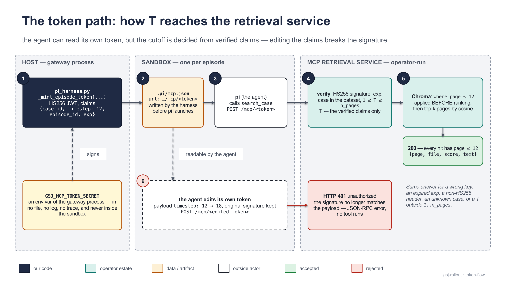

[Documentation](../README.md) › Concepts

# The timestep cutoff

Every task the server runs carries a `timestep`, and the server's whole reason to exist is that the agent cannot see past it. This page explains what "temporally scoped" means for a case at timestep `T`, how the sandbox is truncated at `T` twice (the filesystem and the retrieval service), how the trace is audited against `T` afterwards by gate G5, why the agent may read its own retrieval token but cannot widen it, and which tools are deliberately outside the cutoff.

## What "temporally scoped" means

A case in the corpus is one growing document: `page_0001.md`, `page_0002.md`, … up to the last page. A **timestep** `T` is a cutoff of that document — the case as it stood when only pages `1..T` existed. Numbering never restarts: page 7 is page 7 at every timestep that contains it.

A task is the triple `(case, timestep, prompt)`. Running it at `T = 12` means: put the agent in a sandbox where the case appears to have exactly twelve pages, let it work, and record what it did. Nothing the agent can reach — not the checkout, not search — may contain page 13.

The corpus makes this possible by storing each case as a git repository with one branch per timestep: `timestep-12` holds pages `1..12`, `timestep-18` holds pages `1..18`, and `main` holds the full document. The corpus tree contract is in [`docs/corpus-contract.md`](https://github.com/MHGanainy/gsj-harness-rollout-server/blob/main/docs/corpus-contract.md); how the retrieval service indexes it is in [The retrieval service](../guides/retrieval-service.md).

## Two walls and an audit

The cutoff is enforced twice while the episode runs and checked once after it ends. The two walls are preventive; the audit is evidence.


<sub>T arrives with the task, truncates the sandbox twice while the episode runs, and is audited from the trace alone once it ends.</sub>

### Wall 1 — the filesystem

Before the agent starts, the harness (`gsj_rollout/pi_harness.py`) clones the case repository into the sandbox working directory with exactly this shape:

```bash
git clone --depth 1 --branch timestep-T --single-branch <clone_url> /workspace \
  && git -C /workspace remote remove origin \
  && rm -rf /workspace/.git/logs
```

Each flag closes a specific channel:

| step | what it closes |
|---|---|
| `--branch timestep-T --single-branch` | only the cutoff branch is fetched; `main` and the other timesteps never enter the sandbox |
| `--depth 1` | the branch tip's parent commit (which contains the full document) is not fetched — `git show HEAD~1:md/page_0013.md` fails with "invalid object name", and `git log` cannot leak the total page count |
| `git remote remove origin` | no configured remote to re-fetch from |
| `rm -rf .git/logs` | the reflog records `clone: from <url>`; scrubbing it removes the last copy of the clone URL from the sandbox |

The result is closed at the object level, not just the ref level: neither `main`'s commit nor any post-cutoff page blob is in the object store, so the history cannot reach a page past `T` even with no network at all. The working tree is byte-identical to a full clone, so the agent's `read`, `grep`, `find` and `ls` tools work unchanged.

> [!NOTE]
> **What the filesystem wall does not cover**
>
> An agent that *guesses* the git host's address can attempt a fresh clone over the network if the estate serves anonymous reads. That is an estate posture (credentialed clone URLs or an egress policy), not something the rollout server controls. See [The estate](../guides/estate.md).

### Wall 2 — the retrieval service

The agent's `search_case` tool is served by the retrieval service (an MCP server, hence the `mcp_gsj_*` tool names), which indexes the **full** document of every case once and applies the cutoff at query time. The server has to tell the service what `T` is for this episode, and it has to do so in a way the agent cannot alter. It does this with a signed token:

1. In the gateway process, on the host, the harness mints an HS256 JWT with the claims `{case_id, timestep, episode_id, exp}` (`_mint_episode_token`). `episode_id` is the Polar session id; `exp` is mint time plus a TTL (`harness.mcp_token_ttl_s`, default 3600 s). The signing secret is read from an environment variable of the gateway process (`estate.mcp_token_secret_env`, default `GSJ_MCP_TOKEN_SECRET`) and is never written to any file.
2. The token becomes the last path segment of the MCP URL — `<mcp_url_base>/mcp/<token>` — and that URL is written into the sandbox's `.pi/mcp.json`, which is how pi's MCP extension knows where to send tool calls.
3. On every request the service verifies the signature, checks `exp`, checks that the case exists and that `1 ≤ timestep ≤ n_pages`, and then takes `T` from the **verified** claims. `T` is never a request field.
4. `search_case` constrains candidates to `page ≤ T` as a metadata pre-filter **before** similarity ranking, then returns the top-k pages. Filter-before-rank matters: a post-filter would change result counts and is the classic leak shape.

Anything that fails verification is answered with HTTP 401 and a JSON-RPC error body; no tool runs. The service's contract is documented in full in [The retrieval service](../guides/retrieval-service.md).

### The audit — gate G5

Walls prevent; they do not prove. After the episode, `gsj_rollout/checks.py` reads the trace and re-derives the cutoff from evidence inside it — gate **G5**. The same code runs on the receiver (a failing trace is quarantined before it is stored) and again in the trainer on everything it collects, so no trust is needed across the wire. G5 is described with the other gates in [Validation](validation.md).

## Why the agent may read its token but cannot widen it

The token sits in `.pi/mcp.json`, inside the agent's own working directory, and the agent has `read` and `bash`. It can read the token. That is accepted, by design, because reading it gains nothing:

- Every call the token enables is already scoped to the agent's own episode: its own case, its own `T`.
- The cutoff is decided server-side from the verified claims. The client sends no timestep; there is nothing to lie about in the request.
- Editing any claim invalidates the signature. A token whose payload says `timestep: 18` but whose signature was computed over `timestep: 12` is rejected with HTTP 401.
- The secret needed to re-sign an edited payload lives only in the gateway process's environment on the host and never enters the sandbox.



<sub>The valid path (1–5) and the tampered path (6): the same token, claims edited from 12 to 18 with the original signature, is refused before any tool runs.</sub>

> [!TIP]
> **Verifying this yourself**
>
> From inside a sandbox, decode the token from `.pi/mcp.json`, change `timestep`, re-encode the payload with the original signature and `POST` it to `/mcp/<edited token>`. The service answers 401. The unedited token answers 200. Rotating `GSJ_MCP_TOKEN_SECRET` on the service invalidates every outstanding token immediately.

## What G5 checks

G5 is two functions in `gsj_rollout/checks.py`, both called on every trace by `run_trace_checks`. Both take the trace mapping as it arrives in the callback and return a list of finding strings; an empty list means the clause holds.

### `check_page_cutoff(trace)` — every retrieved page ≤ T

The transcript backstop. It walks `prompt_messages` and `response_messages`, resolves each tool result to its tool name through `tool_calls[].id`, and — for the cutoff-scoped tools only — extracts every page reference from the result text with two regexes:

```
"page"\s*:\s*(\d+)        # the "page" member of a search_case hit
md/page_(\d{4})\.md       # the "file" member of a hit
```

Any page greater than `T` is a finding. `T` comes from the trace, never from the caller, in this order of precedence:

1. `metadata.timestep` — stamped into the task request by `render_task_request` and hoisted by the trajectory builder into every trace's top-level metadata;
2. `metadata.task_metadata.timestep`;
3. the `"timestep"` member of an `mcp_gsj_case_status` result, which the service reports from the same verified claims that drive the clamp.

If none of those yields an integer, the trace fails closed.

### `check_workspace(trace)` — the checkout census

After the clone and before pi launches, the harness probes the checkout and echoes what it found into the trace as `metadata.gsj_workspace`:

```json
{
  "clone_url": "http://host.docker.internal:3000/gsj-staging/case_0001.git",
  "case_id": "case_0001",
  "branch": "timestep-12",
  "commit": "<40 hex>", "tree": "<40 hex>",
  "shallow": true, "commits": 1, "remotes": 0,
  "pages": {"count": 12, "min": 1, "max": 12}
}
```

The `clone_url` is credential-stripped before it is echoed, so a URL in a trace is never a re-fetch path. `check_workspace` enforces four clauses against this echo. Two of them are cross-sourced — the harness's `git` output against the trainer's own `timestep` — which is what makes the echo evidence rather than self-report.

### The G5 finding vocabulary

| finding | clause | fires when |
|---|---|---|
| `G5:search_page_gt_timestep:{page}>{T}` | every retrieved page ≤ T | a `search_case` result cites a page past `T` — one finding per offending page |
| `G5:missing_evidence:timestep` | T is derivable from the trace | no `metadata.timestep`, no `task_metadata.timestep`, no `case_status` result |
| `G5:missing_evidence:workspace` | the checkout census is present | no `gsj_workspace` echo; the `.pages` suffix marks a census whose `min`/`max`/`count` are not integers |
| `G5:checkout_history_posture:shallow=…,remotes=…` | shallow ∧ zero remotes | the clone lost `--depth 1`, or a remote survived |
| `G5:checkout_pages_not_contiguous:{min}-{max}/{count}` | pages contiguous from 1 | `min != 1` or `count != max` |
| `G5:workspace_branch_ne_timestep:{branch}!=timestep-{T}` | branch == `timestep-T` | the checkout is on some other branch |
| `G5:checkout_max_page_ne_timestep:{max}!={T}` | max checkout page == T | the checkout holds more or fewer pages than `T` |

The findings are byte-stable strings — grep for the prefix `G5:` in a quarantine directory or a trainer log. The full vocabulary of every gate is in [Finding vocabulary](../reference/findings.md).

Running the two checks on a collected trace in the trainer role:

```python
from gsj_rollout import checks

# `trace` is one trace mapping from a SessionResult's trajectory.traces
findings = checks.check_page_cutoff(trace) + checks.check_workspace(trace)
if findings:
    print("cutoff evidence failed:", findings)   # e.g. ['G5:search_page_gt_timestep:18>12']

# The full validator runs G5 alongside every other gate:
all_findings = checks.validate_session_result(session_result)
```

> [!WARNING]
> **What the audit can and cannot detect**
>
> G5 detects an honest misconfiguration: a wrong branch, a clone that lost `--depth 1`, a case repository whose pages do not run `1..T`, a retrieval backend that leaked a page. It does not detect a harness that lies about its own sandbox — proving that would need an attestation channel the trace does not carry. The two cross-sourced clauses raise the cost of a lie from "say nothing" to "say something consistent with the trainer's own timestep", and no more.

## What the cutoff does not cover

Only `search_case` is cutoff-scoped. In `checks.py`:

```python
CUTOFF_SCOPED_TOOLS = frozenset({"mcp_gsj_search_case"})
```

| tool | cutoff | why |
|---|---|---|
| `mcp_gsj_search_case` | **scoped** — pages `≤ T` only, pre-filtered server-side and audited by G5 | this is the case document, the thing the cutoff is about |
| `mcp_gsj_case_status` | reports the token's scope (`case_id`, `timestep`, `pages_visible`, `max_visible_page`) | it states `T`; it does not retrieve pages. G5 uses it as the last-resort source of `T` |
| `mcp_gsj_search_decisions` | **exempt** | the decisions corpus is a separate, static collection with no page structure; it is never clamped by the case timestep |
| `mcp_gsj_decision_stats` | **exempt** | aggregate counts over the same decisions corpus |
| built-in `read`, `grep`, `find`, `ls`, `bash` | **not audited** | they act on the checkout, which the filesystem wall already truncated to pages `1..T`. A `read` of `md/page_0007.md` cites the checkout, not the service, and is invisible to the G5 backstop |

Two consequences follow. First, a page reference inside a decisions result is not a cutoff violation and does not count towards G5. Second, the built-in tools are covered by the filesystem wall alone: if that wall were misconfigured, G5's `check_workspace` clauses would report it from the census, but `check_page_cutoff` would not see a `bash` leak — the backstop reads MCP tool results, not shell output. This is why the clone flags are enforced at the source and attested per episode rather than detected downstream.

> [!NOTE]
> **A page reference is what the regexes match**
>
> The G5 backstop is a compatibility contract between `checks.py` and any retrieval backend: every `search_case` hit must carry `"page"` as an integer under the key exactly `page` and `"file"` as exactly `md/page_NNNN.md`. A backend that renames the key or reformats the path blinds the gate without failing it. The service's test suite pins this shape; keep it if you swap the backend.

## Where T enters the system

For reference, the path `T` takes from the trainer's submission to each enforcement point:

| stage | where T lives | who uses it |
|---|---|---|
| submission | `render_task_request(cfg, ..., timestep=T)` → `TaskRequest.metadata.timestep` and `agent.settings.timestep` | the trainer states it once |
| clone | `agent.settings.timestep` → branch name `timestep-T` | the harness, wall 1 |
| token | `agent.settings.timestep` → the `timestep` claim | the harness mints, the service verifies — wall 2 |
| trace | `metadata.timestep`, hoisted from the task metadata; `gsj_workspace.branch` and `.pages` from the probe | `checks.py`, the audit |

The relevant configuration keys are `estate.clone_url_for`, `estate.mcp_url_base`, `estate.mcp_token_secret_env` and `harness.mcp_token_ttl_s`; see [Configuration](../guides/configuration.md).

## See also

- [The retrieval service](../guides/retrieval-service.md) — the second wall in full: token verification, filter-before-rank, the result shape G5 parses.
- [The corpus](../guides/corpus.md) — how the `timestep-T` branches are built.
- [Validation](validation.md) — G5 among the other gates.
- [Finding vocabulary](../reference/findings.md) — every `G5:*` string with its detail format.
- [The estate](../guides/estate.md) — the anonymous-read posture the filesystem wall does not cover.
