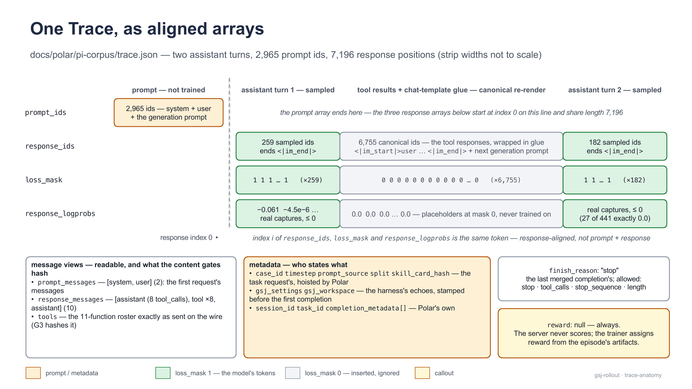

[Documentation](../README.md) › Concepts

# Traces

A trace is the training-ready output of one episode: the prompt tokens, the tokens the model sampled interleaved with the tool results it saw, a mask that says which of those tokens are the model's own, and the log-probabilities captured at sampling time — all as aligned integer and float arrays, plus the message views and the metadata needed to audit them. This page walks through every field of `gsj_rollout.Trace`, explains how a multi-turn agent session ends up as a single token chain, and says which parts a trainer can rely on and why.

## Where a trace comes from

Polar's gateway proxy sits between the agent and the inference engine. Every request the agent makes is one *completion record* — the request as sent, the response as returned, plus the prompt token ids, the sampled token ids and their per-token logprobs, which the proxy asks the engine for on every call (`logprobs: true`, and `return_token_ids: true` on vLLM). When the episode ends, the trajectory builder merges the session's completion records into one `Trace` and the whole thing arrives at the receiver as a `SessionResult` (see [Wire formats](../reference/wire-formats.md) for the envelope). The trace lives at `session_result["trajectory"]["traces"][0]`.

On the trainer side, `RolloutClient.collect` returns validated traces directly:

```python
from gsj_rollout import RolloutClient, Trace, load_config
from gsj_rollout.config import render_task_request

cfg = load_config("rollout.yaml")
client = RolloutClient(cfg.polar.rollout.base_url)
request = render_task_request(cfg, task_id="demo-1", instruction="Summarize the case.",
                              case_id="case_0001", timestep=12)
traces: list[Trace] = client.collect([request])   # only checks-clean sessions
```

`Trace` is a pydantic model that mirrors Polar's trace fields one for one (Polar itself is not importable on the trainer side). It is declared with `extra="allow"`, so a field a future re-vendor adds survives the round trip instead of being dropped.

> [!NOTE]
> **One trace per accepted session**
>
> An accepted `SessionResult` carries exactly one trace. The G7 rule requires `reconstruction_stats.chains_total == 1`, and the builder emits one trace per chain, so a session that reconstructed into two chains is rejected rather than delivered as two traces. See [How a session becomes one chain](#how-a-multi-turn-session-becomes-one-chain).

## The fields



<sub>The example trace: 2,965 prompt ids, then 7,196 response positions across two sampled assistant turns and one canonical interstitial; the three response arrays are indexed together.</sub>

| Field | Type | Meaning | Comes from |
|---|---|---|---|
| `prompt_ids` | `list[int]` | The first completion's prompt, as the engine tokenized it. Static context, never trained on. | `choice.input_token_ids` of completion 1 |
| `response_ids` | `list[int]` | Everything after the prompt: each turn's sampled ids, then the canonical tokens of what the harness inserted before the next turn. | sampled ids, spliced with later prompts' tails |
| `loss_mask` | `list[int]` | `1` where the model sampled the token, `0` where the harness or the chat template inserted it. Same length as `response_ids`. | built during the merge |
| `response_logprobs` | `list[float] \| None` | The engine's per-token logprob at every `response_ids` position; `0.0` at mask-0 positions. Same length as `response_ids`. | `choice.logprobs.content[].logprob`, paired by token id |
| `prompt_messages` | `list[dict]` | The first request's `messages` array — the system prompt and the task. | completion 1's request |
| `response_messages` | `list[dict]` | Each turn's assistant message, followed by the tool/user messages the next request added. | all merged completions |
| `tools` | `list[dict]` | The `tools` array as sent on the wire by the first completion. | completion 1's request |
| `finish_reason` | `str \| None` | The last merged completion's finish reason. | completion N's `choice.finish_reason` |
| `reward` | `float \| None` | Always `null`. The server never scores an episode. | never set |
| `metadata` | `dict` | Task metadata, harness echoes, Polar's identifiers, and one metadata dict per merged completion. | see [Metadata](#metadata) |

The rest of this page uses the checked-in example `docs/polar/pi-corpus/trace.json` — a real two-turn episode of the pinned agent against the corpus. Its shape:

```text
prompt_ids          list[2965]
response_ids        list[7196]
loss_mask           list[7196]     runs: 259 × 1, 6755 × 0, 182 × 1
response_logprobs   list[7196]
prompt_messages     [system, user]
response_messages   [assistant (8 tool_calls), tool ×8, assistant]
tools               11 function schemas
finish_reason       "stop"
reward              null
```

## The token arrays

### `prompt_ids` — the static context

`prompt_ids` is the engine's own tokenization of the first request: the system prompt, the task instruction, the tool schemas as the chat template renders them, and the generation prompt that opens the assistant's turn. It is copied straight from the first completion record, never re-tokenized. In the example it ends with

```text
… 151645, 198, 151644, 77091, 198, 151667, 271, 151668, 271
```

which under the Qwen3 tokenizer reads `<|im_end|>\n<|im_start|>assistant\n<think>\n\n</think>\n\n` — the empty think block the template appends when thinking is off. G6 checks exactly this suffix against the pinned tail; see [Validation](validation.md).

### `response_ids` — sampled tokens and canonical interstitials

`response_ids` is the merged stream after the prompt. It alternates between two kinds of span:

- **Sampled spans** — the token ids the engine actually sampled for an assistant turn, taken raw from the completion record. They are never decoded and re-encoded, so BPE non-canonicality cannot shift them.
- **Interstitials** — what sat between one assistant turn and the next: the tool results, the chat template's glue (`<|im_start|>user`, `<tool_response>`, the next generation prompt), and any user turn the harness inserted. These come from the *next* completion's `prompt_ids` — the engine's canonical tokenization of that text, not a re-tokenization done by this library.

In the example the first sampled span is 259 tokens (an assistant turn issuing eight tool calls, ending `</tool_call><|im_end|>`), the interstitial is 6,755 tokens (eight tool responses wrapped in template glue, ending with a fresh generation prompt), and the second sampled span is 182 tokens (the final answer, ending `<|im_end|>`).

### `loss_mask` — whose tokens are these

The mask is the discipline that makes the merged stream trainable: **`1` only where the model sampled the token; `0` on everything the harness, the tools or the chat template inserted.** Each merged completion contributes `[1] * len(its response_ids)`; each interstitial contributes `[0] * len(interstitial)`. The mask is therefore the same length as `response_ids`, and an assistant turn is a maximal run of ones:

```python
def assistant_turns(trace: Trace) -> list[tuple[int, int]]:
    """[(start, end)) index spans of response_ids the model sampled."""
    spans, start = [], None
    for i, flag in enumerate(trace.loss_mask + [0]):
        if flag == 1 and start is None:
            start = i
        elif flag != 1 and start is not None:
            spans.append((start, i))
            start = None
    return spans

assistant_turns(trace)   # example: [(0, 259), (7014, 7196)]
```

`checks.py` enforces the mask's shape on both sides of the wire: it must be non-empty whenever `response_ids` is (`LP7`), the same length (`LP8`), and made of integer `0`/`1` only — no booleans, strings or floats (`LP9`). The last rule exists because every other mask-keyed rule tests `flag == 1`, and a stringified mask would make them all silently vacuous.

> [!WARNING]
> **Read turn structure from the ids, not from `response_messages`**
>
> The message list is bookkept by count while the token stream is bookkept by content, so a harness that splits or merges messages can shift the message view while the ids stay correct. Every structural check in this library (G6's turn openings, the turn spans above) reads `loss_mask` transitions over `response_ids`. Treat `response_messages` as a readable view for humans and for the content gates, not as the ground truth of where turns begin.

### `response_logprobs` — real captures, aligned one to one

`response_logprobs` is not a re-computation: it is the engine's own per-token logprob, returned in the same response that carried the sampled ids and captured by the proxy. The record utilities pair logprobs with ids only when the engine's logprob entries carry the *same* token ids as the sampled sequence; unaligned sources are never mixed. At every mask-1 position the value is the raw sampling-time logprob of that token; at every mask-0 position it is a `0.0` placeholder, which the mask tells the trainer to ignore.

Two properties follow from "raw":

- **No renormalization** is applied anywhere. A trainer using `response_logprobs` as behavior-policy values is using the model's own logprobs at sampling time, under whatever sampling parameters the engine served.
- **Alignment is exact**: `response_logprobs[i]` is the logprob of `response_ids[i]`. If any mask-1 position lacked a logprob, the builder nulls the entire array rather than leaving a hole — and the checks then reject the trace (`LP1`).

The logprob discipline, run identically by the receiver and by `RolloutClient`:

| Finding | Rule |
|---|---|
| `LP1:response_logprobs_absent` | array missing on a trace with any mask-1 position |
| `LP2:response_logprobs_length_ne_response_ids` | length differs from `response_ids` |
| `LP3:sentinel_logprob_at_mask1` | value ≤ −9000.0 at a mask-1 position (vLLM writes `-9999.0` for "missing") |
| `LP4:nonfinite_logprob` | NaN, ±inf or a non-number anywhere |
| `LP5:positive_logprob` | value > 0 anywhere |
| `LP6:zero_logprob_rate_at_mask1` | more than 25 % of mask-1 positions are exactly `0.0` |

> [!NOTE]
> **Exact zeros at mask 1 are real**
>
> A sampled token with logprob exactly `0.0` looks impossible, but bf16 rounding of a near-certain token produces it on every platform measured — 27 of the example's 441 sampled positions, 6 %. The allowance (the YAML's `checks.zero_at_mask1_max_rate`, default `0.25`) admits that while still rejecting a degenerate mostly-zero array. It is a configuration knob, not an engine detection, because the trace carries no engine identity; see [Configuration](../guides/configuration.md).

## The message views

`prompt_messages`, `response_messages` and `tools` are copies of the OpenAI-style wire objects. They are what a person reads to understand an episode, and they are also what the *content* gates hash:

- `prompt_messages` is the first request's `messages` array — `[system, user]` in the example. G2 hashes the text of every `system` message here against the approved set.
- `tools` is the first request's `tools` array, verbatim. G3 hashes it (canonical JSON) against the approved roster. Because the merged trace carries the *first* completion's tools, roster stability across completions is checked separately by the builder (`R11`).
- `response_messages` is the assistant message of every merged completion, interleaved with the `tool` messages the following request added. G5's backstop reads the `mcp_gsj_search_case` results here to confirm no returned page exceeds the timestep; the optional H41 rule reads `tool_calls`.

The first assistant message in the example has `content: null` and eight `tool_calls`; each `tool` message that follows carries a `tool_call_id` linking it back:

```json
{"role": "tool", "tool_call_id": "chatcmpl-tool-86921e571303ff27",
 "content": "{\n  \"page\": 11,\n  \"file\": \"md/page_0011.md\", …"}
```

## Metadata

`metadata` is a flat dict with three provenances. Knowing which key was stated by whom is what lets a trainer decide what to rely on.

| Key | Stated by | How it reaches the trace |
|---|---|---|
| `case_id`, `timestep`, `prompt_source` | the submitter (`render_task_request`) | `TaskRequest.metadata` → the gateway registers it as session metadata → the proxy stamps it onto every completion record → the builder hoists the first completion's metadata to the trace |
| `skill_card_hash` | the submitter, only for `prompt_source: "skill:<name>"` | same channel |
| `split` | the submitter, only when stated (`"train"` or `"eval"`) | same channel; absent means *unstated*, never `train` |
| `gsj_settings` | the harness, before the first completion | `PiHarness.setup` writes the settings file it launched the agent with and echoes the document into the session registry; same stamping from there |
| `gsj_workspace` | the harness, before the first completion | `PiHarness.setup` probes the checkout after the clone (branch, commit, tree, shallow, remotes, page census) and echoes it |
| `session_id`, `task_id` | Polar | set on every completion record by the proxy |
| `completion_metadata` | Polar's builder | a list with one metadata dict per merged completion, in order |

A trace collected on the reference estate today:

```json
"metadata": {
  "case_id": "case_0001",
  "timestep": 12,
  "prompt_source": "free",
  "gsj_settings": {"compaction": {"enabled": false}},
  "gsj_workspace": {
    "clone_url": "http://172.28.9.10:3000/gsj-staging/case_0001.git",
    "case_id": "case_0001", "branch": "timestep-12",
    "commit": "3aa70d63…", "tree": "b93cf799…",
    "shallow": true, "commits": 1, "remotes": 0,
    "pages": {"count": 12, "min": 1, "max": 12}
  },
  "session_id": "sk-polar-dae2b26a-…",
  "task_id": "cp04prime-stitch-a5",
  "completion_metadata": [ {…}, {…} ]
}
```

Which checks read what: G1 reads `prompt_source` and `skill_card_hash`; G5 reads `timestep` and `gsj_workspace` (branch equals `timestep-T`, shallow with no remotes, pages contiguous from 1 up to exactly T); G7 hashes `gsj_settings` against the approved set — the single approved value is the hash of `{"compaction":{"enabled":false}}`, so passing G7 *is* the compaction-off proof; TR3 rejects a stated `split` outside `train`/`eval`. G1, G5 and G7 each fail closed when their key is missing; an absent `split` is simply unstated and raises nothing.

> [!WARNING]
> **The example trace predates the metadata channel**
>
> `docs/polar/pi-corpus/trace.json` was captured before task metadata and the harness echoes rode into traces, so its `metadata` holds only `session_id`, `task_id` and `completion_metadata`. Its token arrays are exactly what a current trace looks like, but run through today's trace rules (`checks.run_trace_checks`) it is rejected with `G5:missing_evidence:workspace`, `G1:missing_evidence:prompt_source` and `G7:missing_evidence:settings`. The body at `docs/polar/h200-stitch/attempt5.accepted.json` (the source of the metadata excerpt above) passes clean under the reference pins.

Two things the metadata deliberately does not carry: the engine's identity and its sampling parameters (that provenance belongs to the estate, not the trace — which is why the zero-rate allowance is a knob), and any `reward` or `evaluation` (Polar reserves the `evaluation` key for an evaluator this server never configures). The key `reasoning_loss_mask` is a canary: a value of `masked_tokens` other than zero rejects the trace (`TR2`), because no reasoning-masking code exists in the vendored builder and its silent arrival through a re-vendor should be loud.

## `finish_reason` and `reward`

`finish_reason` is the **last merged completion's**. The allowlist is `stop`, `tool_calls`, `stop_sequence` and `length` (`TR1`); `abort` — the engine cut the generation for a weight update — never reaches this rule in practice: the vendored builder fails the whole session with `status: ERROR` if *any* of its completions aborted, and TR1 rejects it at the tail regardless.

`length` at the tail is admitted on purpose. A length-terminated episode is a real trajectory: engine-sampled ids, an exact mask and captured logprobs up to the cut. Rejecting it would quarantine evidence nothing downstream could recover, so the receiver keeps it and the collection surfaces report it (`gsj-rollout submit` prints `length-terminated: K/N`). Whether to train on such rows is the trainer's policy. A `length` finish *mid*-chain is different — the harness discarded that reply and re-prompted, so the stream would misrepresent the episode — and the builder rejects it (`S7`).

`reward` is always `null`. The scope of this server ends at the trace: it does not store, schedule, score or train. What the trainer scores from is the episode's artifacts, which the harness lands under `<artifacts_dir>/<session_id>/` (`pi_transcript.jsonl` and the agent's `out/` deliverable) with `metadata.session_id` as the join key — see [Running a training loop](../guides/training-loop.md).

## How a multi-turn session becomes one chain

An agent episode is many model calls, not one. Each call reaches the gateway as its own completion with its own prompt. Polar's `PrefixMergingBuilder` (vendored, selected through `builder.strategy`) stitches them back into the single `prompt + response₁ + interstitial + response₂ + …` stream a trainer needs, without introducing tokenization drift.


<sub>Grouping is decided on server-tokenized prompts only; the sampled response ids never enter the prefix comparison.</sub>

**Grouping.** A completion joins the chain whose last prompt is a token-prefix of its own prompt: `prompt_ids(C2)[:len(prompt_ids(C1))] == prompt_ids(C1)`. Both sides of that comparison are engine tokenizations of the same conversation prefix, so it is stable across the special-token boundary of the generation prompt and immune to how the sampled response re-tokenizes when it comes back as history. A completion that extends no open chain starts a new one.

**Splicing.** Everything in `C1.prompt_ids` becomes `prompt_ids`. `C1.response_ids` is appended at mask 1. For each following completion, the tail of its prompt beyond the previous prompt is the canonical rendering of *the previous assistant body plus the new interstitial*; the builder finds the first `end_of_turn_token_id` in that tail (the pinned `<|im_end|>`, id `151645` — pinned in `builder.end_of_turn_token_id`, never auto-detected) and takes what follows it as the mask-0 interstitial, then appends the completion's own sampled ids at mask 1. `finish_reason` comes from the last merged completion; `tools` and `prompt_messages` from the first.

**What the stats say.** The builder writes a snapshot of the reconstruction to `trajectory.metadata.reconstruction_stats` — on the trajectory, beside the trace, not inside it:

| Stat | Meaning | Required by G7 |
|---|---|---|
| `chains_total` | how many chains the session's completions grouped into | `== 1` |
| `chains_reconstructed_full` | chains whose every completion merged | — |
| `chains_reconstructed_truncated` | chains where the merge broke part-way and tail completions were dropped | `== 0` |
| `raw_completions_total` | completions the gateway captured | `== completions_total` |
| `completions_total` | completions left after Polar's trainability filter | — |
| `completions_merged` | completions that made it into a trace | `== completions_total` |

The example's stats: `chains_total 1`, `chains_reconstructed_full 1`, `chains_reconstructed_truncated 0`, `raw_completions_total 2`, `completions_total 2`, `completions_merged 2`. Each clause is its own finding (`G7:chains_total_ne_1`, `G7:chains_truncated`, `G7:completions_merged_ne_total`, `G7:raw_completions_ne_total`), and a missing or non-integer stat fails closed (`G7:missing_evidence:reconstruction_stats`). The conjunction matters because every failure it catches otherwise *looks clean*: a session with no engine token ids reconstructs as N tidy one-completion chains; a retry with an identical prompt breaks the merge and drops everything after it; a harness that edits earlier messages opens a fresh chain — all with `status: COMPLETED`.

Beside the stats sits `trajectory.metadata.gsj_validation`, written by this library's `ValidatingPrefixMergingBuilder` subclass: `builder`, the session-level `findings` it raised (empty on an accepted session — any finding flips the session to `status: ERROR`), and `glue_stitched`.

### When the template is asymmetric

Grouping needs consecutive prompts to be prefix-stable, and that is a property of the served chat template. A **symmetric** template renders an assistant turn the same way in history as it does at the generation prompt, so the merge works natively and `generation_prompt_glue_ids` stays unset (`glue_stitched: 0`). An **asymmetric** template appends something to the generation prompt that it omits from the history render — Qwen3's stock template with `enable_thinking: false` appends the empty think block `<think>\n\n</think>\n\n` (`[151667, 271, 151668, 271]`) only at generation time. Then no later prompt extends the earlier one, every turn becomes its own chain, `chains_total` equals the number of turns, and G7 rejects the session.

The repair lives in `ValidatingPrefixMergingBuilder._stitched_session`, applied before Polar groups: when the previous prompt ends with the configured `generation_prompt_glue_ids` and the next prompt extends it exactly up to that glue, the glue is stitched back into the next prompt so the prefix test passes. It is strict-extension only — an identical retry or a non-matching boundary is left alone for the checks to catch — and every stitch is counted in `glue_stitched` (`1` in the example, which was collected under the asymmetric template with the glue ids pinned).

> [!TIP]
> **Prefer a symmetric template**
>
> Under the stitch, the merged stream keeps the glue at the end of each generation prompt while the wire prompt of the *next* turn did not contain it, so later turns are conditioned on a context that differs from the engine's by those glue tokens per prior turn. Serving a symmetric template removes the approximation at the root — the merged stream then is the wire context — which is why the reference estate serves one and leaves `generation_prompt_glue_ids` unset. If you must set it, the failure mode of a wrong pin is loud: the stitch does nothing, chains split, and `G7:chains_total_ne_1` rejects every multi-turn episode.

## Reading a trace from disk

The receiver persists every accepted `SessionResult` verbatim to `<traces_dir>/<session_id>.<pins_mode>.json` and every rejected one, wrapped with its findings, to `<quarantine_dir>/<session_id>.<pins_mode>.json`. Both are plain JSON, and the same `checks` the receiver ran can be re-run on either:

```python
import json
from gsj_rollout import checks
from gsj_rollout.client import traces_of

body = json.load(open("traces/sk-polar-dae2b26a-c62d-4b43-96d5-4a2a98eff4e0.thinking-off.json"))
assert checks.validate_session_result(body) == []       # same rules, same verdict
trace = traces_of(body)[0]

assert len(trace.response_ids) == len(trace.loss_mask) == len(trace.response_logprobs)
sampled = sum(trace.loss_mask)
print(trace.metadata["case_id"], trace.metadata["timestep"], trace.finish_reason, sampled)
```

A quarantined file is an object with two members, `findings` (the list of finding strings) and `session_result` (the rejected body, verbatim); pass its `session_result` member to the same functions to reproduce the verdict. The finding strings are byte-stable and listed in the [finding vocabulary](../reference/findings.md); what each rule protects against is on the [Validation](validation.md) page and, in full, in the [checks specification](https://github.com/MHGanainy/gsj-harness-rollout-server/blob/main/docs/checks-spec.md).

## See also

- [Validation](validation.md) — the logprob discipline, the tripwires and the gates that read these fields.
- [Wire formats](../reference/wire-formats.md) — the `SessionResult` the trace arrives in, and the on-disk files.
- [Python API](../reference/api.md) — `Trace`, `traces_of`, `partition_session_results`.
- [Running a training loop](../guides/training-loop.md) — what a trainer may rely on per trace, and what it may not.
- [The estate](../guides/estate.md#the-symmetric-chat-template) — why the reference estate serves a symmetric template.
