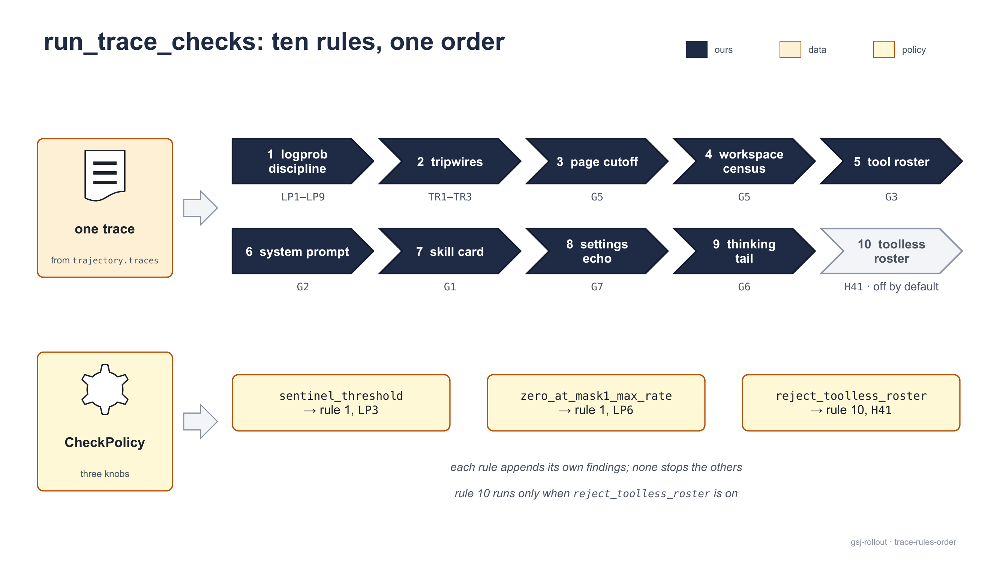

[Documentation](../README.md) › Concepts

# Validation

Every trace the rollout server produces passes through `gsj_rollout.checks` before it counts as training data — once at the receiver, where a failing result is quarantined at the source, and again in the trainer, where the same code re-verifies what arrived. This page explains the validation model: why it fails closed, how findings are spelled, what the admission layer and the per-trace rules look for, what each gate G1–G7 protects against, which knobs `CheckPolicy` exposes and how the YAML `checks:` section sets them, and why none of it works without a pins file.

The rule reasoning lives in [`docs/checks-spec.md`](https://github.com/MHGanainy/gsj-harness-rollout-server/blob/main/docs/checks-spec.md); `checks.py` implements it. The full finding table is in [Finding vocabulary](../reference/findings.md).

## The posture: fail-closed

Validation is evidence-based, and evidence that was never gathered fails the rule that needed it. Three properties follow from that and hold everywhere in `checks.py`:

- **Missing evidence is a finding, never a pass.** A trace with no `tools` array is not "roster unknown" — it is `G3:missing_evidence:tools`. A trace with no `system` message is `G2:missing_evidence:system_prompt`. A `loss_mask` with no mask-1 span is `G6:missing_evidence:turns`. The spec puts it in one sentence: *"evidence that was never gathered fails its owning gate."*
- **Content never raises.** `validate_session_result` returns a list for any JSON-shaped input — hostile, truncated, or malformed. Unhashable content (JSON admits `NaN` and lone surrogates; the canonical convention is `allow_nan=False`) becomes a `*_not_approved:unhashable` finding, not an exception.
- **Configuration does raise.** The one exception `checks` will throw is `PinsConfigurationError`: the pins file is unreadable, corrupt, wrong-shaped, or a key is missing, empty, or not a list. That is the server's fault, not the trace's, and it is loud on purpose — a pins fault must never look like an accepted trace or a client error.

> [!WARNING]
> **Approval is set membership**
>
> Every hash gate asks "is this digest in the approved set?" A wrong pins file therefore produces rejection, not admission: every hash gate fails `*_not_approved:<digest>`, naming the digest it did not find. There is no path from a misconfigured pins file to a silently accepted trace.

## One function, two legs


<sub>One funnel, fed from both sides. The server leg writes accepted results to `traces/` and failing ones to `quarantine/`; the trainer leg returns `Trace` objects and logs the rest. Both read the same pins file, and neither trusts the other's verdict.</sub>

The entry point is one function:

```python
from gsj_rollout import checks

findings: list[str] = checks.validate_session_result(session_result)
if findings:
    ...  # quarantine or log it — never train on it
```

It takes the callback-shaped `SessionResult` mapping (the body Polar POSTs, or one member of a `TaskResult` envelope's `results`) and returns findings; an empty list means accepted. The two legs get their input from different places — the receiver from Polar's callback, `POST /callbacks/session_result`; the trainer from `RolloutClient.wait`, which polls `GET /rollout/task/{id}` and hands back the `SessionResult` bodies verbatim, `status` and `error` intact — and then both call exactly this:

| leg | caller | accepted | rejected |
|---|---|---|---|
| server | `receiver.ingest(body)` | written verbatim to `<traces_dir>/<session_id>.<pins_mode>.json` | written to `<quarantine_dir>/<session_id>.<pins_mode>.json` as `{"findings": [...], "session_result": …}` |
| trainer | `client.partition_session_results(results)`, called by `RolloutClient.collect` | returned as `Trace` objects | logged at `WARNING` as `rejected <session_id>: [...]` and never returned |

On the server leg, rejection is a validation decision, not a delivery failure: the receiver answers Polar `200 {"accepted": n, "rejected": m}` either way. A body that is not a `SessionResult` (no `trajectory` key, or a `session_id` that is not filesystem-safe) is `400`; a `PinsConfigurationError` is `500` naming the key or path; and an envelope is atomic — every member is validated and serialized before anything touches disk, then every file is staged and committed, or none is. The `<pins_mode>` token in the filename is the pins file's `mode` (`thinking-off` when the key is absent), so an archive collected across a re-pin stays attributable. Operational details are in [The receiver](../guides/receiver.md).

On the trainer leg, `collect` submits, waits, partitions, and returns only the traces of clean sessions. If you want the rejected results too, call the pieces yourself:

```python
from gsj_rollout import RolloutClient
from gsj_rollout.client import partition_session_results, traces_of

client = RolloutClient("http://rollout-host:8080")
task_id = client.submit(task_request)
results = client.wait(task_id, timeout_s=1020.0)
accepted, rejected = partition_session_results(results)
for result, findings in rejected:
    print(result["session_id"], findings)
traces = [t for r in accepted for t in traces_of(r)]
```

> [!NOTE]
> **Why the trainer checks again**
>
> The receiver's verdict rides on a disk the trainer need not share, and the poll (`GET /rollout/task/{id}`) returns Polar's in-memory results, not the receiver's files. Re-running the same function trainer-side makes the trainer's verdict independent: nothing upstream — a misconfigured receiver, a stale pins file on the server, a hand-edited archive — can launder a bad trace into training.

## The finding vocabulary

A finding is a byte-stable string `{id}:{slug}[:detail]` — for example `G5:search_page_gt_timestep:18>12` or `LP3:sentinel_logprob_at_mask1:first=41:count=7`. The `{id}:{slug}` part comes from a fixed set, `checks.FINDING_VOCABULARY`, that is snapshot-tested: a rename breaks the test, which is the point, because downstream forensics grep these strings. Never reword, localize, or restructure them.

Two conventions keep the list useful under a broken input:

- **Missing evidence has one shape**: `G{n}:missing_evidence:<field>` (with one sub-form, `G7:missing_evidence:reconstruction_stats.<key>` when the stats block exists but a stat is missing or not an int, and `G5:missing_evidence:workspace.pages` when the census exists but its page counts are not ints).
- **Per-position rules report once**: a rule that scans an array (`LP3`, `LP4`, `LP5`, `LP9`, `G6`'s interstitials) emits one finding with `:first=<index>:count=<n>` rather than one per offending position, so a systematically broken array cannot flood the list.

The families, in the order `validate_session_result` produces them:

| family | scope | what it says |
|---|---|---|
| `ADM1`–`ADM5` | session | admission — the result is not a completed, well-formed session |
| `G7:*` (stats) | session | the chain snapshot on `trajectory.metadata.reconstruction_stats` |
| `LP1`–`LP9` | trace | the logprob discipline — arrays, mask, sentinels, zero rate |
| `TR1`–`TR3` | trace | tripwires — `finish_reason`, the re-vendor canary, the split label |
| `G1`, `G2`, `G3`, `G5`, `G6`, `G7` (settings) | trace | the gates |
| `H41` | trace | roster offered, zero tool calls — only when the policy arms it |

See [Finding vocabulary](../reference/findings.md) for every entry with its trigger and detail format.

## Inside `validate_session_result`


<sub>Three stages append to one list — admission its `ADM*` findings, the chain snapshot its `G7` stat findings, the per-trace rules everything else — and the list is the verdict: empty is accepted, anything else is quarantined or rejected with the findings kept. Nothing short-circuits except a missing trajectory, which ends admission because there is nothing left to inspect.</sub>

### Admission

Admission honors what the builder already decided. The validating builder inside Polar runs the session-level checks the callback cannot carry (per-completion token presence, choices arity, roster stability, and so on) and records its findings on `trajectory.metadata.gsj_validation.findings`, flipping the session to `status="ERROR"` when any exist. Admission reads that verdict; it does not re-derive it.

| finding | fires when |
|---|---|
| `ADM1:status_not_completed:<status>` | `status != "COMPLETED"` |
| `ADM3:trajectory_missing` | `trajectory` is not an object — admission stops here |
| `ADM2:builder_findings_present:<n>` | the builder recorded findings; each one is re-emitted verbatim after `ADM2` |
| `ADM4:no_traces` | `trajectory.traces` is absent or empty |
| `ADM5:malformed_trace` | an entry of `traces` is not an object (emitted in the per-trace loop, once per such entry) |

### The chain snapshot (G7, session-level)

`check_chain_snapshot(trajectory.metadata)` reads `reconstruction_stats` — the numbers Polar's prefix-merging builder records about how the episode's completions were merged into one token stream — and requires the conjunction:

```
chains_total == 1
∧ chains_reconstructed_truncated == 0
∧ completions_merged == completions_total
∧ raw_completions_total == completions_total
```

Each clause is its own finding (`G7:chains_total_ne_1:<n>`, `G7:chains_truncated:<n>`, `G7:completions_merged_ne_total:<m>!=<t>`, `G7:raw_completions_ne_total:<r>!=<t>`); a missing or non-int stat is `G7:missing_evidence:reconstruction_stats` (or `G7:missing_evidence:reconstruction_stats.<key>` when the block exists but that stat is bad) before any comparison. This is the receiver-side view of "no compaction, no dropped completions": a harness that edits earlier messages produces a second chain, a merge break shows up as a truncated chain, and a filtered-out completion shows up as merged ≠ total. See [Traces](traces.md) for what the merged stream looks like.

### The per-trace rules



<sub>`run_trace_checks` on one trace: the ten rules in the order the code runs them, the ids each can emit, and the three `CheckPolicy` knobs pointing at the rules they tune.</sub>

`run_trace_checks(trace, policy)` runs every trace-level rule, in this order, and concatenates their findings:

1. logprob discipline — `LP1`–`LP9` (reads `sentinel_threshold` for `LP3` and `zero_at_mask1_max_rate` for `LP6`)
2. tripwires — `TR1`–`TR3`
3. page cutoff — `G5`
4. workspace census — `G5`
5. tool roster — `G3`
6. system prompt — `G2`
7. skill card — `G1`
8. settings echo — `G7`
9. thinking tail — `G6`
10. toolless roster — `H41`, only when `reject_toolless_roster` is on; off by default

No rule stops the others, so a rejected trace's findings list is the complete picture, not the first failure.

## The gates


<sub>Read from the trace, compare with the pin. Five gates hold a key into `pins.gsj.json`; G5 compares the trace with its own timestep and needs no pin; G4 is teal because no codec evidence rides the callback — the tokenizer and chat template are verified on the estate at bring-up, never per trace.</sub>

Each gate reads one kind of evidence and compares it with one thing. The findings are the fail-closed shape first, then the mismatch; the detail suffixes (`:<hash>`, `:<page>><T>`, `:first=<turn>:count=<n>`) are spelled out in [Finding vocabulary](../reference/findings.md).

| gate | compares with | findings |
|---|---|---|
| G1 skill card | `skill_card_hash` — sha256 of the card's UTF-8 bytes | `G1:missing_evidence:prompt_source` · `G1:missing_evidence:skill_card_hash` · `G1:skill_card_hash_not_approved` |
| G2 system prompt | `system_prompt_hash` — sha256 of the flattened text | `G2:missing_evidence:system_prompt` · `G2:system_prompt_hash_not_approved` |
| G3 tool roster | `tool_roster_hash` — canonical-JSON sha256 of `tools` | `G3:missing_evidence:tools` · `G3:tool_roster_hash_not_approved` |
| G4 tokenizer + template | `tokenizer_hash`, `chat_template_hash` — checked by `pins/derive_pins.py` at bring-up | none — never emitted per trace |
| G5 page cutoff | the trace's own timestep — no pin | `G5:missing_evidence:timestep` · `G5:search_page_gt_timestep` · `G5:missing_evidence:workspace` · `G5:workspace_branch_ne_timestep` · `G5:checkout_max_page_ne_timestep` · `G5:checkout_pages_not_contiguous` · `G5:checkout_history_posture` |
| G6 thinking tail | `g6_expected_tail_ids` — an ids `endswith`, no hash and no tokenizer at check time | `G6:missing_evidence:turns` · `G6:prompt_suffix_ne_tail_ids` · `G6:interstitial_ne_tail_ids` |
| G7 no compaction | `settings_hash` — canonical-JSON sha256 of `gsj_settings`; plus the four chain stats above | `G7:missing_evidence:settings` · `G7:settings_hash_not_approved` · `G7:missing_evidence:reconstruction_stats` · `G7:chains_total_ne_1` · `G7:chains_truncated` · `G7:completions_merged_ne_total` · `G7:raw_completions_ne_total` |

Every hash gate reports content it cannot hash as `*_not_approved:unhashable`, never as an exception. What follows is what each check is worth.

**G1 — skill-card integrity** (`check_skill_card`). The task states its origin in trace metadata: `prompt_source` is `free` or `skill:<name>`, and a skill source carries `skill_card_hash`, the sha256 of the card's UTF-8 bytes as computed by `render_task_request`. `free` passes with no card; `skill:<name>` with no string hash is `G1:missing_evidence:skill_card_hash`, and a hash outside `skill_card_hash` is `G1:skill_card_hash_not_approved:<hash>`; anything else — absent, non-string, a bare or blank `skill:`, an unrecognised word — is `G1:missing_evidence:prompt_source`. This is stated evidence: the submit path's own declaration, riding the same channel as `case_id` and `timestep`. It is also set membership, not name-to-card binding: any approved card's hash passes under any skill name.

**G2 — a clean system prompt** (`check_system_prompt`). Every `system`-role message in `prompt_messages` has its content flattened to text (typed content parts included) and hashed; each must be in `system_prompt_hash`. Zero system messages fails closed. The hash is path-sensitive by design: the checkout path is the only case-dependent span, so the constant container path collapses the approved set to a single value — and changing `harness.workdir` changes every hash, which means a re-pin.

**G3 — the roster unmodified** (`check_tool_roster`). The `tools` array *as sent on the wire* is canonical-JSON-hashed (sorted keys, compact separators, UTF-8) and must be in `tool_roster_hash`. It is stricter than checking the allowlist in the config: key order, schema shape, and the MCP SDK's serialization all have to reproduce. A merged trace carries the first completion's roster; cross-completion stability is the builder's rule, not this gate's.

**G4 — pinned template and tokenizer.** Not a per-trace gate. No codec identity reaches the callback, and a config-echoed claim would verify the claim rather than the artifact, so G4 is verified on the estate: `pins/derive_pins.py` checks the served snapshot against `tokenizer_hash` and `chat_template_hash` at bring-up. `checks.py` never emits a `G4:*` finding.

**G5 — the page cutoff held** (`check_page_cutoff`, `check_workspace`). Two instruments, both reading the trace's own timestep — `metadata.timestep`, then `metadata.task_metadata.timestep`, then the `"timestep"` member of an `mcp_gsj_case_status` result; none of them is `G5:missing_evidence:timestep`. The transcript backstop parses every `mcp_gsj_search_case` result with the two regexes every retrieval backend must honour (`"page": N` and `md/page_NNNN.md`) and fails any page above T. The checkout census reads the `gsj_workspace` echo the harness records after the clone and before the agent starts: branch must be `timestep-T`, the pages must run contiguously from 1 with the maximum equal to T, and the checkout must be shallow with zero remotes. Decisions results and built-in file reads are exempt — the clamp on the checkout already scopes them. What this detects is honest misconfiguration (wrong branch, a clone that lost `--depth 1`, a mis-built case repo); it cannot detect a harness that lies about its own sandbox. See [The timestep cutoff](timestep-cutoff.md).

**G6 — the thinking tail** (`check_thinking_tail`). Tokenizer-free: assistant turns are the maximal mask-1 runs of `loss_mask`; turn 1's opening is `prompt_ids` plus any leading mask-0 run of `response_ids`, and every later turn's opening is the mask-0 interstitial before its span. Each opening must end (`list` `endswith`, on ids) with an entry of `g6_expected_tail_ids`. Zero mask-1 spans is `G6:missing_evidence:turns`; a bad first opening is `G6:prompt_suffix_ne_tail_ids`; bad later openings are one `G6:interstitial_ne_tail_ids:first=<turn>:count=<n>`. Under the reference thinking-off pins the tail is the empty think block, so the gate asserts thinking was off at every position the template could have shown it. Under the thinking-on pins the tail is the bare generation prompt, which asserts template integrity plus "no opening carries the off signature". On a model family without a thinking mode both derive the same tail and the gate reduces to template integrity. Running a thinking-on estate against thinking-off pins (or the reverse) fails every episode, loudly — see [Pins and approved sets](pins.md).

**G7 — no compaction, ever** (`check_settings_echo` plus the chain snapshot above). The harness echoes the settings document it rendered into trace metadata as `gsj_settings`; its canonical-JSON hash must be in `settings_hash`. The approved set holds exactly one value, the hash of `{"compaction":{"enabled":false}}`, so a document that hashes into the set *is* that document — stronger than reading a `compaction.enabled` field, which would accept unpinned extra keys. The echo is read from the trace metadata the capture layer stamped, never from caller-supplied task metadata; otherwise a trainer could certify compaction-off in the same request that asks for the episode.

> [!NOTE]
> **Self-reported evidence**
>
> G1's statement, G7's stats block and settings echo, and G5's workspace census are all produced by our own submit path or harness and carried across the wire. The gates verify that what was reported is consistent with the approved sets and with the trainer's own timestep; they raise the cost of a lie from "say nothing" to "say something consistent", and no more. That limit is stated in the spec so that nobody mistakes the check for an attestation.

## The logprob discipline and the tripwires

`response_logprobs` are raw model logprobs, R-aligned with `response_ids`, and must be finite and ≤ 0 everywhere. The rules are explicit because the obvious failure modes are arithmetically legal: vLLM writes `-9999.0` as both its missing-logprob default and its clamp floor, which is finite, negative, and not zero.

| finding | rule | knob |
|---|---|---|
| `LP1:response_logprobs_absent` | array absent on a trace that has any mask-1 position (or a non-empty `response_ids` with an empty mask) | — |
| `LP2:response_logprobs_length_ne_response_ids:<a>!=<b>` | array length ≠ `len(response_ids)` | — |
| `LP3:sentinel_logprob_at_mask1:first=…:count=…` | a mask-1 logprob ≤ the sentinel threshold | `sentinel_threshold` (−9000.0) |
| `LP4:nonfinite_logprob:first=…:count=…` | NaN, ±inf, or a non-numeric value anywhere | — |
| `LP5:positive_logprob:first=…:count=…` | a value > 0 anywhere | — |
| `LP6:zero_logprob_rate_at_mask1:<z>/<n>><rate>` | share of exact `0.0` at mask-1 positions above the allowance | `zero_at_mask1_max_rate` (0.25) |
| `LP7:empty_loss_mask` | empty mask with non-empty `response_ids` | — |
| `LP8:loss_mask_length_ne_response_ids:<a>!=<b>` | mask length ≠ `len(response_ids)` | — |
| `LP9:loss_mask_value_not_binary:first=…:count=…` | any mask entry that is not int `0` or `1` (bools excluded) | — |
| `TR1:finish_reason_not_allowed:<value>` | `finish_reason` not in `{stop, tool_calls, stop_sequence, length}` | — |
| `TR2:reasoning_loss_mask_masked_tokens:<value>` | `metadata.reasoning_loss_mask.masked_tokens` is anything but a recognised zero | — |
| `TR3:split_not_train_or_eval:<value>` | `metadata.split` is present and not `train` or `eval`; absent is legal | — |

Three of these deserve a sentence. `LP9` is the rule the others depend on: every mask-keyed rule tests `flag == 1`, which is false for `"1"`, `2`, or `NaN`, so a mask whose entries were stringified by a serializer bug would make `LP1`, `LP3`, and `LP6` vacuous at once — the mask is 0/1 ints or it is not evidence. `LP6` is an allowance rather than a ban because exact `0.0` at a sampled position is a measured bf16 property on both the Mac and the CUDA reference stacks (single-digit percentages on clean episodes, 24.9% on a degenerate repetitive-loop episode — within 0.1 pp of the allowance); `0.0` restores the strict rule. `TR1` deliberately admits `length`: a length-terminated episode is a real trajectory up to the cut, and rejecting it at the receiver would quarantine evidence nothing downstream can recover, so the CLI and the example trainer report `length-terminated: K/N` instead and leave the policy to the trainer.

> [!TIP]
> **Reading a quarantine file**
>
> A quarantined result is `{"findings": [...], "session_result": …}`. Findings are ordered: session-level first (`ADM*`, then `G7` stats), then each trace's rules in `run_trace_checks` order. The first `ADM` finding usually explains the rest — an `ERROR` session carries `ADM1` plus the builder's own findings, and a session with no traces stops at `ADM4`.

## `CheckPolicy` and the `checks:` section

Three rules are platform-conditioned, so they read a `CheckPolicy`:

```python
@dataclass(frozen=True)
class CheckPolicy:
    sentinel_threshold: float = -9000.0      # LP3: mask-1 logprob ≤ this fails
    zero_at_mask1_max_rate: float = 0.25     # LP6: allowed share of exact 0.0 at mask-1
    reject_toolless_roster: bool = False     # H41: arm the "roster offered, zero tool calls" flag
```

`reject_toolless_roster` arms `check_toolless_roster`: a trace whose `tools` array is non-empty but whose messages contain no parsed `tool_calls` anywhere emits `H41:roster_offered_zero_tool_calls`. It is off by default because a legitimate episode can call no tools; it exists because a missing tool-call parser in the serving stack produces exactly this shape — gates-green, tool-free — and validation must be able to make that loud. A missing roster is G3's shape, deliberately not H41's.

The YAML mirrors the policy field for field, with defaults read from `CheckPolicy` itself (a test asserts the mirror is complete, so the two cannot drift):

```yaml
checks:
  sentinel_threshold: -9000.0
  zero_at_mask1_max_rate: 0.25
  reject_toolless_roster: false
```

How it reaches the rules: both call sites — `receiver.ingest` and `partition_session_results` — call `validate_session_result(result)` with no policy argument, and every policy-reading rule resolves its `policy=None` default **at call time** from `checks.DEFAULT_POLICY`. `load_config` rebinds that module attribute:

```python
# gsj_rollout/config.py, the last statement of load_config before it returns
checks.DEFAULT_POLICY = checks.CheckPolicy(**cfg.checks.model_dump())
```

The consequences, stated plainly:

- an explicitly passed `policy=` always wins over the default;
- the last `load_config` in a process wins — one YAML per process is the design;
- a library consumer that never loads a config gets the spec defaults above.

To validate under a stricter policy without a YAML — for example the original zero rule — pass one:

```python
from gsj_rollout.checks import CheckPolicy, validate_session_result

strict = CheckPolicy(zero_at_mask1_max_rate=0.0)
findings = validate_session_result(session_result, policy=strict)
```

> [!WARNING]
> **The trainer leg only sees the YAML if it loads it**
>
> `RolloutClient.collect` validates with `DEFAULT_POLICY`. A trainer that never calls `load_config` validates with the defaults, not with the estate's `checks:` section — which is fine when the estate runs the defaults, and a silent divergence when it does not. Load the same YAML on both sides, or pass the policy explicitly. See [Configuration](../guides/configuration.md).

## The pins dependence

Every hash gate, and G6, reads an approved set through `checks.approved_set(key)`. The keys `checks.py` consumes are `tool_roster_hash`, `system_prompt_hash`, `skill_card_hash`, `settings_hash`, and `g6_expected_tail_ids`; each value must be a non-empty list. Pins are generated data — never literals in code — and [Pins and approved sets](pins.md) covers how they are derived and re-pinned. What matters for validation:

`checks.PINS_PATH` is resolved once at import — `GSJ_PINS_PATH` if set, else the checkout's `pins/pins.gsj.json`, else the wheel's packaged copy (which is the reference estate's approved sets, not defaults, and warns when used) — and the file is cached for the life of the process, so both legs must be pointed at the same file before their first import and restarted after a re-pin. The order, the warning, the thinking-on set and how a wheel snapshots the pins are on [Pins and approved sets](pins.md#resolution-order).

```bash
export GSJ_PINS_PATH=/etc/gsj/pins.gsj.json    # before the first import, on BOTH legs
gsj-rollout serve --config rollout.yaml
```

## What validation cannot see

Findings over features: the limits are recorded so nobody mistakes the seam for more than it is.

- **No replay.** No rule teacher-forces `response_ids` to re-score logprobs. It would need an engine on both legs, it cannot run at all on Mac estates, and the tolerance it would need is a per-estate measurement, not a constant.
- **No codec evidence per trace** (G4 above), and no sampling evidence: the trace carries no engine identity and no sampling parameters. Both are estate provenance — the served snapshot, the generation-config pin, the request log — not trace provenance.
- **No cutoff channel other than retrieval.** G5 sees `mcp_gsj_search_case` results and the checkout census; a leak through some other channel inside the sandbox is prevented by the shallow, remote-less clone, not detected here.
- **`length` is admitted, mid-chain aborts are the builder's.** A tail `finish_reason == "length"` passes `TR1`; a mid-chain `length` or abort is a builder finding that arrives as `ADM2`.
- **The split's meaning is the trainer's.** `TR3` polices the label's spelling; not training on `eval` is the training loop's job — see [Running a training loop](../guides/training-loop.md).

## See also

- [Finding vocabulary](../reference/findings.md) — every string `checks` can return, with trigger and detail format.
- [Pins and approved sets](pins.md) — the file the hash gates and G6 read.
- [The receiver](../guides/receiver.md) — the server leg: quarantine, atomicity, file naming.
- [Configuration](../guides/configuration.md#from-checks-to-checkpolicy) — the `checks:` section that binds `CheckPolicy`.
- [Troubleshooting](../guides/troubleshooting.md#at-the-callback-findings-by-family) — findings by family, with the fix for each.
