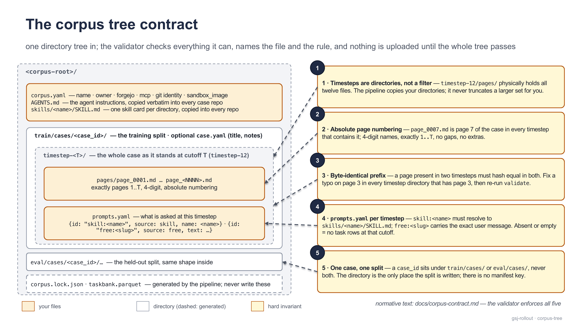

[Documentation](../README.md) › Guides

# The corpus

The rollout server runs tasks against a *corpus*: a set of cases, each a growing document cut at several timesteps, plus the prompts asked at each cut. This page explains the corpus from the consumer's side — the directory tree you hand to the pipeline and the five rules it enforces, the phases of `ingest_corpus.py` with their exact commands and credentials, what `corpus.lock.json` and `taskbank.parquet` contain, and how one taskbank row becomes one `submit`. The normative text is [`docs/corpus-contract.md`](https://github.com/MHGanainy/gsj-harness-rollout-server/blob/main/docs/corpus-contract.md); everything here is written from the pipeline as it is.

## Who does what

| role | produces | consumes | runs |
| --- | --- | --- | --- |
| data-prep team | the source tree (`<corpus-root>/`) | — | `validate` after every edit |
| estate operator | case repositories on the git host, the search index, `corpus.lock.json`, `taskbank.parquet` | the source tree | `all` (or the phases one by one) — see [The estate](estate.md) |
| trainer | task requests, one per taskbank row | `taskbank.parquet` | `gsj-rollout submit --from-bank …` or `render_task_request` in a loop — see [Command line](cli.md) and [Running a training loop](training-loop.md) |

The pipeline never edits your tree, and you never edit the two files it generates. It talks to the world through git and HTTP only.

## The tree contract in plain words

One directory, one shape:

```
<corpus-root>/
  corpus.yaml                     # corpus-level configuration
  AGENTS.md                       # the agent instructions (required, non-empty)
  skills/<name>/SKILL.md          # skill cards (skills/ required; may be empty)
  train/cases/<case_id>/          # the training split — the id becomes the repo name
    case.yaml                     # optional: title, notes
    timestep-<T>/                 # T = page cutoff, unpadded (timestep-12)
      pages/page_<NNNN>.md        # 4-digit, absolute numbering, exactly 1..T
      prompts.yaml                # what is asked at this timestep
  eval/cases/<case_id>/…          # the held-out split — same shape inside
  corpus.lock.json                # GENERATED — never write
  taskbank.parquet                # GENERATED — never write
```

The tree is strict: at the root only these entries are allowed (dot-prefixed entries such as `.git` are ignored at the root only); under a split only `cases/`; under a case only `case.yaml` and `timestep-<T>/`; under a timestep only `pages/` and `prompts.yaml`; under `pages/` only page files. A misspelled `timestep_12/` or a third split named `test/` is a validation error, never something silently skipped.



<sub>The source tree and the five rules a folder shape cannot enforce on its own — the validator checks all of them before anything is uploaded.</sub>

### The five hard invariants

| # | rule | what the validator does |
| --- | --- | --- |
| 1 | **Timesteps are directories, not a filter.** `timestep-12/pages/` physically holds `page_0001.md` … `page_0012.md`. | The page census of every timestep must be exactly `1..T`; missing or extra pages are named. |
| 2 | **Absolute page numbering.** `page_0007.md` is page 7 of the case in every timestep that contains it. Names are 4-digit (`page_7.md` is rejected). | Same census check; the file-name pattern is `^page_(\d{4})\.md$`. |
| 3 | **Byte-identical prefix.** For T1 < T2, every page present in both timesteps must hash equal. | Consecutive timesteps are compared page by page; a divergence names the case, the page and both sha256 prefixes. |
| 4 | **`prompts.yaml` per timestep.** `skill:<name>` entries must resolve to `skills/<name>/SKILL.md`; `free:<slug>` entries carry the exact user message. | Keys must be exactly `{id, source, name}` or `{id, source, text}`; duplicate ids within one timestep are errors; an absent or empty file is legal and yields no rows. |
| 5 | **One case, one split.** A `case_id` sits under `train/cases/` or `eval/cases/`, never both. | Both directories are read; a duplicate is a FAIL naming the case. There is no manifest key for the split. |

> [!WARNING]
> **Rule 3 is the one you will break first**
>
> A timestep is a cutoff of one growing document, never a re-edit. Fixing a typo on page 3 means fixing it in every timestep directory that contains page 3. Run `validate` after every edit; the comparison is by sha256, so a one-byte difference is a hard failure.

### `prompts.yaml`

```yaml
prompts:
  - {id: "skill:tatbestand", source: skill, name: tatbestand}
  - {id: "free:entity-question", source: free,
     text: "Which parties are named so far? Cite pages."}
```

- `source: skill` — `id` must be exactly `skill:<name>` and `<name>` must be a directory under `skills/` with a non-empty `SKILL.md`. The card's *bytes* are copied into every taskbank row that references it (the `skill_card_text` column), so the prompt the agent receives is fixed at build time.
- `source: free` — `id` must be `free:<slug>` (letters, digits, `._-`, starting alphanumeric); `text` is stored verbatim.
- The same `id` at different timesteps is normal: it is the same question asked as the case grows. Every `(case, timestep, prompt)` triple becomes exactly one row.

### `corpus.yaml`

```yaml
name: staging-fixtures                 # letters, digits, ._-
owner: gsj-staging                     # gsj-staging | gsj-prod — the staging/prod switch
forgejo:
  base_url: http://172.28.9.10:3000    # exactly this one key
mcp:                                   # OPTIONAL block; omit to skip the ingest phase
  url_base: http://127.0.0.1:8790
git:                                   # fixed identity + date => deterministic commit SHAs
  name: gsj-fixtures
  email: fixtures@gsj.invalid
  date: "2026-01-01T00:00:00 +0000"
sandbox_image: ghcr.io/mhganainy/gsj-pi-harness:pi0.83.0-3   # rides every taskbank row
```

| key | rule |
| --- | --- |
| `name` | non-empty token |
| `owner` | one of `gsj-staging`, `gsj-prod`; selects the git-host account and the credential variable |
| `forgejo.base_url` | required; the mapping must contain exactly `base_url`. `file://<path>` is a first-class value: repos are bare-initialised under `<path>/<owner>/` with no API and no token |
| `mcp.url_base` | optional; when present the mapping must contain exactly `url_base`. Absent means "no retrieval service": `ingest` and `verify`'s service census are skipped with a printed note |
| `git.name`, `git.email`, `git.date` | all three required, non-empty. Do not bump the date when you edit the corpus — it exists so that an unchanged tree reproduces identical SHAs |
| `sandbox_image` | non-empty; copied into every taskbank row and checked against the rollout config at submit time |

Unknown keys are rejected by name, and so is the retired `eval_case_ids` key — the split lives in the tree, nowhere else.

## The pipeline

`ingest_corpus.py` is one file with five phases as subcommands and `all` running them in order, stopping at the first failure. Every phase re-validates the tree before doing anything, so nothing downstream ever runs on a tree that fails the contract.


<sub>Validate checks the input; scaffold, ingest and taskbank change the estate and write the two artifacts; verify checks reality against the tree and the lock.</sub>

### Where to run it from

The file ships inside the wheel as `gsj_rollout/ingest_corpus.py`, so a pip install can validate a tree with no checkout:

```bash
pip install gsj-harness-rollout-server
python -m gsj_rollout.ingest_corpus validate --corpus /path/to/corpus
```

The other phases run from a checkout, next to the estate recipe:

```bash
git clone https://github.com/MHGanainy/gsj-harness-rollout-server
cd gsj-harness-rollout-server
pip install -r estate/corpus/requirements.txt          # pyyaml + pyarrow
python estate/corpus/ingest_corpus.py all --corpus /path/to/corpus
```

The wheel copy and the checkout copy are the same file — stdlib plus PyYAML, with `pyarrow` imported lazily behind a named error. `validate`, `scaffold` and `ingest` run without `pyarrow`; `taskbank` and the row half of `verify` need it.

> [!NOTE]
> **An editable install has no `gsj_rollout.ingest_corpus`**
>
> The module copy is made at wheel-build time. After `pip install -e .` in a checkout, `python -m gsj_rollout.ingest_corpus` fails with "No module named gsj_rollout.ingest_corpus" — use the script path `estate/corpus/ingest_corpus.py` instead. Running the wheel copy imports `gsj_rollout`, which emits a one-line `UserWarning` that the packaged pins are the reference estate's; it is unrelated to the corpus and safe to ignore here.

### The phases

| phase | what it does | needs | writes |
| --- | --- | --- | --- |
| `validate` | checks the tree against the contract; prints a findings table with one line per case and timestep (`case`, `split`, `where`, `result`, detail) | nothing | nothing |
| `scaffold` | builds one git repository per case in a temp dir with the fixed identity, creates the remote repo if missing (public, default branch `main`), pushes `refs/heads/*` with `--force --prune`, then confirms the remote heads equal the built heads | `git`, reach to the git host, `GSJ_FORGEJO_TOKEN_<OWNER>` | `corpus.lock.json` |
| `ingest` | mints an admin JWT, `POST /admin/reindex` on the retrieval service, polls `/health` every 2 s until `state` is `ready` (fails on `error`, or after `--ingest-timeout`, default 900 s) | `mcp.url_base`, `GSJ_MCP_TOKEN_SECRET` | nothing |
| `taskbank` | one row per `(case, timestep, prompt)`, the split read from the lock, sorted by `(case_id, timestep, prompt_id)` | a lock that agrees with the tree, `pyarrow` | `taskbank.parquet`; row counts and sha256 into the lock |
| `verify` | clones every case back from the git host and compares branch by branch; checks the service's census; checks the parquet's sha256 and its rows against the tree | everything above | nothing — a findings table and the exit code |

What `scaffold` puts in each repository, on every branch: your `AGENTS.md` and `skills/<name>/SKILL.md` verbatim, an empty `out/.gitkeep`, a fixed `.gitignore` (`.pi/`, `out/*`, `!out/.gitkeep`), and the pages as `md/page_<NNNN>.md` — the source `pages/` directory becomes `md/` in the repo, which is the `page:N ↔ md/page_NNNN.md` citation convention `AGENTS.md` relies on. Branch `main` is the largest timestep's pages; each `timestep-<T>` branch is `main` with pages `T+1..max` removed in one commit, so every branch holds exactly pages `1..T`. The repository name is `<case_id>` regardless of split — an episode's checkout cannot reveal whether its case is held out. How the branch is checked out at episode time is in [The timestep cutoff](../concepts/timestep-cutoff.md).

Because the commit identity and date are fixed, re-running `scaffold` over an unchanged tree reproduces identical commit SHAs; a changed SHA is a real content change. Moving a case between splits changes no SHA — only the lock.

### Exit codes

| code | meaning |
| --- | --- |
| `0` | every check passed (or the phase completed) |
| `1` | the findings table has at least one `FAIL` — from `validate` (any phase, since each re-validates) or from `verify` |
| `2` | a usage or environment error: unset credential, unreachable host, missing lock, `--only` naming an unknown case, `taskbank --only`, or a corpus root that is not a directory |

### Flags

| flag | effect |
| --- | --- |
| `--dry-run` | validate and build every repo locally; push nothing, write nothing, trigger nothing. `taskbank` prints the row counts it would write; `verify` is skipped |
| `--skip-ingest` | skip the reindex trigger and `verify`'s service census (no retrieval service in reach) |
| `--only CASE_ID …` | limit `validate`/`scaffold`/`verify` repo work to these cases. The task table is corpus-wide, so `all --only` skips the `taskbank` phase loudly and a plain `taskbank --only` is a usage error — refresh the table afterwards with an unqualified `taskbank` run |
| `--owner-override OWNER` | push under a different account than `corpus.yaml` says (its credential variable applies), e.g. a rehearsal of a `gsj-prod` tree under `gsj-staging` |
| `--base-url URL` | transport override for the git host (a workstation tunnel); the lock keeps `corpus.yaml`'s canonical URL |
| `--mcp-url URL` | transport override for the retrieval service |
| `--ingest-timeout S` | seconds to wait for `/health` to report `ready` (default 900) |

### Credentials

Credentials come from the environment, never from files, and the pipeline refuses to run a phase that needs one it cannot find.

| variable | read by | what it is |
| --- | --- | --- |
| `GSJ_FORGEJO_TOKEN_<OWNER>` | `scaffold` | the push token for `owner`. The name is `GSJ_FORGEJO_TOKEN_` + the owner upper-cased with `-` → `_`: `GSJ_FORGEJO_TOKEN_GSJ_STAGING`, `GSJ_FORGEJO_TOKEN_GSJ_PROD`. The pipeline checks the token authenticates as exactly that owner before creating or pushing anything. Not needed for `file://` base URLs |
| `GSJ_MCP_TOKEN_SECRET` | `ingest` | the retrieval service's shared token secret. The pipeline signs a short-lived HS256 JWT with the claims `{admin: "reindex", exp}` (TTL 300 s) and sends it as a bearer token — the same secret the service uses to verify episode tokens; ask the estate operator. See [The retrieval service](retrieval-service.md) |

Anonymous *read* access to the pushed repositories is expected — episodes clone without credentials; the token authorises pushes only.

> [!TIP]
> **Staging and prod differ by two values**
>
> `owner` in `corpus.yaml` and the matching credential variable. Nothing else in the tree changes between staging and prod.

## `corpus.lock.json`

The freeze record: what is live, written by `scaffold`, extended by `taskbank`, checked against reality by `verify`. It is deterministic — no timestamps — so an unchanged tree reproduces it byte for byte. Commit it with the corpus. Trimmed from the shipped staging corpus:

```json
{
  "cases": {
    "case_0001": {
      "clone_url": "http://172.28.9.10:3000/gsj-staging/case_0001.git",
      "refs": {
        "main": "29515d3dfcec54839a5c404119a18873797084ba",
        "timestep-12": "3aa70d6391c227b8e05e3b53c1e242060b95154a",
        "timestep-18": "2428ac0c0753b87253001b3a7ca237c0d0756e76",
        "timestep-5": "26cb9a0f851ff2ce140a952a44cbe9588e9ef637"
      },
      "split": "train",
      "timesteps": {
        "12": {"pages": 12, "prompt_ids": ["skill:summarize"]},
        "18": {"pages": 18, "prompt_ids": ["skill:summarize"]},
        "5":  {"pages": 5,  "prompt_ids": ["skill:summarize"]}
      }
    }
  },
  "corpus": {
    "base_url": "http://172.28.9.10:3000",
    "name": "staging-fixtures",
    "owner": "gsj-staging",
    "sandbox_image": "ghcr.io/mhganainy/gsj-pi-harness:pi0.83.0-3"
  },
  "taskbank": {
    "path": "taskbank.parquet",
    "rows": 12, "train": 9, "eval": 3,
    "sha256": "ae9e0bbdbeafd5e33d71eba2cdea5c6852746e8d8820f64edba435a595c30653"
  }
}
```

| block | written by | contents |
| --- | --- | --- |
| `cases.<case_id>` | `scaffold` | `clone_url` (from `corpus.yaml`'s canonical base URL), `refs` (every branch → commit SHA, as confirmed on the remote), `split`, and per timestep the page count and the prompt ids |
| `corpus` | `scaffold` | `name`, `owner`, `base_url`, `sandbox_image` |
| `taskbank` | `taskbank` | `path`, `rows`, `train`, `eval`, `sha256` of the parquet file |

`taskbank` reads each case's split from this file and refuses to run if the lock disagrees with the tree; `verify` fails on the same disagreement. So a case moved between splits after an upload must be re-scaffolded before the table can state its new split.

## `taskbank.parquet`

One row per `(case, timestep, prompt)`, flat columns, a fixed schema that `verify` compares by full type equality (a `float64` timestep would fail, not pass as `1.0 == 1`):

| column | type | value |
| --- | --- | --- |
| `case_id` | string | the case directory name — the repo name and the `--case` argument |
| `timestep` | int64 | `T` — the branch and the retrieval cutoff |
| `prompt_id` | string | `skill:<name>` or `free:<slug>`, the id from `prompts.yaml` |
| `split` | string | `train` or `eval`, from the lock — case-level, so every row of a case shares it |
| `prompt_source` | string | `free`, or `skill:<name>` |
| `prompt_text` | string | free rows: the verbatim text; **null** on skill rows |
| `skill_card_text` | string | skill rows: the bytes of `skills/<name>/SKILL.md` decoded as UTF-8; **null** on free rows |
| `sandbox_image` | string | `corpus.yaml`'s `sandbox_image` |

Rows are sorted by `(case_id, timestep, prompt_id)` and the file rebuilds byte-identically from an unchanged tree. Reading it needs `pyarrow`:

```python
import pyarrow.parquet as pq

rows = pq.read_table("taskbank.parquet").to_pylist()
train = [r for r in rows if r["split"] == "train"]
```

> [!WARNING]
> **The split is a label, not a wall**
>
> `split` travels tree → lock → taskbank row → task request metadata → collected trace, so every consumer can see it. Nothing in the pipeline or the rollout server stops a trainer from training on an `eval` row; the checks reject only a malformed value (anything other than `train`/`eval` fails validation as `TR3`). If you need a wall, build it trainer-side — the filter above is the whole of it.

## From a taskbank row to a submit

Every column of a row is either the triple or a submit-path argument, so a row is submitted as-is. On the command line:

```bash
gsj-rollout submit --config rollout.yaml --from-bank taskbank.parquet --row 3 --out traces/
```

`--row` is 0-based and defaults to `0`. What the CLI does with the row, in order:

1. Refuses `--case`, `--timestep`, `--prompt` or `--prompt-file` alongside `--from-bank` (exit 2) — the row carries the triple.
2. Reads the row with `pyarrow` (a named error if it is not installed) and checks the taskbank columns are present; an out-of-range index is exit 2.
3. Compares the row's `sandbox_image` with `runtime.image` in the config. They must be equal, otherwise exit 2: the task request is rendered from the config's image, so a mismatch would run the row in the wrong sandbox. Align the config; the row is the corpus's statement of what it was built for.
4. Takes `instruction = prompt_text or skill_card_text`, and passes `prompt_source`, `split` and `skill_card_text` through to `render_task_request`.

`render_task_request` stamps the task's metadata, which Polar hoists into every trace: `case_id`, `timestep`, `prompt_source`, `split`, and — on skill rows — `skill_card_hash`, the UTF-8 sha256 of `skill_card_text`. That hash is what gate G1 checks against the approved set at validation time, on the receiver and again in the trainer; see [Pins and approved sets](../concepts/pins.md) and [Validation](../concepts/validation.md).

The same path from Python, for a training loop:

```python
import pyarrow.parquet as pq
from gsj_rollout import RolloutClient, load_config
from gsj_rollout.config import render_task_request

cfg = load_config("rollout.yaml")
rows = pq.read_table("taskbank.parquet").to_pylist()

requests = [
    render_task_request(
        cfg,
        task_id=f"bank-{i}",
        instruction=row["prompt_text"] or row["skill_card_text"],
        case_id=row["case_id"],
        timestep=row["timestep"],
        prompt_source=row["prompt_source"],
        skill_card_text=row["skill_card_text"],
        split=row["split"],
        episodes=4,
    )
    for i, row in enumerate(rows)
    if row["split"] == "train" and row["sandbox_image"] == cfg.runtime.image
]

client = RolloutClient(cfg.polar.rollout.base_url)
traces = client.collect(requests)      # only checks-clean episodes come back
```

`render_task_request` raises `ValueError` on a `prompt_source` that is neither `free` nor `skill:<name>`, on `skill_card_text` given with a `free` source, and on a `split` outside `train`/`eval`. Omitting `split` leaves the key out of the metadata — absent means unstated, never `train`. The client side of this loop is described in [Running a training loop](training-loop.md).

> [!WARNING]
> **Editing a skill card changes a hash the rollout side pins**
>
> After editing `skills/<name>/SKILL.md`, re-run `taskbank` (`verify` fails a table whose card text no longer matches the tree) and tell the rollout-server operator: every episode submitted on the new card carries a new `skill_card_hash`, and until the approved set is re-derived, gate G1 rejects it at trace validation. The pipeline cannot do that step — it is deliberately unaware of the rollout side's pins.

## Hand-over checklist

- `validate` passes with zero `FAIL` lines.
- Every case sits under exactly one of `train/cases/` or `eval/cases/`, and the held-out cases are the ones you mean.
- Every timestep directory is the complete case at that cutoff; page names are 4-digit and absolute.
- After any page edit, the edit is applied to every timestep containing the page, and `validate` was re-run.
- Every skill referenced by any `prompts.yaml` has a non-empty card under `skills/`.
- No `eval_case_ids` key in `corpus.yaml`; no credentials anywhere in the tree.
- After an upload: `verify` passes, and `corpus.lock.json` and `taskbank.parquet` are committed with the corpus.

## See also

- [The timestep cutoff](../concepts/timestep-cutoff.md) — what the `timestep-T` branches enforce at episode time.
- [The retrieval service](retrieval-service.md) — the service `ingest` reindexes and the secret it shares.
- [The estate](estate.md) — where the pipeline sits in the bring-up order.
- [Command line](cli.md#naming-the-task) — `--from-bank` and the taskbank columns it reads.
- [Pins and approved sets](../concepts/pins.md) — the skill-card hashes the rollout side pins.
