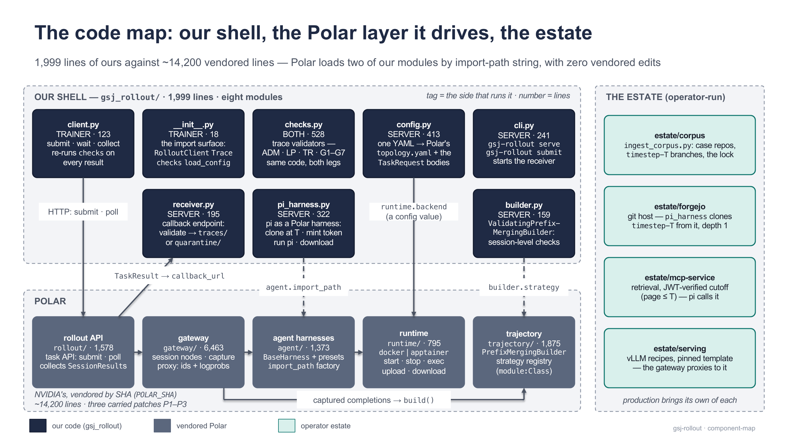
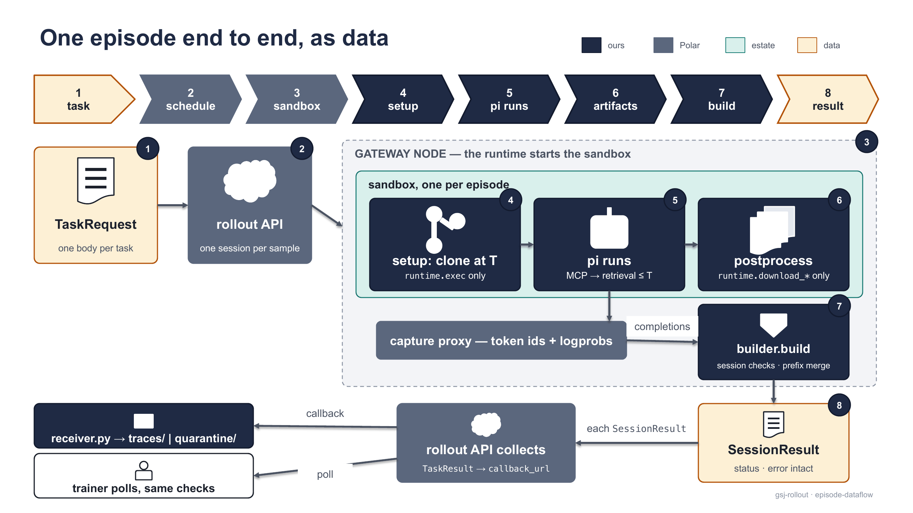
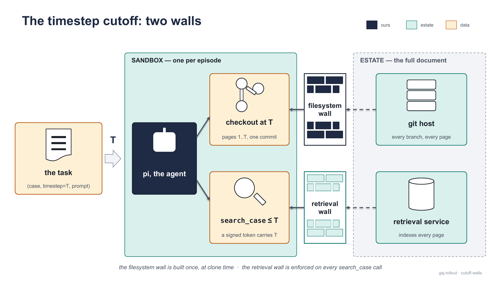
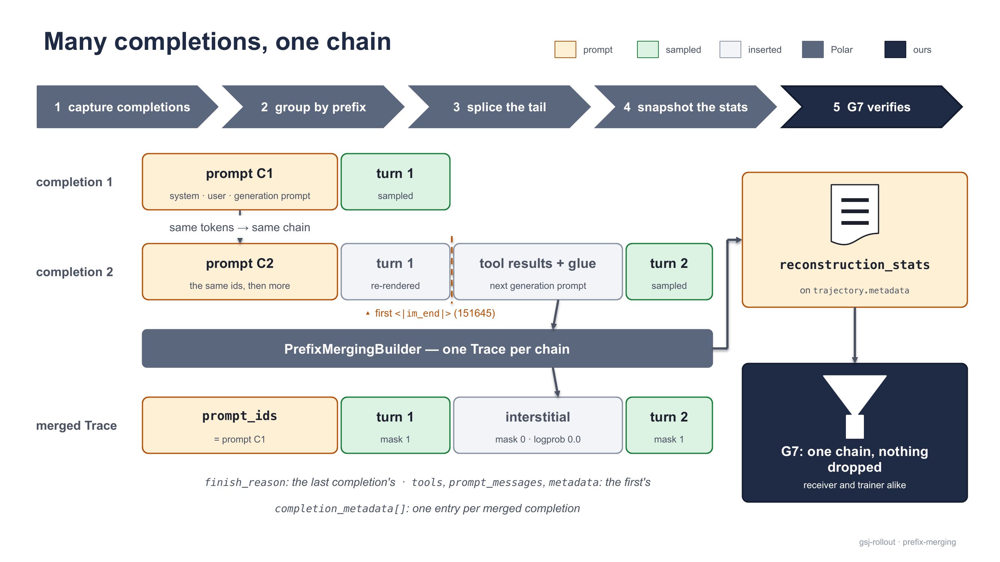

[← Documentation index](README.md)

# How it works

Given a task `(case, timestep, prompt)`, the server runs a pinned coding agent (pi 0.83.0) in a sandbox truncated at `timestep`, captures every sampled token and logprob, and emits one validated trace — this page covers the architecture, the episode dataflow, the timestep cutoff, and the trace itself.

## Architecture

> The rollout server owns **task → sandbox → agent → trace**. Nothing else. If it stores, schedules, scores, weights, versions, or trains — it's out.

It never keeps a trace, computes a reward (`reward` is always `null`), or trains — those belong to the trainer that calls it ([trainer-guide.md](trainer-guide.md)).



<sub>Three regions: our 2,034-line shell, the ~14,200-line vendored Polar layer beneath it, the estate beside both. The two dashed arrows are the only places Polar reaches into our code.</sub>

| role | needs | uses |
|---|---|---|
| **Server** | an estate (inference engine, Forgejo git host, retrieval service, ingested corpus) + this repo + Polar's venv | `gsj-rollout serve`, two Polar processes, `pi_harness.py`, `builder.py`, `receiver.py` |
| **Trainer** | `pip install gsj-harness-rollout-server` (Python ≥ 3.12; pydantic + httpx) — no estate, no Polar | `gsj_rollout.RolloutClient`, `gsj_rollout.checks` |

The published wheel serves the trainer role only — `gsj_rollout/`, both pins sets, the G2 reference capture, `ingest_corpus.py` and (since 0.1.3) the estate tool (`gsj_rollout.estate` from 0.1.6, CP-72's rename; `gsj_rollout.bringup` on wheels ≤ 0.1.5), no `vendor/` — so it cannot run an episode by itself: the estate tool stands an estate up from a corpus, but Polar's two processes are still the operator's.

**Ours** — `gsj_rollout/`, 2,034 lines under a hard 2,034-line budget (zero headroom by design, machine-checked as a suite equality since CP-65; re-set to the landed size at CP-75, ADR-0033):

| module | side | what it does |
|---|---|---|
| `__init__.py` | trainer | the consumer surface: `RolloutClient`, `Trace`, `checks`, `load_config`, `RunConfig`; never imports `polar` |
| `client.py` | trainer | submit + collect; polls `GET /rollout/task/{id}` (never the receiver's disk) and re-runs the checks on every result |
| `checks.py` | both | the validators (528 lines): admission (`ADM`), logprob discipline (`LP`), tripwires (`TR`), gates `G1`–`G7`; one entry point `validate_session_result` returns byte-stable `{id}:{slug}[:detail]` findings — empty list means accepted |
| `config.py` | server | the one YAML: renders the receiver settings + Polar's `topology.yaml` (server) and `TaskRequest` bodies (trainer); unknown keys reject loudly |
| `cli.py` | server | the `gsj-rollout` console script: `serve`, `submit` |
| `receiver.py` | server | the callback endpoint `POST /callbacks/session_result` (stdlib HTTP); validates and lands each result under `traces/` or `quarantine/` |
| `pi_harness.py` | server | pi as a Polar harness: clone at `timestep-T`, mint the cutoff token, write pi's config, run pi, download artifacts |
| `builder.py` | server | `ValidatingPrefixMergingBuilder`: session-level checks + the glue stitch; any finding fails the trajectory closed with `status="ERROR"` |

**Polar's** — NVIDIA's [ProRL-Agent-Server](https://github.com/NVIDIA-NeMo/ProRL-Agent-Server), no releases, vendored by SHA into `vendor/polar/` (`POLAR_SHA`: `f0e8343a…`, branch `stable`): the episode lifecycle (sandbox start/exec/upload/download/stop, gateway workers, heartbeats, timeouts), the capture proxy (rewrites each of pi's model calls to request token ids and per-token logprobs and records both; the traffic itself reaches the wire byte-identical), prefix-merging reconstruction, and the task API (`POST /rollout/task/submit`, `GET /rollout/task/{id}` polling, callback push).

Polar reaches into our code at exactly two import-path strings in every `TaskRequest` — both upstream features, no vendored edit needed. In our YAML they sit under `harness:` and `builder:`; `render_task_request` puts the first on the wire as `agent.import_path` (the figure's name, and the trainer guide's wire body) and the second under `builder`:

```yaml
harness:                                  # -> TaskRequest.agent.import_path on the wire
  import_path: gsj_rollout.pi_harness:PiHarness
builder:
  strategy: gsj_rollout.builder:ValidatingPrefixMergingBuilder
  end_of_turn_token_id: 151645       # pinned, never auto-detected
```

> [!WARNING]
> `pi_harness.py` and `builder.py` run inside Polar's process, so `gsj_rollout` must be installed into Polar's venv (`vendor/polar/.venv`) — without it the seam fails with `ModuleNotFoundError: gsj_rollout`. Re-run `uv pip install -e ../..` there after any venv rebuild.

**The estate's** — services the server needs running; reference copies under `estate/`, production names its own in the YAML's `estate` and `runtime` sections: `corpus/` (`ingest_corpus.py` + the staging tree: one git repository per case, one `timestep-T` branch per timestep), `forgejo/` (the git host the harness clones from), `mcp-service/` (the retrieval service, cutoff-token-verified), `serving/` (vLLM recipes with the pinned chat template). Operator detail: [server-guide.md](server-guide.md).

**The three carried patches** — in `vendor/patches/`, applied in order by `vendor/apply_patches.sh`; the committed `vendor/polar/` tree is the *patched* tree:

| patch | one line |
|---|---|
| **P1** | filters non-agent-shaped completions out of both builders and adds `raw_completions_total` beside `completions_total` in `reconstruction_stats`, so auxiliary harness LLM calls cannot become trainable traces (G7 compares the counts) |
| **P2** | any completion with `finish_reason == "abort"` fails the session: `status="ERROR"`, `error="aborted generation (weight-update cutoff)"` — a mid-chain abort otherwise merged cleanly |
| **P3** | policy-version stamping in `SessionStore` (`set_policy_version`/`get_policy_version`, per-session `gen_version`, `session_would_span()`); inert until a trainer calls it |

`bash vendor/apply_patches.sh --verify` asserts all three (ten symbol checks); `vendor/REVENDOR.md` is the recipe for moving the pin.

**Nothing assumes Docker.** The runtime is a config value: Polar's factory maps `backend` to `DockerRuntime`, `ApptainerRuntime`, or your own `import_path`, and hands the harness a `BaseRuntime` whose interface — `start`/`stop`/`exec`/`upload_*`/`download_*` — is the entire contract our code sees. The harness never shells out to `docker` and assumes only that the image provides `node` and `git`:

```yaml
runtime:
  backend: docker                                      # or apptainer
  image: ghcr.io/mhganainy/gsj-pi-harness:pi0.83.0-3
  network: bridge
```

## One episode, as data

Every hop is a payload or a file you can read.



<sub>TaskRequest in, SessionResult out. The rollout API both posts the terminal envelope to our receiver and serves the trainer's poll — and both legs run the same `checks.py`.</sub>

1. **TaskRequest.** `render_task_request` builds one body per triple: `instruction`, `num_samples`, `timeout_seconds`, `metadata {case_id, timestep, prompt_source}`, `runtime`, `agent`, `builder`, `callback_url` (default `http://127.0.0.1:8300/callbacks/session_result`). `metadata.timestep` is hoisted by Polar into every trace's metadata — gate G5 reads it there.
2. **Submit.** `POST /rollout/task/submit` creates one session per sample and dispatches each to a gateway node.
3. **Sandbox.** The node builds a runtime from `runtime.backend` and starts `runtime.image` on `runtime.network`.
4. **`PiHarness.setup`** (`runtime.exec` only). Writes pi's settings and models template; clones at `timestep-T` (the exact shape is under [the cutoff](#the-timestep-cutoff) below); probes the checkout; echoes `gsj_settings` and `gsj_workspace` into the session registry *before any model call*, so the first completion carries them.
5. **The token.** The harness mints the HS256 cutoff token host-side — claims `{case_id, timestep, episode_id, exp}`, secret never enters the sandbox — and writes it into the MCP URL in `.pi/mcp.json`; the Polar session id becomes pi's API key, which maps captures to the session.
6. **pi runs** (`run_steps`). Model calls go through the capture proxy, which records token ids and per-token logprobs per completion; `mcp_gsj_*` tool calls go to the retrieval service, which verifies the token and clamps results to page ≤ T.
7. **`postprocess`** (`runtime.download_*` only). pi's transcript and the `out/` deliverable land under `<artifacts_dir>/<session_id>/` — loud but non-fatal; evidence collection never fails the run.
8. **The builder reconstructs one trajectory.** `ValidatingPrefixMergingBuilder.build` runs the session-level checks — empty prompt/response ids (`S1`, `S6`), duplicate consecutive prompts (`S3`), mid-chain `finish_reason=length` (`S7`), more than one choice (`S8`), mixed policy versions (`S9`), non-agent shape (`A12`), a roster that changed across completions (`R11`), unconfigured end-of-turn id (`A15`) — then the optional glue stitch, then Polar's prefix merging. Findings go to `trajectory.metadata["gsj_validation"]`; any finding sets `status="ERROR"` (a status is only ever escalated, never cleared).
9. **SessionResult.** The gateway posts `{session_id, task_id, status, error, trajectory {traces[], metadata}}` to the rollout server, which holds it verbatim for `GET /rollout/task/{id}` and, once the task is terminal, posts the `TaskResult` envelope (`results: [SessionResult…]`) to `callback_url`.
10. **Both legs validate.** The receiver runs `checks.validate_session_result`, lands the body under `traces/` (no findings) or `quarantine/` (with them), and answers 200 either way; `RolloutClient` runs the identical checks on what it polls. Same code both sides — no trust required across the wire, nothing upstream can launder a bad trace into a batch.

## The timestep cutoff

A case is one growing document — `page_0001.md`, `page_0002.md`, … (numbering never restarts) — and timestep `T` is the case as it stood with only pages `1..T`, stored as git branch `timestep-T` (`main` holds the full document; contract: [corpus-contract.md](https://github.com/MHGanainy/gsj-harness-rollout-server/blob/main/docs/corpus-contract.md)). The cutoff is enforced twice while the episode runs and audited once after.



<sub>Two preventive walls: the checkout holds pages 1..T in one commit (built once, at clone time); every `search_case` call carries T in a signed token (enforced per call). The full document sits only on the far side.</sub>

**Wall 1 — the filesystem.** Before pi starts, the harness clones exactly:

```bash
git clone --depth 1 --branch timestep-T --single-branch <clone_url> /workspace \
  && git -C /workspace remote remove origin \
  && rm -rf /workspace/.git/logs
```

`--single-branch` keeps `main` and other timesteps out; `--depth 1` keeps the tip's parent (which contains the full document) out of the object store — `git show HEAD~1:md/page_0013.md` fails with "invalid object name" and `git log` cannot leak the page count; removing the remote and scrubbing the reflogs deletes the re-fetch path and the last copy of the clone URL. The result is closed at the *object* level: history cannot reach a page past `T` even with no network, while the working tree stays byte-identical to a full clone. (An agent that guesses the git host's address can attempt a fresh clone if the estate serves anonymous reads — an estate posture, not something the server controls. An estate closes this by requiring sign-in for read and giving the harness a read-scoped token via `estate.clone_credential_env`; the guessed re-clone then returns 401. See [server-guide.md](server-guide.md).)

**Wall 2 — retrieval.** The retrieval service indexes the **full** document and clamps at query time from a token the agent cannot alter. The harness mints an HS256 JWT — claims `{case_id, timestep, episode_id, exp}`; TTL `harness.mcp_token_ttl_s`, default 3600 s; secret read from the gateway-process env var named by `estate.mcp_token_secret_env`, default `GSJ_MCP_TOKEN_SECRET`, never written to any file — as the last path segment of the MCP URL, `<mcp_url_base>/mcp/<token>`. On every request the service verifies the signature and `exp`, checks the case exists and `1 ≤ timestep ≤ n_pages`, takes `T` from the **verified** claims (`T` is never a request field), constrains candidates to `page ≤ T` as a ChromaDB `where` pre-filter **before** cosine ranking, and returns top-k hits `{page, file, score, text}`. Anything failing — wrong key, expired `exp`, any algorithm but HS256, unknown case, out-of-range timestep — gets HTTP 401 with a JSON-RPC error body; no tool runs.


<sub>The agent may read its token in `.pi/mcp.json`; reading gains nothing. Every call is already scoped to its own episode, editing any claim invalidates the signature (401 before any tool runs), and the signing secret exists only in the gateway process's environment on the host. Rotating it invalidates every outstanding token immediately.</sub>

**The audit — gate G5.** Walls prevent; the audit proves, from the trace alone, identically on the receiver and in the trainer. `check_page_cutoff` walks the message views, resolves tool results to tool names, and — for cutoff-scoped tools only — extracts page references with two regexes, `"page"\s*:\s*(\d+)` and `md/page_(\d{4})\.md`; any page past `T` is a finding, e.g. `G5:search_page_gt_timestep:18>12`. `T` comes from the trace, never a caller, in order: `metadata.timestep` → `metadata.task_metadata.timestep` → an `mcp_gsj_case_status` result — none yields an integer, fail closed. `check_workspace` enforces the harness's checkout census (`metadata.gsj_workspace`, clone URL credential-stripped): shallow with zero remotes, branch `timestep-T`, pages contiguous from 1, max page equal to `T`. Every `G5:*` string is in [validation-and-pins.md](validation-and-pins.md); note G5 detects honest misconfiguration, not a harness that lies about its own sandbox.

**What the cutoff does not cover.** Only one tool is scoped — in `checks.py`:

```python
CUTOFF_SCOPED_TOOLS = frozenset({"mcp_gsj_search_case"})
```

| tool | posture |
|---|---|
| `mcp_gsj_search_case` | **scoped**: pages ≤ T, pre-filtered server-side, audited by G5 |
| `mcp_gsj_case_status` | reports the token's scope (`case_id`, `timestep`, `pages_visible`, `max_visible_page`); retrieves no pages; G5's last-resort source of `T` |
| `mcp_gsj_search_decisions`, `mcp_gsj_decision_stats` | **exempt**: a separate corpus with no page structure, never clamped — real BGH decisions by Randnummer when the corpus carries `decisions/` (corpus-contract v3, CP-88) or the estate mounts a drop with `estate.py up --decisions-dir`, the surface of [`decisions-surface.md`](../decisions-surface.md); the agent cites them as `dec:<doknr>:rn:<N>`), the synthetic 30 otherwise |
| built-in `read`, `grep`, `find`, `ls`, `bash` | **not audited**: they act on the checkout wall 1 already truncated. A `bash` leak is invisible to the G5 backstop (it reads MCP tool results, not shell output) — which is why the clone flags are enforced at the source and attested per episode |

The backstop is also a shape contract: every `search_case` hit must carry `page` as an integer and `file` as exactly `md/page_NNNN.md` — a backend that renames either blinds the gate without failing it.

## Traces


<sub>One real two-turn episode: 2,965 prompt ids, then 7,196 response positions — a 259-token sampled turn, a 6,755-token mask-0 interstitial (tool results + template glue), a 182-token sampled turn. The three response rows share one index.</sub>

The trace lives at `session_result["trajectory"]["traces"][0]`; an accepted session carries exactly one. `gsj_rollout.Trace` mirrors it field for field (pydantic, `extra="allow"`, so future fields survive the round trip):

| field | type | meaning |
|---|---|---|
| `prompt_ids` | `list[int]` | the first completion's prompt as the engine tokenized it — static context, never trained on |
| `response_ids` | `list[int]` | each turn's engine-sampled ids (never re-tokenized), spliced with canonical interstitials taken from the *next* completion's prompt |
| `loss_mask` | `list[int]` | `1` where the model sampled the token, `0` where the harness/tools/template inserted it; same length as `response_ids` |
| `response_logprobs` | `list[float] \| None` | the engine's raw sampling-time logprob at every position; `0.0` placeholder at mask 0 |
| `prompt_messages` | `list[dict]` | the first request's `messages`, verbatim — G2 hashes its system text |
| `response_messages` | `list[dict]` | each assistant turn + the tool/user messages the next request added — a human-readable view; read turn structure from `loss_mask` transitions, not from message counts |
| `tools` | `list[dict]` | the first request's `tools`, verbatim — G3 hashes it; roster stability across completions is the builder's `R11` |
| `finish_reason` | `str \| None` | the last merged completion's; allowlist `stop`, `tool_calls`, `stop_sequence`, `length` (`TR1`) |
| `reward` | `float \| None` | **always `null`** — the server never scores an episode |
| `metadata` | `dict` | submitter keys (`case_id`, `timestep`, `prompt_source`, optional `split`, `skill_card_hash`), harness echoes (`gsj_settings`, `gsj_workspace`), Polar's (`session_id`, `task_id`, `completion_metadata[]`) |

**The mask and logprob discipline.** `loss_mask` must be non-empty whenever `response_ids` is (`LP7`), the same length (`LP8`), and integer `0`/`1` only (`LP9`).
`response_logprobs` is a capture, never a recomputation: no renormalization anywhere, `response_logprobs[i]` is the logprob of `response_ids[i]`, and a mask-1 position without a logprob nulls the whole array, which the checks then reject.
The rules, run identically both sides: array absent `LP1`, wrong length `LP2`, sentinel ≤ −9000.0 at mask 1 (`LP3`; vLLM writes `-9999.0` for "missing"), non-finite `LP4`, positive `LP5`, more than 25 % exact zeros at mask 1 (`LP6`; knob `checks.zero_at_mask1_max_rate`, default `0.25` — bf16 rounding makes real exact zeros, ~6 % in the example).



<sub>Prefix merging. Grouping compares engine-tokenized prompts only — sampled ids never enter the prefix test — so the merge is immune to BPE re-tokenization drift.</sub>

**Prefix merging, the stats, and the glue stitch.** A completion joins the chain whose last prompt is a token-prefix of its own (`prompt_ids(C2)[:len(prompt_ids(C1))] == prompt_ids(C1)`); everything in the next prompt after the first `end_of_turn_token_id` (`151645`, `<|im_end|>`, pinned) becomes the mask-0 interstitial, and the completion's own sampled ids append at mask 1.
The builder snapshots `trajectory.metadata.reconstruction_stats` (`chains_total`, `chains_reconstructed_full`, `chains_reconstructed_truncated`, `raw_completions_total`, `completions_total`, `completions_merged`); G7 requires `chains_total == 1`, `chains_reconstructed_truncated == 0`, and `raw_completions_total == completions_total == completions_merged`, failing closed on a missing or non-integer stat — every failure it catches otherwise *looks clean* (`status: COMPLETED`).
An asymmetric chat template breaks the prefix test: Qwen3's stock template with `enable_thinking: false` appends `<think>\n\n</think>\n\n` (`[151667, 271, 151668, 271]`) only at generation time, so every turn opens its own chain. Pin `generation_prompt_glue_ids` and `ValidatingPrefixMergingBuilder` stitches the glue back into the next prompt before Polar groups (strict extension only; each stitch counted in `glue_stitched`).
Prefer a symmetric template — the reference estate serves one and leaves the pin unset; a wrong pin fails loud with `G7:chains_total_ne_1` on every multi-turn episode.

**Tail `length` and the null reward.** A `length` finish at the tail is admitted on purpose — engine-sampled ids, exact mask, captured logprobs up to the cut; `gsj-rollout submit` prints `length-terminated: K/N` and training on such rows is the trainer's policy. Mid-chain `length` is rejected (`S7`), and an `abort` anywhere fails the session (patch P2). `reward` is always `null`: trainers score from the episode's artifacts under `<artifacts_dir>/<session_id>/` (`pi_transcript.jsonl`, the `out/` deliverable), joined by `metadata.session_id`. On disk, the receiver writes accepted bodies verbatim to `<traces_dir>/<session_id>.<pins_mode>.json` and rejected ones as `{findings, session_result}` under the quarantine directory.

Rule-by-rule reasoning for every check named here: [checks-spec.md](https://github.com/MHGanainy/gsj-harness-rollout-server/blob/main/docs/checks-spec.md).

## See also

- [validation-and-pins.md](validation-and-pins.md) — the checks, the gates, and the complete finding vocabulary.
- [trainer-guide.md](trainer-guide.md) — collecting traces and running a training loop against them.
- [server-guide.md](server-guide.md) — serve, the one YAML, the estate, the corpus, the retrieval service.
