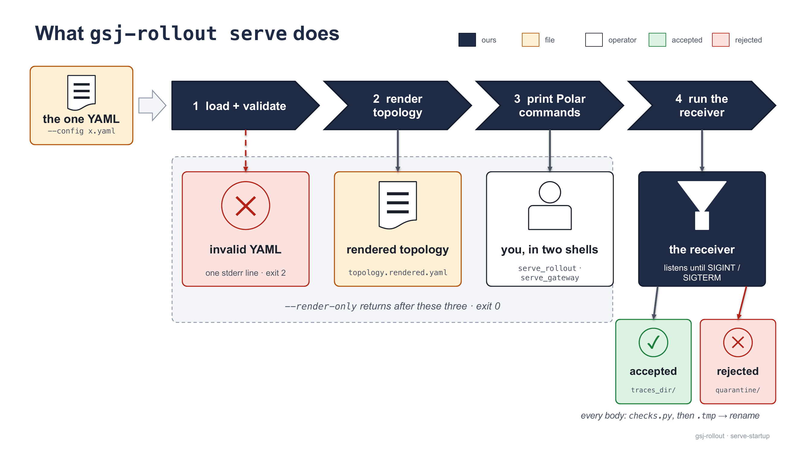
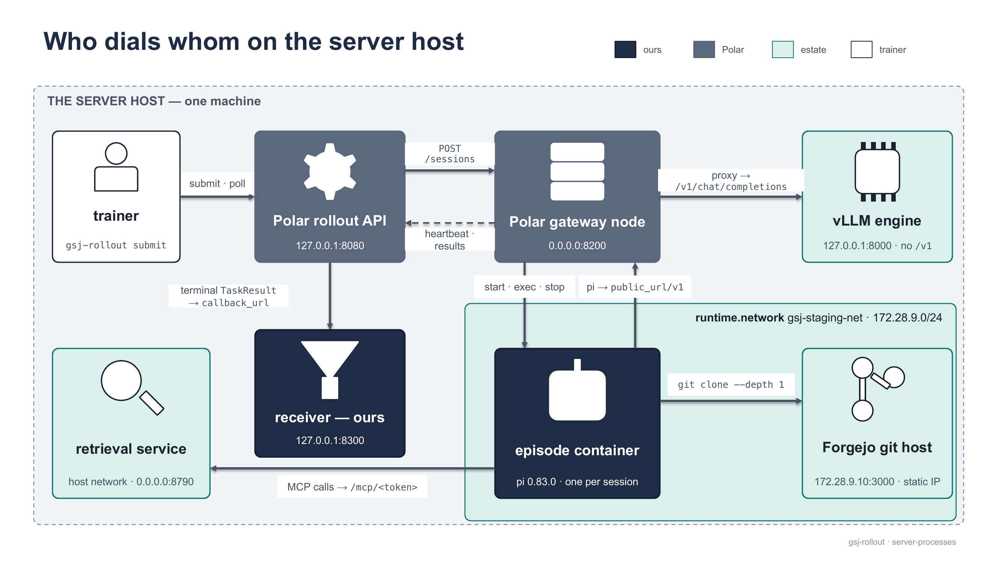
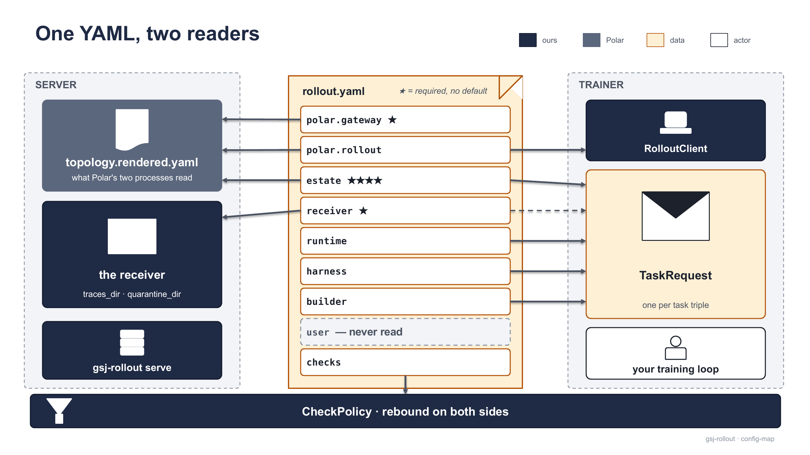
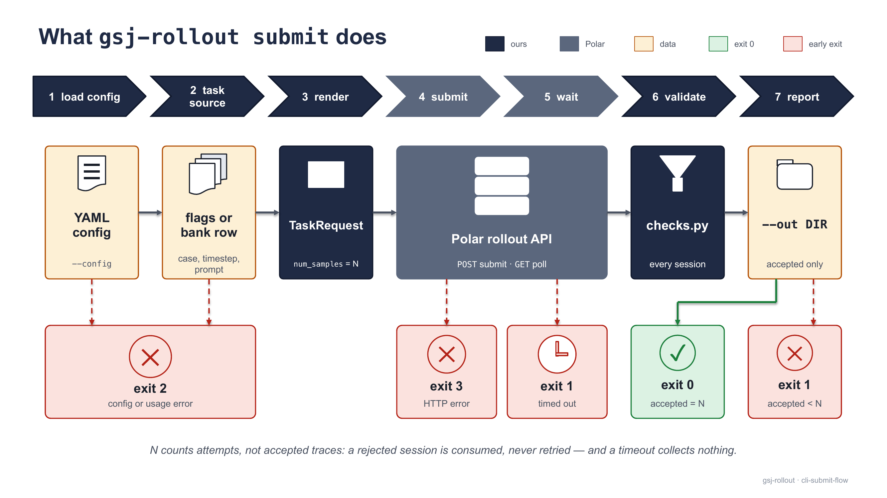
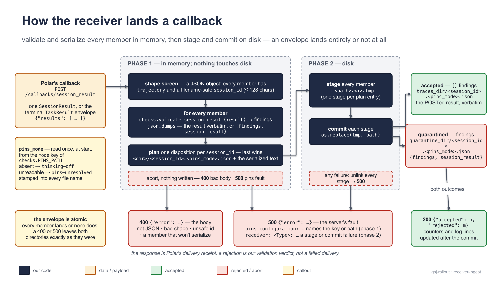
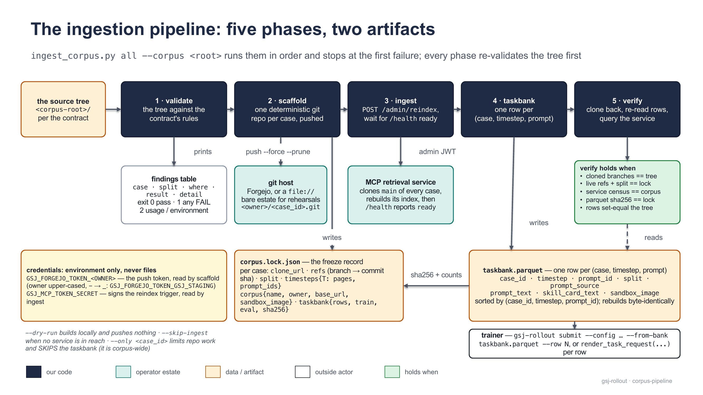
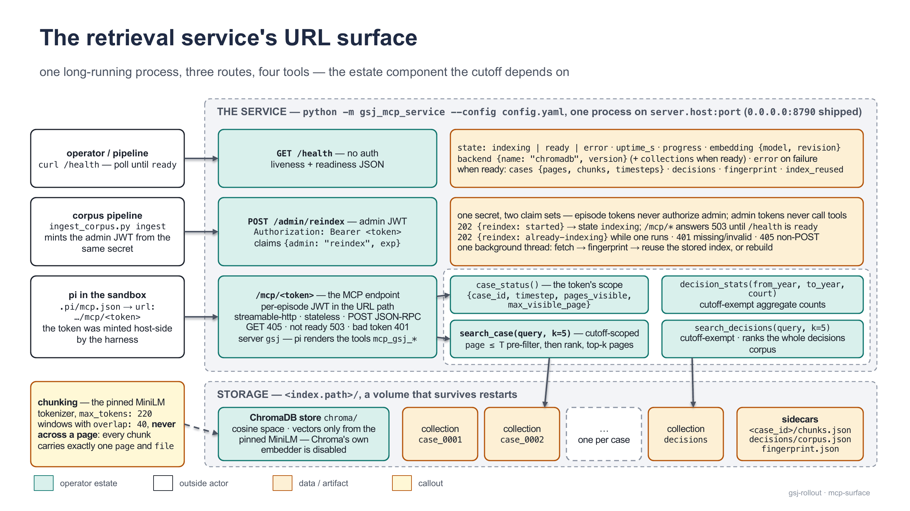

[← Documentation index](README.md)

# Server guide

Everything the operator runs, in operating order: bring-up, the one YAML, the CLI, the receiver, the estate, the corpus, and the retrieval service.

## Bring-up

The server role needs a repository checkout (the PyPI wheel ships no `vendor/`) and a running estate:

| You need | Check |
| --- | --- |
| vLLM serving `estate.model` under that exact `--served-model-name` at `estate.serving_base_url` (engine root, **no `/v1`**) | `estate/estate.sh health` |
| Forgejo with one repo per case, one `timestep-T` branch per timestep, reachable from **inside** episode containers | `curl -fsS http://172.28.9.10:3000/api/healthz` |
| The retrieval service with `GSJ_MCP_TOKEN_SECRET` in its environment | `curl -s localhost:8790/health` until `"state": "ready"` |
| The corpus ingested | `estate/estate.py validate --corpus estate/corpus/staging` |
| Docker with the harness image | `docker image ls ghcr.io/mhganainy/gsj-pi-harness` |
| Polar's venv, with `gsj_rollout` importable in it | `vendor/polar/.venv/bin/polar --help`; recipe in [vendor/REVENDOR.md](https://github.com/MHGanainy/gsj-harness-rollout-server/blob/main/vendor/REVENDOR.md) — its `uv pip install -p .venv/bin/python -e ../..` step is not optional |

```bash
gsj-rollout serve --config estate/rollout.h200.yaml
```



<sub>One YAML in, four steps: only the last keeps running. `--render-only` performs steps 1–3 and exits 0.</sub>

`serve` (1) validates the YAML — any failure is one stderr line, exit 2; (2) writes `topology.rendered.yaml` beside the config (generated — never hand-edit); (3) prints the two Polar commands plus the callback line; (4) runs the receiver until SIGINT/SIGTERM. It supervises nothing else:

```text
topology rendered: <checkout>/estate/topology.rendered.yaml — run Polar's two processes yourself:
  PYTHONPATH=<checkout> <checkout>/vendor/polar/.venv/bin/polar serve_rollout -c <checkout>/estate/topology.rendered.yaml
  GSJ_MCP_TOKEN_SECRET=<secret> PYTHONPATH=<checkout> <checkout>/vendor/polar/.venv/bin/polar serve_gateway -c <checkout>/estate/topology.rendered.yaml
callbacks: http://127.0.0.1:8300/callbacks/session_result | traces -> /home/sysadmin/cp04prime/traces | quarantine -> /home/sysadmin/cp04prime/traces/quarantine
receiver listening on 127.0.0.1:8300
```

Run them in two shells, rollout API first (the gateway registers with it). `GSJ_MCP_TOKEN_SECRET` goes on the **gateway** line only — the harness mints each episode's token there, reading the gateway process's own environment (it is Polar's process, not ours — the one place a secret must still be *in* an environment); unset, the episode fails with `token secret env var 'GSJ_MCP_TOKEN_SECRET' is unset in the gateway process`. `serve` itself reads no secret, and since CP-75 `submit` reads the run's `.env` beside its config for the read token (below) — so with an `estate.py` run directory the gateway line is the only one that ever sees a value. `PYTHONPATH=<checkout>` makes `gsj_rollout` importable in Polar's process. From a wheel install (no `vendor/`), `serve` prints a `NOTE:` line and `<checkout>` placeholders.



<sub>Who dials whom on the reference host. Nothing dials into the episode container; it dials out to the gateway's `public_url` + `/v1`, git-clones from `clone_url_for`, and speaks MCP to `mcp_url_base` + `/mcp/<token>`.</sub>

| Process | Listens on | Named by |
| --- | --- | --- |
| Polar rollout API (`serve_rollout`) | `127.0.0.1:8080` | `polar.rollout` |
| Polar gateway (`serve_gateway`) | `0.0.0.0:8200`, advertised `http://172.28.9.1:8200` | `polar.gateway` |
| vLLM engine (gateway-dialed only) | `127.0.0.1:8000` | `estate.serving_base_url` |
| receiver (ours) | `127.0.0.1:8300` | `receiver` |
| retrieval service | `0.0.0.0:8790` | `estate.mcp_url_base` |
| Forgejo (static IP, no published ports) | `172.28.9.10:3000` | `estate.clone_url_for` |

First episode, from the same host:

```bash
gsj-rollout submit --config estate/rollout.h200.yaml \
  --case case_0001 --timestep 12 --prompt "Summarise the case so far." --out ./first-run
```

Accepted traces land in `<traces_dir>/`, rejected ones in `<traces_dir>/quarantine/` with their findings. On a foreign estate every hash gate fails `*_not_approved` until `GSJ_PINS_PATH` points both the receiver and the trainer at your own pins — see [validation-and-pins.md](validation-and-pins.md). Ctrl-C the `serve` shell to stop: it prints `receiver stopped: accepted=<n> rejected=<m>`.

## The one YAML

One file, both sides: `serve` renders topology + receiver from it; `submit` renders every `TaskRequest` from it; `load_config` rebinds `checks.DEFAULT_POLICY` on both (last load wins — keep the two sides on the same file).



<sub>Server side renders topology from `polar.*` + `estate.model`/`serving_base_url` and the receiver from `receiver.*`; trainer side renders each `TaskRequest` from `estate`/`runtime`/`harness`/`builder` + `receiver.base_url`; `checks` binds both; `user` is read by nobody.</sub>

Six values have no default; a file with only them is complete:

```yaml
estate:
  clone_url_for: "http://git.example:3000/gsj/{case_id}.git"   # sandbox-reachable
  mcp_url_base: "http://mcp.example:8790"                      # sandbox-reachable
  serving_base_url: "http://127.0.0.1:8000"                    # engine root, no /v1
  model: Qwen/Qwen3-0.6B                                       # byte-equal to --served-model-name
polar:
  gateway:
    public_url: "http://192.0.2.1:8100"    # dialable by host dispatch AND episodes — never localhost
receiver:
  traces_dir: /data/traces                 # durable storage; this is the training data
```

Full reference — every key, type, default (unknown keys are rejected everywhere):

| Key | Type | Default | Meaning |
| --- | --- | --- | --- |
| `estate.clone_url_for` | str | **required** | clone URL with `{case_id}`; the harness runs `git clone --depth 1 --branch timestep-<T>` **inside** the sandbox |
| `estate.clone_credential_env` | str \| None | `None` | env-var **name** of a read-scoped Forgejo token (CP-56). Set it when the estate requires sign-in for read: render splices the value into `clone_url_for`'s userinfo, and `_strip_credentials` keeps it out of the trace. Fail-closed — if set, the value must be exported **or present in the `.env` beside the config** (CP-75: `KEY='value'` per line as `estate.py` writes it; the environment wins over the file; the file is read only for this variable, only when the environment lacks it, and never exported; a malformed line refuses naming file and line; absent from both, `submit` refuses naming both). The `.env` read ships from 0.1.7 (CP-80); wheels through 0.1.6 read the environment only — export it there. Unset = anonymous clone |
| `estate.mcp_url_base` | str | **required** | retrieval-service root; harness appends `/mcp/<token>` |
| `estate.mcp_token_secret_env` | str | `"GSJ_MCP_TOKEN_SECRET"` | env-var **name** of the HMAC secret, read in the gateway process; must equal the service's secret |
| `estate.serving_base_url` | str | **required** | engine root the gateway proxies to; `/v1` suffix rejected at load |
| `estate.provider` | str | `"gsj"` | pi provider key; `agent.model_name` = `<provider>/<model>` |
| `estate.model` | str | **required** | served model name; → topology `model_served` |
| `estate.model_revision` | str \| None | `None` | optional snapshot pin; never read by the server |
| `runtime.backend` | str | `"docker"` | Polar runtime backend (a value, not an assumption) |
| `runtime.image` | str | `"ghcr.io/mhganainy/gsj-pi-harness:pi0.83.0-3"` | pinned harness image (node, git, pi 0.83.0) |
| `runtime.network` | str | `"bridge"` | container network; must let episodes reach the git host and retrieval service |
| `harness.import_path` | str | `"gsj_rollout.pi_harness:PiHarness"` | class Polar's gateway imports |
| `harness.tools_allowlist` | list, ≥ 1 | `[read, ls, grep, find, write, edit, bash, mcp_gsj_search_case, mcp_gsj_search_decisions, mcp_gsj_case_status, mcp_gsj_decision_stats]` | pi's roster; hashed against the approved set (G3) |
| `harness.artifacts_dir` | str | `"/tmp/gsj-artifacts"` | **host-side**; transcript + `out/` land under `<dir>/<session_id>/` — point at durable storage |
| `harness.workdir` | str | `"/workspace"` | in-image checkout path; G2 pinned against it |
| `harness.context_window` | int | `32768` | pi `contextWindow` |
| `harness.max_tokens` | int | `8192` | pi `maxTokens` |
| `harness.thinking` | str | `"off"` | one of `off\|minimal\|low\|medium\|high\|xhigh\|max`; non-`off` needs the thinking-on pins on both sides |
| `harness.pi_entry`, `.pi_mcp_extension` | str \| None | `None` | in-image overrides; rendered only when set |
| `harness.mcp_token_ttl_s` | int | `3600` | per-episode retrieval-token lifetime |
| `builder.strategy` | str | `"gsj_rollout.builder:ValidatingPrefixMergingBuilder"` | builder class, loaded by import-path string |
| `builder.end_of_turn_token_id` | int | `151645` | `<\|im_end\|>` under the served Qwen3 tokenizer; re-derive when `estate.model` changes |
| `builder.generation_prompt_glue_ids` | list \| None | `None` | stitch glue for asymmetric chat templates only |
| `checks.sentinel_threshold` | float | `-9000.0` | at/below on a trainable position → `LP3` |
| `checks.zero_at_mask1_max_rate` | float | `0.25` | max exact-`0.0` fraction at `loss_mask==1` → `LP6` |
| `checks.reject_toolless_roster` | bool | `False` | `True` rejects roster-offered-zero-calls traces → `H41` |
| `polar.heartbeat_interval_seconds` | int | `30` | → topology |
| `polar.rollout.host` / `.port` | str / int | `"127.0.0.1"` / `8080` | rollout API bind |
| `polar.rollout.public_url` / `.save_dir` | str \| None | `None` | rendered only when set |
| `polar.rollout.base_url` *(property)* | str | — | `public_url`, else `http://<host>:<port>` (`0.0.0.0`/`::` → `127.0.0.1`); where `submit` posts |
| `polar.gateway.id` | str | `"gsj-node-01"` | node id |
| `polar.gateway.host` / `.port` | str / int | `"0.0.0.0"` / `8100` | gateway bind; port must equal `public_url`'s |
| `polar.gateway.public_url` | str | **required** | dialed by host dispatch **and** episodes; needs `http(s)://` scheme |
| `polar.gateway.engine` | str | `"vllm"` | → `inference.engine` |
| `polar.gateway.max_init_workers` / `max_run_workers` / `max_postrun_workers` | int | `4` / `2` / `4` | Polar worker pools |
| `receiver.host` / `.port` | str / int | `"127.0.0.1"` / `8300` | receiver bind |
| `receiver.public_url` | str \| None | `None` | set when Polar must dial something other than the bind address |
| `receiver.traces_dir` | str | **required** | accepted traces |
| `receiver.quarantine_dir` | str \| None | `<traces_dir>/quarantine` | rejected traces + findings |
| `user` | dict | `{}` | reserved; round-trips into `cfg.user`, never read |

Validation at load: `load_config` raises one `ValueError` listing **every** failing field — `config <path> invalid — 'section.field': <message>; section '<section>': unknown key '<key>'`. Two earlier failures carry their own text: `config <path>: invalid YAML: <parser error>` and `config <path> must contain a top-level mapping`. A section gutted to comments is normalised to `{}` so the missing fields are named (`'polar.gateway.public_url': Field required`). The trap validators:

| Check | Trigger | Message (leading text) |
| --- | --- | --- |
| `/v1` suffix | `serving_base_url` ends in `/v1`(`/`) | `'estate.serving_base_url': Value error, must not end in /v1 — Polar's proxy appends /v1/chat/completions itself …` |
| Gateway scheme | `public_url` lacks `http(s)://` | `'polar.gateway': Value error, public_url '192.0.2.1:8100' needs an explicit http:// or https:// scheme …` |
| Gateway port | `public_url` port ≠ `gateway.port` | `'polar.gateway': Value error, public_url advertises port 9100 but the gateway listens on port 8100 …` |
| Thinking level | not a pi level (YAML 1.1 bare `on` becomes a rejected boolean; bare `off` is accepted) | `'harness.thinking': Value error, 'on' is not a pi thinking level — use one of off\|minimal\|low\|medium\|high\|xhigh\|max …` |
| Unknown key | any section, root counts as `<root>` | `section 'estate': unknown key 'clone_pattern'` |

## The CLI

`gsj-rollout = gsj_rollout.cli:main`; `python -m gsj_rollout.cli …` is the identical program. `serve` takes `--config` (required) and `--render-only`; its exit codes are 0 (clean stop) and 2 (config error). `submit` renders one `TaskRequest`, submits, polls, re-validates, reports:

| flag | default | meaning |
| --- | --- | --- |
| `--config` | required | the one YAML; `polar.rollout` = where to submit, `receiver` = callback |
| `--case` / `--timestep` | — | case repo name / `T` (branch **and** cutoff claim; `0` is valid) |
| `--prompt` \| `--prompt-file` | — | instruction text \| file read whole; mutually exclusive |
| `--from-bank PARQUET` / `--row` | `None` / `0` | submit a taskbank row (0-based index); never combined with the triple flags |
| `--episodes` | `1` | **attempts** → `num_samples` |
| `--task-id` | `gsj-task` | Polar task id |
| `--timeout` / `--grace` / `--poll-interval` | `900.0` / `120.0` / `2.0` | task budget / extra polling seconds / poll period |
| `--out DIR` | `None` | one `<session_id>.json` per accepted session (the receiver's copies are named `<session_id>.<pins_mode>.json`) |



<sub>Load config → task source → render → submit → wait → validate → report; exit 0 needs accepted == `--episodes`, nothing looser.</sub>

| exit | meaning |
| --- | --- |
| `0` | all collected (`accepted == --episodes`) |
| `1` | not all collected — rejected/`ERROR`/`TIMEOUT` sessions, or task not terminal after `--timeout + --grace` (then nothing is collected: `gsj-rollout: task <id> not terminal after 1020.0s (k/N sessions)`) |
| `2` | config or usage error — bad YAML, incomplete triple (`submit needs --case, --timestep and --prompt/--prompt-file — or --from-bank`), `--from-bank` mixed with triple flags, out-of-range `--row`, missing bank column, image mismatch, missing pyarrow (`--from-bank needs pyarrow (pip install pyarrow)`), any argparse error |
| `3` | any `httpx.HTTPError` on submit or poll — `rollout server unreachable or errored at <base_url>: …` |

Collect-N semantics (`submit --help` epilog, `config.COLLECT_SEMANTICS`):
- COLLECTED = status `COMPLETED` + zero findings; `ERROR` and `TIMEOUT` never count.
- `--episodes N` targets N **attempts** (`num_samples=N`) — not collect-until-N-accepted.
- A rejected trace is a consumed attempt, quarantined with its findings, never auto-retried.
- Exit 1 says `collected < attempted`; the loop that wants more submits again.

`--from-bank` requires seven of the taskbank's eight columns (refusing the file otherwise; the eighth, `prompt_id`, rides along unread — `--row` selects the row): the triple from `case_id`/`timestep`, instruction = `prompt_text` else `skill_card_text`, `prompt_source` and `split` into metadata (skill rows also get `skill_card_hash`), and `sandbox_image` **checked against `runtime.image`** — a mismatch is exit 2, never a run on the wrong image. Progress goes to stdout: `task <id>: k/N sessions terminal` (on change), `rejected <session_id>: [findings]`, `collected a/N episodes -> <out>`, and an unconditional `length-terminated: k/a accepted episodes ended finish_reason=length — …` (length-stops are accepted by design; training on them is the trainer's call). Errors go to stderr prefixed `gsj-rollout: `; under a pipe use `PYTHONUNBUFFERED=1`. From Python, `cli.main(argv)` returns the exit code — or skip the CLI for the pieces it wraps ([trainer-guide.md](trainer-guide.md)).

## The receiver

`gsj_rollout/receiver.py` — stdlib `ThreadingHTTPServer`, no framework. Polar POSTs each terminal `TaskResult` to `callback_url` = `<receiver.base_url>/callbacks/session_result`; every member is run through `checks.validate_session_result` and landed on disk.

| method + path | responses |
| --- | --- |
| `GET /healthz` | `200 {"status": "ok", "accepted": n, "rejected": m}` — process-lifetime totals |
| `POST /callbacks/session_result` | `200 {"accepted": n, "rejected": m}` (every member dispositioned — rejection is a verdict, not a delivery failure); `400 {"error": …}` (body at fault: not JSON, missing `trajectory`, unsafe `session_id`, unserializable member); `500 {"error": "pins configuration: <detail>"}` (unusable pins file/key); `500 {"error": "receiver: <ExceptionType>: <detail>"}` (filesystem fault) |
| anything else | `404 {"error": "not found"}` |

The body is a single `SessionResult` or a `TaskResult` envelope (`results: [...]`; other keys ignored). Each member's `session_id` must fullmatch `[A-Za-z0-9][A-Za-z0-9._-]{0,127}` — it becomes a file name.



<sub>Three in-memory steps can only abort with nothing written; the two disk steps unlink every staged file on a fault.</sub>

The envelope is atomic — every member is dispositioned, or none:
1. Validate each member; payload = the result itself, or `{"findings": [...], "session_result": …}` when rejected.
2. Serialize with `json.dumps` **now** — an unserializable member is a 400 with nothing written.
3. Plan one path + text per `session_id` (a duplicate id in one envelope: the later member wins).
4. Stage every entry as `<path>.<i>.tmp`, then commit each with `os.replace` (atomic rename).
5. Any fault unlinks all stages and answers 500; counters and log lines (`INFO accepted <sid>` / `WARNING rejected <sid>: [...]`) move only after commit.

Files are `<session_id>.<pins_mode>.json` in `traces_dir/` or `quarantine/`. `<pins_mode>` is the pins file's `mode` key, read once at construction: `thinking-off` (no key — the reference set), `thinking-on`, any string matching `[A-Za-z0-9][A-Za-z0-9_-]{0,31}`, or `pins-unresolved` when the file is unreadable — that last one is a misconfiguration: fix `GSJ_PINS_PATH` and restart, both legs. An accepted file is the POSTed `SessionResult` verbatim; a quarantined file wraps it under `session_result` with the `findings` list first — forensics, not a queue: nothing ever re-reads or promotes it. The finding vocabulary is in [validation-and-pins.md](validation-and-pins.md). Embedding: `Receiver(host, port, traces_dir, quarantine_dir)` has no signal handlers; port `0` binds ephemeral, read `.port` back; `receiver.ingest(body)` is the handler's code path.

## The estate

The estate is what the agent needs and the operator runs: inference engine, git host, retrieval service, corpus, sandbox runtime. `estate/` ships the reference implementation; production replaces piece by piece (only the YAML values change). Depth: [estate/README.md](https://github.com/MHGanainy/gsj-harness-rollout-server/blob/main/estate/README.md).


<sub>`172.28.9.1` is the host as seen from inside the compose network; an episode on the default bridge never reaches Forgejo.</sub>

`estate.sh` is the front door — every verb `exec`s an existing script; unknown verb/missing arg exits 1:

| verb | runs |
| --- | --- |
| `bringup [args…]` | `estate.py` — corpus → running estate + taskbank + `rollout.yaml`, creating or adopting Forgejo and the retrieval service (needs the checkout's python: `PYTHON=<abs path>` or an activated `.venv`) |
| `up` | Forgejo compose up, health wait (90 s), admin `gsj-admin`, API token → `forgejo/.token` |
| `owner <name>` | pipeline owner + push token → `forgejo/.token-<name>` + read-scoped clone token → `forgejo/.token-<name>-read` (CP-56); prints both export lines |
| `down [--wipe]` | compose down; `--wipe` also deletes `forgejo-data/` and `.token` |
| `mcp-up` / `mcp-down` | retrieval service compose up/down; refuses without `GSJ_MCP_TOKEN_SECRET` and `GSJ_FORGEJO_READ_TOKEN_GSJ_STAGING` exported (the index build clones under sign-in, CP-58) |
| `serve <0.6b\|llama31>` | vLLM via SSH to the serving host |
| `serve-updated <dir>` | serve a trainer's HF-format export under the same served name |
| `health` | `/health`, `/v1/models`, one full tool round trip |
| `status` | compose ps × 2 + the engine probe |

One command instead of the sequence below: `estate/estate.py up` (or `./estate.sh bringup up`) validates the corpus, creates **or adopts** Forgejo and the retrieval service, runs the five pipeline phases, probes the engine and writes a validated `estate/runs/<name>/rollout.yaml` with every secret in a `0600` `.env` — [estate/README.md](https://github.com/MHGanainy/gsj-harness-rollout-server/blob/main/estate/README.md#estatepy--corpus-to-estate-in-one-command) has the prompts, the adopt paths and the re-run posture. Since CP-73 the interactive prompts say which answers bind (the owner, the run name, the embedding identity once a store is built) and which do not (the engine URL and model land in `rollout.yaml` and change by editing it or re-running), the retrieval config is printed for review **before** the index is built under it (each setting priced by what a later change costs; `--mcp-config <yaml>` is the scripted form), and **`estate.py update --name <run>`** syncs corpus edits into the standing estate — diff against the run's lock, report, then push only the changed repos, rebuild the bank, one if-stale reindex, verify.

**CP-84 checkout contract; public delivery pending.** The following early config and credential refusals are source changes. Public PyPI 0.1.7 does not contain them; the audit's phase 3 must publish the library changes and prove the installed consumer before a pip-installed estate can rely on them.

`--mcp-config <yaml>` accepts only `embedding`, `chunking`, `search` and `decisions` mappings. Unknown keys refuse with their name and cure. Use actual YAML integers and booleans: a quoted `"32"`, integer `1` in place of `true`, or boolean `true` in place of an integer is refused even where the service's parser would coerce it. The file overrides the generated template; a plain rerun retains recorded residual settings, and an explicitly empty overrides file clears those residuals.

The merged effective config is validated before containers are created:

| Setting | Supported value |
| --- | --- |
| `embedding.model` / `.revision` | model id (`name` or `owner/name`) / full 40-character lowercase hexadecimal commit SHA |
| `embedding.batch_size` | integer at least 1 |
| `embedding.normalize` / `chunking.respect_page_boundaries` | `true` |
| `chunking.max_tokens` / `.overlap` | integers: window at least 16; `0 <= overlap < max_tokens` |
| `search.default_k` / `.max_k` | integers at least 1 |
| `search.method` | `chroma` |
| `decisions.corpus_size` | integer at least 1 |

Use `--decisions-dir <host directory>` for a drop; `decisions.path` in the overrides file is refused because the estate owns that mount. The review still prices each setting's consequence. Default store identity is unchanged, including the absent-when-32 batch-size fingerprint convention.

Adopted passwords and token secrets must be nonempty printable ASCII (U+0020–U+007E), without apostrophes or an odd number of backslashes at the end. Controls, DEL, non-ASCII characters and every newline form are refused; internal backslashes and an even terminal run are supported. Leading and trailing spaces remain literal. An incompatible credential must be **rotated, or replaced with a token without the named character class**; the refusal says this before adoption or minting can proceed.

Secret files may contain one optional terminal LF as file framing; CRLF, multiple LFs and embedded line separators are refused, and no spaces are trimmed. `printf '%s'` writes an exact value without file framing. The estate validates legacy env files before loading values so a separator cannot silently shorten a credential. Submit's existing environment-first, adjacent-`.env` reader stays unchanged.

The verbs, by hand (steps 3 and 5 are the corpus pipeline, not verbs):

```bash
cd estate
./estate.sh up && ./estate.sh owner gsj-staging
export GSJ_FORGEJO_TOKEN_GSJ_STAGING="$(cat forgejo/.token-gsj-staging)"
export GSJ_FORGEJO_READ_TOKEN_GSJ_STAGING="$(cat forgejo/.token-gsj-staging-read)"   # every read under sign-in (CP-58)
export GSJ_MCP_TOKEN_SECRET='<the shared secret>'
# a fresh or --wipe'd estate scaffolds CLOSED as is (CP-59: the post-push read-back presents the
# read token too); the H200's four repos exist, so there this line converges and changes nothing
python3 corpus/ingest_corpus.py scaffold --corpus corpus/staging
./estate.sh mcp-up
./estate.py ingest --corpus corpus/staging
./estate.sh serve 0.6b && ./estate.sh health
```

(The three `export` lines are this by-hand path's, whose tokens live in `forgejo/.token*` files — there is no `.env` here for `submit` to read. An `estate.py` run directory needs none of them before `submit`: its `rollout.yaml` names the read token by variable and the `.env` beside it carries the value, read at submit and never exported (CP-75). Only Polar's `serve_gateway` still wants `GSJ_MCP_TOKEN_SECRET` in *its* environment.)

The three networking traps:
- **The clone happens inside the sandbox.** `clone_url_for` must resolve from the episode container; with `runtime.network` unset or wrong, every episode dies at its `git` setup step with `PiHarness setup failed` after consuming the attempt. The cure is `runtime.network: gsj-staging-net`. If the estate requires sign-in for read (below) and `clone_credential_env` is unset or its token wrong, the same setup step dies with a `git ... Authentication failed`.

**Closing anonymous read (CP-56; the reference estate ships closed since CP-58).** An estate serving anonymous git read lets a sandbox agent that guesses `…/gsj-staging/<case>.git` re-clone past its cutoff. The reference estate now requires sign-in for every read (`estate/forgejo/docker-compose.yml`'s `REQUIRE_SIGNIN_VIEW: "true"`) and every reader presents the one read-scoped token `estate.sh owner gsj-staging` mints (`GSJ_FORGEJO_READ_TOKEN_GSJ_STAGING`): the sandbox clone via `rollout.h200.yaml`'s `clone_credential_env`, the MCP index build via `config.yaml`'s `source.auth_token_env`, and the pipeline's verify clone-back — so the bring-up is one shot, no anonymous-first phase. The two re-clone channels return 401 while the harness's own credentialed clone is unaffected; the token never reaches a trace (`_strip_credentials`). Not defended: the model endpoint and the retrieval service, which the agent must reach. Since CP-59 no reader is anonymous: the scaffold's post-push `ls-remote` convergence check presents the same read token (`resolve_read_auth`), and against a closed estate without it the pipeline fails with a `PipelineError` naming `GSJ_FORGEJO_READ_TOKEN_<OWNER>` (the push itself succeeded, the lock is not written) — a fresh or wiped estate scaffolds closed, one shot.
- **`host.docker.internal` never resolves in an episode** — Polar's Docker runtime passes only `--network`, never `--add-host`. Address host-bound services by the compose network's gateway IP, `172.28.9.1` (not `172.17.0.1`).
- **One `public_url`, two dialers.** The rollout API dispatches to it from the host and pi dials it + `/v1` from the container — never `localhost`, and its port must equal `polar.gateway.port`. `estate.py` *measures* the host (a listener on the port, a container on the run's network dialing every host address) rather than deriving it: on a Docker Desktop Mac the LAN IP was host-only and `host.docker.internal` container-only (CP-59).

Serving: `serve.sh` works over SSH (`GSJ_VLLM_SSH_HOST=h200-admin`) with a tunnel `127.0.0.1:8100 → 8000`; overrides `GSJ_VLLM_PORT=8000`, `GSJ_VLLM_LOCAL_PORT=8100`, `GSJ_VLLM_GPU=3`, `GSJ_VLLM_REMOTE_DIR=gsj-vllm`, `GSJ_VLLM_GPU_FRAC=0.30`, `GSJ_VLLM_MODEL_ENV=model-0.6b.env`. It byte-copies the snapshot's `generation_config.json` and passes `--generation-config` explicitly — the engine's defaults *are* the sampling policy. Qwen (`serve 0.6b`, `Qwen/Qwen3-0.6B` @ `c1899de2…`) serves TRL's symmetric `qwen3_training.jinja` (sha256 `1d944ff8f268b611abb296cdd24d0f51981eef1c8647ac321c3a0258f61eb6c9` — the pinned `chat_template_hash`; why symmetric: [how-it-works.md](how-it-works.md)) with `--tool-call-parser hermes`, `--reasoning-parser qwen3`, `enable_thinking: false`; Llama (`serve llama31`, `unsloth/Meta-Llama-3.1-8B-Instruct` @ `a2856192…`) uses its embedded template and `--tool-call-parser llama3_json`. `health` asserts the Qwen pin unless `GSJ_VLLM_MODEL_ENV=serving/model-llama31-8b.env`. Switching family is YAML only: `estate.model` byte-equal, `builder.end_of_turn_token_id` re-derived, pins re-derived. `serve-updated <dir>` serves a local HF export under `--served-model-name Qwen/Qwen3-0.6B` (wire identity constant), stopping the old engine first (SIGTERM, 60 s, then SIGKILL) — vLLM at this pin has no in-place weight swap.

## The corpus

One directory, one shape — the normative text is [docs/corpus-contract.md](https://github.com/MHGanainy/gsj-harness-rollout-server/blob/main/docs/corpus-contract.md):

```text
<corpus-root>/
  corpus.yaml  AGENTS.md  skills/<name>/SKILL.md
  train/cases/<case_id>/timestep-<T>/{pages/page_<NNNN>.md, prompts.yaml}
  eval/cases/<case_id>/…                    # same shape
  corpus.lock.json  taskbank.parquet        # GENERATED — never write
```

Five hard invariants the validator enforces: (1) `timestep-T/pages/` physically holds exactly pages `1..T`; (2) numbering is absolute and 4-digit (`^page_(\d{4})\.md$`); (3) pages shared between timesteps are byte-identical (sha256 — fix a typo in *every* timestep that holds the page); (4) `prompts.yaml` entries are `{source, name}` (`skill:<name>` resolving to a non-empty `skills/<name>/SKILL.md`) or `{source, text}` (free), each with an optional `id` (generated when absent — CP-71); (5) a case sits under `train/` or `eval/`, never both. `corpus.yaml` since CP-71 is three fields: `name`, `owner` (any usable Forgejo username — it selects the credential variable), fixed `git.name`/`email`/`date` for deterministic SHAs. The estate values ride flags instead: `--base-url` (with `file://<path>` first-class — no API, no token), `--mcp-url` (absent skips `ingest`), `--sandbox-image` riding every row; a corpus still carrying the deprecated `forgejo.base_url`/`mcp.url_base` keys is honored with a warning, a `sandbox_image` key is ignored. `estate.py scaffold --out <dir>` writes an annotated starting tree.



<sub>Two artifacts land next to the tree; two estate services are touched, each behind one environment credential; `verify` reads everything back.</sub>

| phase | does | needs | writes |
| --- | --- | --- | --- |
| `validate` | checks the tree; findings table | — | — |
| `scaffold` | deterministic repo per case, pushed `--force --prune`; pages become `md/page_<NNNN>.md`; `main` = largest timestep, each `timestep-<T>` branch holds exactly `1..T` | git, `GSJ_FORGEJO_TOKEN_<OWNER>` (owner upper-cased, `-`→`_`) | `corpus.lock.json` |
| `ingest` | mints an admin JWT, `POST /admin/reindex`, polls `/health` until `ready` (default `--ingest-timeout 900`) | `GSJ_MCP_TOKEN_SECRET` | — |
| `taskbank` | one row per `(case, timestep, prompt)`, sorted, byte-reproducible | `pyarrow` | `taskbank.parquet` + sha256/rows into the lock |
| `verify` | clones back and compares refs, service census, parquet sha256 and rows | everything above | exit code |

`all` runs them in order, stopping at the first failure; each phase re-validates first. Exit codes: `0` pass, `1` any `FAIL` finding, `2` usage/environment (unset credential, unreachable host, `taskbank --only`). Flags: `--dry-run`, `--skip-ingest`, `--only CASE_ID …` (skips `taskbank` loudly), `--owner-override`, `--base-url`, `--mcp-url`, `--ingest-timeout S`. Validate from the wheel, no checkout:

```bash
pip install gsj-harness-rollout-server
python -m gsj_rollout.estate validate --corpus /path/to/corpus
```

(Since 0.1.6 — CP-72's fold. Wheels 0.1.2–0.1.5 carry only the pipeline's own entry, `python -m gsj_rollout.ingest_corpus validate --corpus <root>`, which keeps working on 0.1.6 and 0.1.7 with a deprecation notice on stderr and is removed no earlier than 0.1.8. An editable install has no module copy — use `estate/estate.py validate`.) Taskbank columns, fixed schema, full type equality: `case_id` (string), `timestep` (int64), `prompt_id`, `split` (`train`/`eval`, case-level, a label not a wall — filter trainer-side), `prompt_source` (`free` or `skill:<name>`), `prompt_text` (null on skill rows), `skill_card_text` (the card's bytes; null on free rows), `sandbox_image`. Editing a skill card changes `skill_card_hash` — on a standing estate `estate.py update` is the one command for that (it pushes the changed repos, rebuilds the bank, reindexes and verifies, and says the pins consequence out loud); re-pin the approved set or gate G1 rejects every new episode.

## The retrieval service

`estate/mcp-service/` (package `gsj_mcp_service`, image `gsj-mcp-service:0.5.0`, run `python -m gsj_mcp_service --config config.yaml`, shipped bind `0.0.0.0:8790`, `network_mode: host`). It indexes the **full** document of every case once (the configured, revision-pinned embedding model — MiniLM by default — → ChromaDB) and applies the cutoff at query time. Depth and the full `config.yaml` reference: [estate/mcp-service/README.md](https://github.com/MHGanainy/gsj-harness-rollout-server/blob/main/estate/mcp-service/README.md).



<sub>One process, three doors; behind them the readiness JSON, the reuse-or-rebuild thread, and the four tools reading the store.</sub>

| route | auth | purpose |
| --- | --- | --- |
| `GET /health` | none | poll until `"state": "ready"` (`indexing`\|`ready`\|`error`) |
| `POST /admin/reindex` | admin JWT (`{admin: "reindex", exp}`, TTL 300 s, same secret) | `202 {"reindex": "started"}` or `"already-indexing"`; `/mcp/*` answers 503 until ready again |
| `POST /mcp/<token>` | per-episode JWT in the path | the stateless MCP endpoint (POST JSON-RPC only; GET is 405) |

The episode token is HS256, minted host-side by the harness with claims `{case_id, timestep, episode_id, exp}` (TTL `harness.mcp_token_ttl_s`, leeway 30 s); the secret is shared **by name** (`GSJ_MCP_TOKEN_SECRET` on both sides), never by value. `T` comes from the verified claims only — `search_case(query, k)` has no timestep argument, so the client can read its token but cannot widen it. The pre-filter is structural: the case collection is queried with `where={"page": {"$lte": T}}` **before** similarity ranking — filter-before-rank, never after. Errors: 503 before the token is examined; 401 (JSON-RPC code `-32001`) for any bad token — tampered, expired, wrong alg, unknown `case_id`, `timestep` outside `1..n_pages`. The four tools (`search_case` scoped, `case_status` reports T, `search_decisions` and `decision_stats` exempt — the decisions corpus has no pages) have pinned declarations: names, signatures, docstrings, and the `mcp==2.0.0` SDK pin feed the G3 roster hash; `chromadb==1.5.9` is part of the corpus fingerprint, so a bump forces a loud re-index (`index.rebuild`: `if-stale` default, `always`, `never` — the frozen-production posture that errors on staleness).

The compatibility contract for any replacement backend:
- **The G5 result shape.** Every `search_case` hit carries `"page"` as an integer under exactly that key and `"file"` exactly `md/page_NNNN.md`; `checks.py` re-reads results with `"page"\s*:\s*(\d+)` and `md/page_(\d{4})\.md` — renaming either blinds the gate without failing it.
- **The cutoff, filter-before-rank,** with T from the verified token claims only.
- **The exemptions are fixed** — `search_decisions`/`decision_stats` exempt, `case_status` reports the token's scope. `search_decisions` answers with one JSON object, `{query, k, hits, index_commit}` (the decisions surface, [`decisions-surface.md`](../decisions-surface.md) §7) — level-2 hits with `rn` and `section` over a drop the estate mounts (`estate.py up --decisions-dir <dir>`, with `--mcp-image` naming a `0.5.0` image — `ghcr.io/mhganainy/gsj-mcp-service:0.5.0` from the wheel, the local `gsj-mcp-service:0.5.0` build from a checkout; the tool's default pin is `0.4.1` on both sides, whose config parser refuses the `decisions.path` key the tool writes, so the service fails at start instead of serving the drop — wishlist 77), the synthetic 30 otherwise; a consumer keys on the tool's name, never on a `page` key.
- **The configured, pinned embedder, never the backend's own** — stored vectors must be the configured model's output at its pinned revision (to the measured bound); the store records which model built it and refuses to serve under another until an explicit re-embed (`estate/mcp-service/README.md`, *Indexing, fingerprints and reindex*).

Rule reasoning: [docs/checks-spec.md](https://github.com/MHGanainy/gsj-harness-rollout-server/blob/main/docs/checks-spec.md).

## See also

- [validation-and-pins.md](validation-and-pins.md) — the checks the receiver runs, the gates, and re-pinning on your own estate.
- [trainer-guide.md](trainer-guide.md) — the Python API, wire formats, and a training loop against this server.
- [troubleshooting.md](troubleshooting.md) — symptom → cause → fix for everything above.
