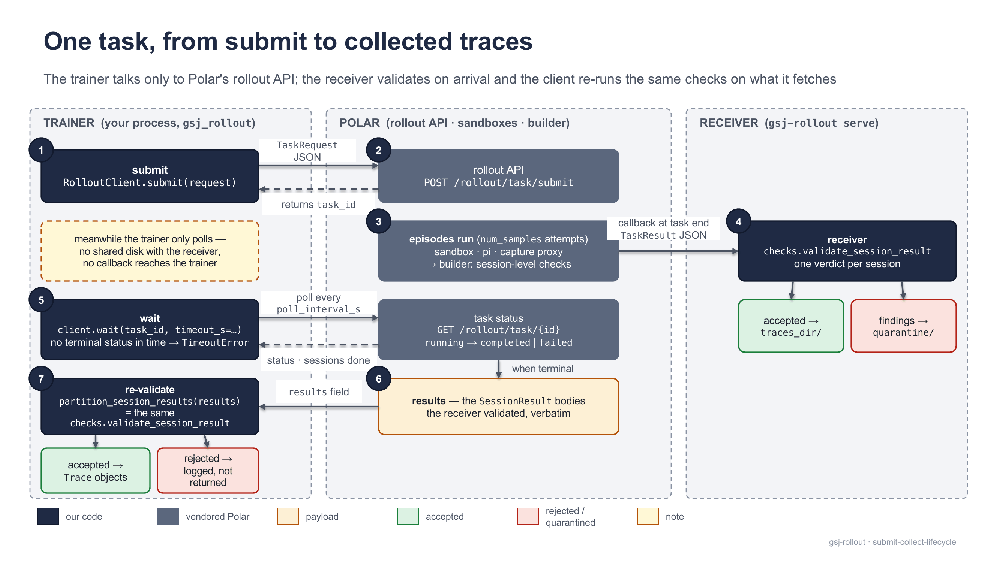
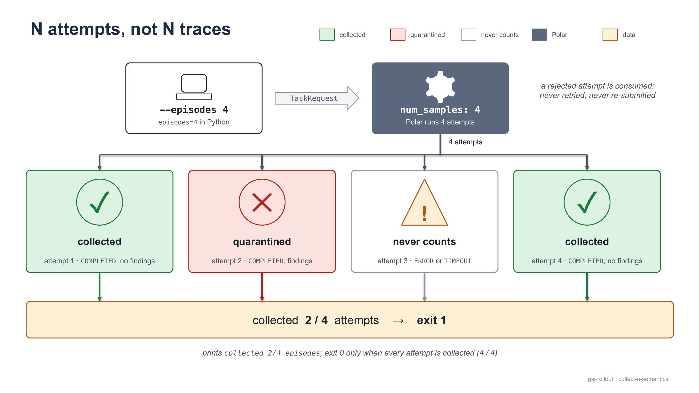
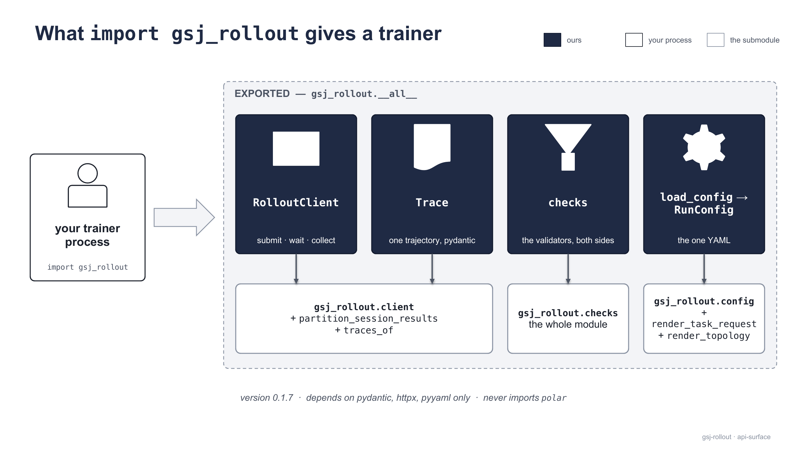
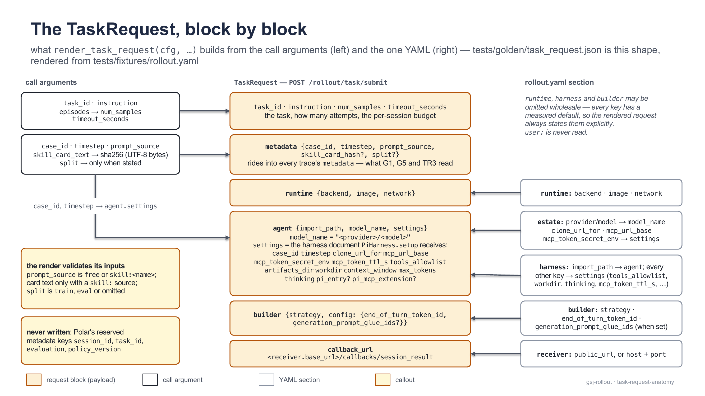
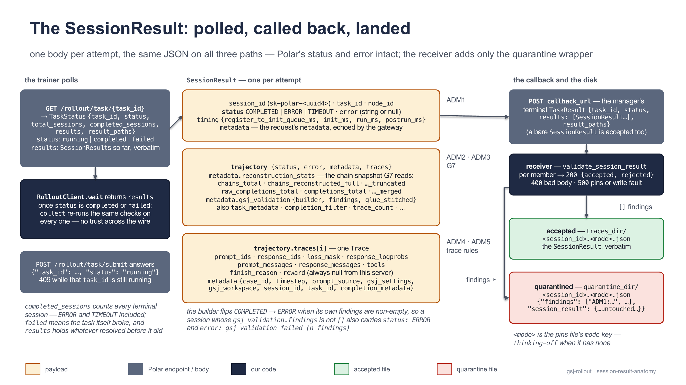
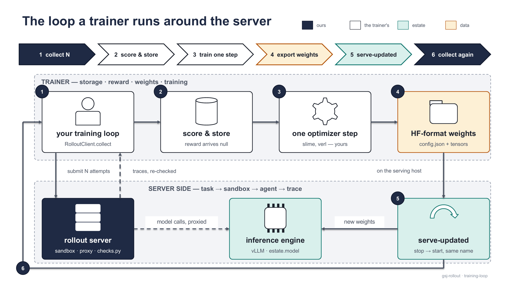

[← Documentation index](README.md)

# Trainer guide

Everything the trainer side needs: install the wheel, collect a first validated `Trace`, the Python API, the JSON bodies on the wire, and the shape of a training loop.

## Install

`pip install gsj-harness-rollout-server` — version **0.1.10**, Python **≥ 3.12**, wheel-only and `py3-none-any`; in a venv of your own (`python3 -m venv .venv && . .venv/bin/activate`) — stock Ubuntu ≥ 23.04 refuses a bare `pip install` with `externally-managed-environment` (PEP 668). Three dependencies: `pydantic`, `httpx`, `pyyaml`; `import gsj_rollout` never imports `polar` (the server-side modules `pi_harness`, `builder`, `receiver`, `cli` stay off the import surface), and `__all__` is `['RolloutClient', 'Trace', 'checks', 'load_config', 'RunConfig', '__version__']`. The `gsj-rollout` console script installs too: `submit` works from the wheel against a running server; `serve` runs from the wheel too — the receiver starts, and its printout carries a `NOTE:` with `<checkout>` placeholders for Polar's two processes, which need a checkout's `vendor/polar` venv (or the demo's published `gsj-polar` image).


<sub>What `pip install` delivers: the package plus five force-included files — three data files (both pins sets and the G2 reference capture under `gsj_rollout/pins/`) and two modules (`gsj_rollout.ingest_corpus`, `gsj_rollout.estate` — the corpus pipeline and the estate tool, whose homes stay `estate/`); nothing else in the checkout ever ships. Since 0.1.6 (CP-72's rename) the estate tool is `gsj_rollout.estate` — wheels 0.1.3–0.1.5 carry it as `gsj_rollout.bringup` — with `validate` and `ingest` folded in as verbs, and `python -m gsj_rollout.ingest_corpus` deprecated (works, warns; retained in 0.1.9; earliest-removal bound 0.1.8, not a deadline).</sub>

| in the wheel | why |
| --- | --- |
| `gsj_rollout/` — 8 modules | the package; console script `gsj-rollout = gsj_rollout.cli:main` |
| `gsj_rollout/pins/pins.gsj.json` | the reference (thinking-off) approved sets, so the trainer leg validates on install |
| `gsj_rollout/pins/thinking-on/pins.gsj.json` | the thinking-on set, data only — a target for `GSJ_PINS_PATH` on a pip-only estate |
| `gsj_rollout/ingest_corpus.py` | the corpus pipeline as a module; validate a corpus tree with no clone: `python -m gsj_rollout.estate validate --corpus <root>` (since 0.1.6 — the module's own entry `python -m gsj_rollout.ingest_corpus validate`, the only form on wheels 0.1.2–0.1.5, still works with a deprecation notice; retained in 0.1.9; the notice and docs agree on earliest removal 0.1.8, which permits but does not schedule retirement) |
| `gsj_rollout/pins/container/system_prompt.container.derived.txt` | the G2 reference capture (since 0.1.3) — the singleton whose sha256 IS `pins.system_prompt_hash`; derive your estate's G2 prompt from it instead of a copied file |
| `gsj_rollout/estate.py` | corpus → estate with no clone: `python -m gsj_rollout.estate up --corpus <root>` — needs Docker and `pip install pyarrow` (the taskbank's parquet writer; `up` refuses without it, naming the cure); a non-reference model's served name, end-of-turn id (`--end-of-turn-token-id`) and G6 tail come from [bring-your-own.md#your-model](bring-your-own.md#your-model); runs land in `./runs/<name>/` (`--runs-dir` puts them elsewhere). Seven verbs: `scaffold` (an annotated starting corpus), `validate`, `up`, `ingest`, `update` (sync an edited corpus into a standing estate), `status`, `down`. History: wheels 0.1.3–0.1.5 carry this file as `gsj_rollout/bringup.py` (`python -m gsj_rollout.bringup up`); 0.1.4 (CP-62) added `--runs-dir` and the image pulls (`--forgejo-image` / `--mcp-image` name others) — 0.1.3's bring-up pins a Forgejo tag codeberg no longer serves and never pulls the retrieval image; 0.1.6 (CP-71–73) is the rename, the folded `validate`/`ingest`, `scaffold`, and `update`; 0.1.7 (CP-79) adds `up --decisions-dir <dir>` — a rii-dok v1 drop mounted read-only into the retrieval service and served as Randnummern (level 2 of [`docs/decisions-surface.md`](https://github.com/MHGanainy/gsj-harness-rollout-server/blob/main/docs/decisions-surface.md)), named in the pre-embed review and the run record — on 0.1.7 this needs `--mcp-image ghcr.io/mhganainy/gsj-mcp-service:0.5.0`; 0.1.8 defaults to that published image and includes the CP-83/84 run, teardown, config and credential boundary repairs; 0.1.9 adds corpus-contract v3 (`decisions/`, its lock and default mount) and CP-90's refusal repairs, including an unwritable runs root and an actionable legacy-credential cure |

Never in the wheel: `vendor/`, `estate/` (except the two modules above, force-included under `gsj_rollout/`), `tests/`, `docs/`, `spike/`, `.github/`. Inspect one yourself: `pip download gsj-harness-rollout-server --no-deps && unzip -l gsj_harness_rollout_server-*.whl`.

> [!WARNING]
> **The pins trap.** The wheel ships the *reference estate's* approved sets, not neutral defaults — on any other estate every hash gate fails `*_not_approved`. From a bare wheel, importing `gsj_rollout.checks` warns once at import:
>
> ```text
> gsj_rollout.checks: <site-packages>/gsj_rollout/pins/pins.gsj.json holds the REFERENCE ESTATE's approved sets, not defaults — set GSJ_PINS_PATH to your own or every hash gate fails *_not_approved.
> ```
>
> Fix: `export GSJ_PINS_PATH=/srv/my-estate/pins.gsj.json` **before the process starts, on both legs** (receiver and trainer). Resolution is `GSJ_PINS_PATH` → checkout `pins/pins.gsj.json` → packaged copy, fixed once at import; the file is read once per process (change pins ⇒ restart); a wrong path raises `checks.PinsConfigurationError` on first use. Deriving a file for your estate: [bring-your-own.md#your-pins](bring-your-own.md#your-pins) (the walk); the file's format is [validation-and-pins.md](validation-and-pins.md).

> **What the file you name covers.** An accepted trace passed every gate that had an approved set to check against — and on a foreign-model estate not every set is that estate's: G1/G2/G6 derived there, G3 and G7's settings carried from the reference and matched on every trace, G4's two sets **empty or absent** (no API exposes the served tokenizer or template bytes) and the sampling policy pinned nowhere. Read the file's `not_measured` / `coverage` keys before you treat `[]` as "all seven gates passed": [bring-your-own.md#what-an-acceptance-covers](bring-your-own.md#what-an-acceptance-covers) has the per-gate table and the borrowed-endpoint case (sound for provenance work, not for training-distribution work).

## First collect

Get three things from the operator: the rollout API's URL, **the operator's YAML verbatim** (the same file starts the server and renders every request, so copying it guarantees your requests describe the estate the sandboxes run in), and the case ids / timesteps that exist in the corpus. Six keys have no default:

```yaml
estate:
  clone_url_for: "http://forgejo.estate:3000/gsj-staging/{case_id}.git"  # {case_id} placeholder; must resolve from INSIDE the sandbox
  # clone_credential_env: GSJ_FORGEJO_READ_TOKEN_GSJ_STAGING  # CP-56: only if the operator's estate requires sign-in for read — then export that var, or keep it in the .env beside this file (CP-75; the environment wins; fail-closed if in neither)
  mcp_url_base: "http://mcp.estate:8790"            # retrieval service, sandbox-reachable
  serving_base_url: "http://vllm.estate:8000"       # NO /v1 suffix — rejected at load
  model: "Qwen/Qwen3-0.6B"                          # byte-for-byte the engine's served name
polar:
  rollout:
    public_url: "http://rollout.estate:8080"        # where YOUR client submits and polls (default http://127.0.0.1:8080)
  gateway:
    public_url: "http://10.0.0.5:8100"              # reachable from host AND sandboxes; port must equal polar.gateway.port (8100)
receiver:
  public_url: "http://10.0.0.5:8300"                # rides in every request as callback_url (default http://127.0.0.1:8300)
  traces_dir: /data/gsj/traces                      # required — no silent /tmp default
```

```bash
# the CLI one-liner
gsj-rollout submit --config rollout.yaml --case case_0001 --timestep 12 --prompt "Summarize the case."
```

It prints `task <id>: <completed>/<total> sessions terminal` when the count changes, `rejected <session_id>: [findings]` per session failing re-validation, then `collected N/M episodes` and a `length-terminated: K/N` count — accepted traces ending `finish_reason == "length"` are qualified by design; training on them is your call.

| exit | meaning |
| --- | --- |
| `0` | every attempt collected (`collected == --episodes`) |
| `1` | a session rejected or errored, or not terminal within `--timeout` + `--grace` (`TimeoutError`) |
| `2` | config or usage error — YAML failed to load, or the `--case`/`--timestep`/`--prompt` triple incomplete |
| `3` | any `httpx.HTTPError` — unreachable server, 4xx/5xx alike |

| flag | default | effect |
| --- | --- | --- |
| `--episodes N` | `1` | attempts to run — see collect-N below |
| `--out DIR` | report only | write each accepted `SessionResult` to `DIR/<session_id>.json` |
| `--task-id` | `gsj-task` | the Polar task id, echoed in every trace's metadata |
| `--timeout` / `--grace` | `900` / `120` | the request's `timeout_seconds`; extra wait before giving up |
| `--poll-interval` | `2.0` | seconds between polls |
| `--prompt-file PATH` | — | read the instruction from a file |
| `--from-bank PARQUET` / `--row N` | — / `0` | whole triple + prompt + source + split from a taskbank row (needs `pyarrow`: `pip install pyarrow` — no extra carries it, ADR-0022 §5) |



<sub>The trainer talks only to Polar's rollout API. The receiver validates every callback at the source; the trainer re-runs the same `checks` on what it fetches — no trust required across the wire.</sub>

The same run in Python — the CLI is a thin wrapper over these three calls:

```python
from gsj_rollout import RolloutClient, load_config
from gsj_rollout.config import render_task_request

cfg = load_config("rollout.yaml")                      # the operator's file, verbatim
request = render_task_request(cfg, task_id="first-run", instruction="Summarize the case.", case_id="case_0001", timestep=12)
client = RolloutClient(cfg.polar.rollout.base_url)
traces = client.collect([request])                     # list[Trace] — checks-clean sessions only
```

**What `episodes=N` (`--episodes N`) means:** N *attempts* (`num_samples=N`), never N accepted traces. Collected = status `COMPLETED` + `gsj_validation.findings == []` + zero `checks` findings; `ERROR` and `TIMEOUT` never count. A rejected attempt is consumed — quarantined with its findings, never retried — and exit `0` needs collected == attempted, so `2/4` exits `1` and is the honest count. The definition ships as `gsj_rollout.config.COLLECT_SEMANTICS`, printed as the `submit --help` epilog.



<sub>Attempts, not accepted traces: the tally sets the exit code, and neither the CLI nor the server ever resubmits to top it up.</sub>

## The Python API



<sub>The whole trainer surface. `gsj_rollout.client` also exports `partition_session_results` and `traces_of`; `gsj_rollout.config` also exports `render_task_request` and `render_topology`.</sub>

### `RolloutClient`

```python
class RolloutClient:
    def __init__(self, base_url: str, *, poll_interval_s: float = 2.0, http: httpx.Client | None = None): ...
    def submit(self, task_request: Mapping[str, Any]) -> str: ...
    def wait(self, task_id: str, *, timeout_s: float,
             on_poll: Callable[[dict[str, Any]], None] | None = None) -> list[dict[str, Any]]: ...
    def collect(self, task_requests: Iterable[Mapping[str, Any]], *, timeout_s: float = 1020.0) -> list[Trace]: ...
```

- `base_url` is `cfg.polar.rollout.base_url` (a trailing `/` is stripped); the default HTTP client is `httpx.Client(timeout=30.0)` — pass your own for auth or proxies.
- `submit` posts the body to `POST {base_url}/rollout/task/submit` and returns Polar's `task_id`; raises `httpx.HTTPStatusError` on non-2xx.
- `wait` polls `GET {base_url}/rollout/task/{task_id}` every `poll_interval_s` until status is `completed` or `failed`, handing every status body to `on_poll`, and returns the `SessionResult` bodies verbatim — **unvalidated**, `ERROR`/`TIMEOUT` sessions included. On deadline it raises `TimeoutError` — `task <id> not terminal after <n>s (<completed>/<total> sessions)` — and the task keeps running server-side.
- `collect` = submit all → wait each (default `timeout_s=1020.0`: the 900 s task timeout + 120 s callback grace) → partition → the accepted sessions' traces. Rejections are logged at `WARNING` on the `gsj_rollout.client` logger as `rejected <session_id>: <findings>` and never returned. Content never raises; a pins fault raises `checks.PinsConfigurationError` out of `collect`.

When you need the rejections in hand, use the pieces `collect` is made of:

```python
from gsj_rollout.client import partition_session_results, traces_of
results = client.wait(client.submit(request), timeout_s=1020.0)
accepted, rejected = partition_session_results(results)   # rejected: list[(dict, list[str])]
traces = [t for r in accepted for t in traces_of(r)]
```

`partition_session_results(session_results)` runs `checks.validate_session_result` on each body (process-default policy) and returns `(accepted, rejected)` as shallow copies, rejections paired with their non-empty findings. `traces_of(session_result)` returns `Trace.model_validate(t)` per element of `trajectory.traces` (`[]` when missing) — it does not validate first.

### `Trace`

A pydantic model with `extra="allow"` (any key a future Polar adds rides along as an attribute) and every field defaulted (`Trace.model_validate({})` succeeds — `checks` decides acceptability, not the model). `model_dump()` gives back the plain dict.

| field | type | meaning |
| --- | --- | --- |
| `prompt_ids` | `list[int]` | token ids of the prompt the first turn was generated from |
| `response_ids` | `list[int]` | every response position across the merged turns, tool results included |
| `loss_mask` | `list[int]` | one `0`/`1` per `response_ids` entry; `1` = model-generated (trainable) |
| `response_logprobs` | `list[float] \| None` | one per `response_ids` entry, the engine's own at sampling time, never renormalized; `0.0` at mask-0 |
| `prompt_messages`, `response_messages` | `list[dict]` | the chat-message views behind the ids (the system prompt is the `role: system` entry) |
| `tools` | `list[dict]` | the roster on the wire — gate G3 hashes exactly this |
| `finish_reason` | `str \| None` | `stop`, `length`, … from the last completion |
| `reward` | `float \| None` | always `null` from this server — scoring is the trainer's job |
| `metadata` | `dict` | `case_id`, `timestep`, `prompt_source` (+ `skill_card_hash`, `split` when stated), `gsj_settings`, `gsj_workspace`, `session_id`, `task_id` |

### `checks` — the validators

The same code the receiver ran; the gates, rule reasoning and every finding string live in [validation-and-pins.md](validation-and-pins.md) and [docs/checks-spec.md](https://github.com/MHGanainy/gsj-harness-rollout-server/blob/main/docs/checks-spec.md).

```python
def validate_session_result(session_result: Mapping[str, Any],
                            policy: CheckPolicy | None = None) -> list[str]: ...
def run_trace_checks(trace: Mapping[str, Any], policy: CheckPolicy | None = None) -> list[str]: ...
def approved_set(key: str) -> list[str]: ...
@dataclass(frozen=True)
class CheckPolicy:
    sentinel_threshold: float = -9000.0        # a mask-1 logprob at or below this is LP3
    zero_at_mask1_max_rate: float = 0.25       # a higher share of exact zeros at mask-1 is LP6
    reject_toolless_roster: bool = False       # True arms H41 (roster offered, zero tool calls)
```

`validate_session_result` returns byte-stable finding strings; `[]` means accepted. Fixed order: `ADM1` (status ≠ `COMPLETED`), `ADM3` (no trajectory — the rest is skipped), `ADM2` (builder findings, re-emitted verbatim after it), `ADM4` (no traces), the session-level G7 chain snapshot (`check_chain_snapshot(trajectory_metadata)`), then `run_trace_checks` per trace (`ADM5:malformed_trace` for a non-mapping). `run_trace_checks` runs the ten per-trace rules in order — logprob discipline `LP1`–`LP9`, tripwires `TR1`–`TR3`, page cutoff and workspace census `G5`, tool roster `G3`, system prompt `G2`, skill card `G1`, settings echo `G7`, thinking tail `G6`, policy-armed `H41` — each also public as a `check_*` function with the same `list[str]` contract.

Content never raises. The one exception is `PinsConfigurationError` — always a configuration fault, never a bad trace: `pins file <path> unusable: <error>`, or `pins key '<key>' missing, empty, or not a list in <path>`. `approved_set` keys: `tool_roster_hash`, `system_prompt_hash`, `skill_card_hash`, `settings_hash`, `g6_expected_tail_ids`; the file is read once and cached per process.

`policy=None` resolves `checks.DEFAULT_POLICY` at call time, and `load_config` rebinds `DEFAULT_POLICY` from the YAML's `checks:` section — rebind it by hand when there is no YAML. Module constants: `FINDING_VOCABULARY` (42 `{id}:{slug}` prefixes, each also a named constant), `PINS_PATH` / `CHECKOUT_PINS` / `PACKAGED_PINS`, `ACCEPTED_STATUS = "COMPLETED"`, `ALLOWED_FINISH_REASONS = {"stop", "tool_calls", "stop_sequence", "length"}` (anything else is `TR1`), `ALLOWED_SPLITS = ("train", "eval")` (else `TR3`), `CUTOFF_SCOPED_TOOLS = {"mcp_gsj_search_case"}`.

### `load_config` and `RunConfig`

```python
def load_config(path: str | Path) -> RunConfig: ...   # side effect: rebinds checks.DEFAULT_POLICY
```

Loading is strict — `ValueError` with `config <path>: invalid YAML: <error>`, `config <path> must contain a top-level mapping`, or per-offender details like `section 'harness': unknown key 'foo'` and `'polar.gateway.public_url': Field required` (an empty section becomes `{}` so the message names the field, not the section). Every section forbids unknown keys. The sections, with the defaults a trainer cares about (full key-by-key reference: [server-guide.md](server-guide.md)):

| section | required keys | fields (default) |
| --- | --- | --- |
| `estate` | `clone_url_for`, `mcp_url_base`, `serving_base_url`, `model` | `provider` (`gsj`) — wire `model_name` is `<provider>/<model>`; `clone_credential_env` (`None`; CP-56 — env-var name of a read-scoped token for a sign-in-required estate, spliced into the clone URL; the value comes from the environment or, since CP-75, the `.env` beside the config — read, never exported; fail-closed if set and in neither); `mcp_token_secret_env` (`GSJ_MCP_TOKEN_SECRET`); `model_revision` (`None`, never read by the server); `serving_base_url` must not end in `/v1` |
| `runtime` | — | `backend` (`docker`), `image` (`ghcr.io/mhganainy/gsj-pi-harness:pi0.83.0-3`), `network` (`bridge`) |
| `harness` | — | `import_path` (`gsj_rollout.pi_harness:PiHarness`), `tools_allowlist` (11 tools), `artifacts_dir` (`/tmp/gsj-artifacts`), `workdir` (`/workspace`), `context_window` (`32768`), `max_tokens` (`8192`), `thinking` (`off` — pi's levels `off`…`max`; non-`off` needs the thinking-on pins on both sides), `mcp_token_ttl_s` (`3600`), `pi_entry`/`pi_mcp_extension` (`None`) |
| `builder` | — | `strategy` (`gsj_rollout.builder:ValidatingPrefixMergingBuilder`), `end_of_turn_token_id` (`151645`, Qwen3's `<\|im_end\|>`), `generation_prompt_glue_ids` (`None`) |
| `checks` | — | the `CheckPolicy` mirror (defaults above), copied into `checks.DEFAULT_POLICY` |
| `polar` | `gateway` | `heartbeat_interval_seconds` (`30`) |
| `polar.rollout` | — | `host` (`127.0.0.1`), `port` (`8080`), `public_url` (`None`), `save_dir` (`None`); property `base_url` = `public_url` or `http://<host>:<port>` — what `RolloutClient` takes |
| `polar.gateway` | `public_url` | `id` (`gsj-node-01`), `host` (`0.0.0.0`), `port` (`8100` — must equal `public_url`'s port), `engine` (`vllm`), `max_init_workers` `4` / `max_run_workers` `2` / `max_postrun_workers` `4` |
| `receiver` | `traces_dir` | `host` (`127.0.0.1`), `port` (`8300`), `public_url` (`None`), `quarantine_dir` (`None` ⇒ `<traces_dir>/quarantine`); the rendered `callback_url` is `<base_url>/callbacks/session_result` |
| `user` | — | free mapping, never read by the library |

### `render_task_request` and `render_topology`

```python
def render_task_request(cfg: RunConfig, *, task_id: str, instruction: str, case_id: str, timestep: int,
                        episodes: int = 1, timeout_seconds: float = 900.0, prompt_source: str = "free",
                        skill_card_text: str | None = None, split: str | None = None) -> dict[str, Any]: ...
def render_topology(cfg: RunConfig) -> dict[str, Any]: ...
```

`render_task_request` builds one `TaskRequest` body (below). `episodes` becomes `num_samples`; `timestep` is coerced with `int()` and is both the branch checked out and the retrieval cutoff; `prompt_source` is `"free"` or `"skill:<name>"` (recorded for gate G1); `skill_card_text` is only valid with a `skill:` source — its UTF-8 SHA-256 becomes `metadata.skill_card_hash`, so read the card as bytes (`path.read_bytes().decode("utf-8")`, never `read_text()`); `split` is `"train"`/`"eval"` or `None` (key omitted — unstated, never `train`). It raises `ValueError` before anything is sent: `prompt_source must be 'free' or 'skill:<name>', got …`, `skill_card_text is only valid with a skill: prompt_source`, `skill_card_text must be non-empty text`, `skill_card_text is not UTF-8-encodable`, or a message naming an invalid `split`.

`render_topology` returns the dict `gsj-rollout serve` writes as `topology.rendered.yaml` — two keys, `rollout` and `gateway` — reading only `polar.*`, `estate.model` and `estate.serving_base_url`.

## Wire formats



<sub>Two sources, one body: your call fills the task triple and `metadata` (and reaches `agent.settings` a second time); the YAML fills everything else.</sub>

```jsonc
// POST {rollout}/rollout/task/submit → {"task_id": "...", "status": "running"} (non-blocking;
// 409 = same task_id still running, 422 = failed Polar's model validation)
{
  "task_id": "golden-task",
  "instruction": "Summarize the case.",
  "num_samples": 1,                       // = episodes: attempts, not accepted traces
  "timeout_seconds": 900.0,
  "metadata": { "case_id": "case_0001", "timestep": 12, "prompt_source": "free" },  // + "skill_card_hash", "split" when stated — read by G1, G5, TR3
  "runtime": { "backend": "docker", "image": "ghcr.io/mhganainy/gsj-pi-harness:pi0.83.0-3", "network": "bridge" },
  "agent": {
    "import_path": "gsj_rollout.pi_harness:PiHarness",
    "model_name": "gsj/Qwen/Qwen3-0.6B",  // "<provider>/<model>"
    "settings": { /* the harness's whole config: case_id, timestep, clone_url_for, mcp_url_base, mcp_token_secret_env,
                     mcp_token_ttl_s, tools_allowlist, artifacts_dir, workdir, context_window, max_tokens, thinking
                     (+ pi_entry, pi_mcp_extension when set) */ }
  },
  "builder": { "strategy": "gsj_rollout.builder:ValidatingPrefixMergingBuilder",
               "config": { "end_of_turn_token_id": 151645 /* + generation_prompt_glue_ids when set */ } },
  "callback_url": "http://127.0.0.1:8300/callbacks/session_result"
}
```

The poll `wait` loops on:

```jsonc
// GET {rollout}/rollout/task/{task_id} — unknown id: 404 {"detail": "Task not found"}
{
  "status": "running",          // "completed" | "failed" (failed = the task raised inside Polar's manager)
  "total_sessions": 4,          // num_samples
  "completed_sessions": 1,      // terminal sessions — COMPLETED, ERROR and TIMEOUT all count
  "results": [ /* one SessionResult per terminal session so far, verbatim */ ],
  "result_paths": []            // Polar's own save_dir copies; the client never reads them
}
```



<sub>Three layers, three readers: ADM1 reads the top-level status; ADM2/ADM3/G7 read the trajectory; ADM4/ADM5 admit the trace list before the per-trace rules run.</sub>

```jsonc
{
  "session_id": "sk-polar-<uuid4>",   // minted by Polar; the receiver's file name (task_id rides beside it)
  "status": "COMPLETED",              // | "ERROR" | "TIMEOUT" — ADM1 accepts COMPLETED only
  "error": null,                      // e.g. "gsj validation failed (<n> findings)" from our builder
  "timing": { "register_to_init_queue_ms": 3.5, "init_ms": 555.4, "run_ms": 7822.2, "postrun_ms": 416.9 },
  "node_id": "gsj-node-01",           // polar.gateway.id
  "metadata": { /* the request's metadata, echoed unchanged */ },
  "trajectory": {
    "status": "COMPLETED",            // our builder sets ERROR whenever its own findings are non-empty
    "error": null,
    "metadata": { /* the builder's report: reconstruction_stats (what G7 reads), completion_filter, task_metadata,
                     record_count, trace_count, api_type, model_requested, model_used, and "gsj_validation":
                     {"builder": "...", "findings": [], "glue_stitched": 0} — ADM2 reads findings */ },
    "traces": [ /* one per reconstructed chain — one for this harness; the Trace fields above */ ]
  }
}
```

The same body travels three paths: the poll (what `wait` returns), the callback, and the receiver's disk. At task end Polar POSTs one `TaskResult` envelope — `{"task_id", "status", "results": [SessionResult, …], "result_paths"}` — to `callback_url`, with a 10 s timeout, best effort, never retried: a failed callback is a missing file on the server, never lost data, because the trainer still collects everything through the poll and validates it itself. The receiver writes accepted bodies verbatim to `<traces_dir>/<session_id>.<pins_mode>.json` and rejected ones to `<quarantine_dir>/<session_id>.<pins_mode>.json` in a two-key wrapper — re-running `checks.validate_session_result` on `session_result` reproduces the verdict:

```json
{ "findings": ["LP6:zero_logprob_rate_at_mask1:34/237>0.0"],
  "session_result": { "…": "the SessionResult, untouched" } }
```

The receiver's endpoints, responses, file naming and atomicity: [server-guide.md](server-guide.md).

## Running a training loop



<sub>One iteration, strictly serialized. Only weights cross downward, only traces come back up, and the server side never learns a loop exists.</sub>

1. **Collect** — `client.collect(requests)` blocks until every task is terminal and returns checks-clean traces only; the same rules ran on both sides of the wire.
2. **Score and store** — yours. `reward` is `null` in every callback. Score from the trace plus the episode artifacts the harness lands under `<harness.artifacts_dir>/<session_id>/` on the server host (`pi_transcript.jsonl` and the agent's `out/` deliverable); `trace.metadata["session_id"]` is the join key; `artifacts_dir` defaults to `/tmp/gsj-artifacts`, so point it at durable storage first.
3. **Train one step** — slime, verl, or your own optimizer.
4. **Export** — HF-format weights (`config.json` plus tensors) on the serving host.
5. **Sync** — `./estate/estate.sh serve-updated <dir>`: stops the engine, restarts it on `<dir>` under the **same** `--served-model-name`, waits for `/health` (up to 600 s) and verifies `/v1/models`. The loop is serialized, so nothing is in flight when the weights change — a trace carries no policy version, and a session spanning a sync would look clean.
6. **Collect again** — same YAML, same requests, new weights.

The server never stores, schedules, scores, weights, versions, or trains — and sampling parameters are the engine's configuration, not the trace's (pin `--generation-config` on your estate as the reference does). **The wire identity never changes:** `estate.model` names the model in the topology, in every request's `model_name`, and in every captured completion; a sync swaps the weights under the same served name so the config, the requests, the checks and the pins are all untouched, and every batch stays comparable to the last. When an iteration needs a fixed number of accepted traces, resubmit under an attempt budget — the server never tops up a batch and never retries a consumed attempt.

Two complete bridges (slime and verl), each collecting with this library, taking one optimizer step and syncing through `serve-updated`, were built and measured in [gsj-harness-rollout-server-examples](https://github.com/MHGanainy/gsj-harness-rollout-server-examples) — start there rather than from a blank file. Since its CP-69, main carries the verl bridge plus the multi-step training loop (`example_project/train_loop.py`, restart sync scripted and probe-proven); the slime bridge is frozen at tag [`slime-cp17`](https://github.com/MHGanainy/gsj-harness-rollout-server-examples/tree/slime-cp17/slime_bridge) (commit `73e63f0e`; restore with `git checkout slime-cp17 -- slime_bridge`).

## See also

- [validation-and-pins.md](validation-and-pins.md) — every gate, the complete finding vocabulary, and the pins workflow.
- [server-guide.md](server-guide.md) — the full YAML reference, `serve`, the receiver, the estate.
- [how-it-works.md](how-it-works.md) — the episode dataflow, the timestep cutoff, and trace anatomy.
