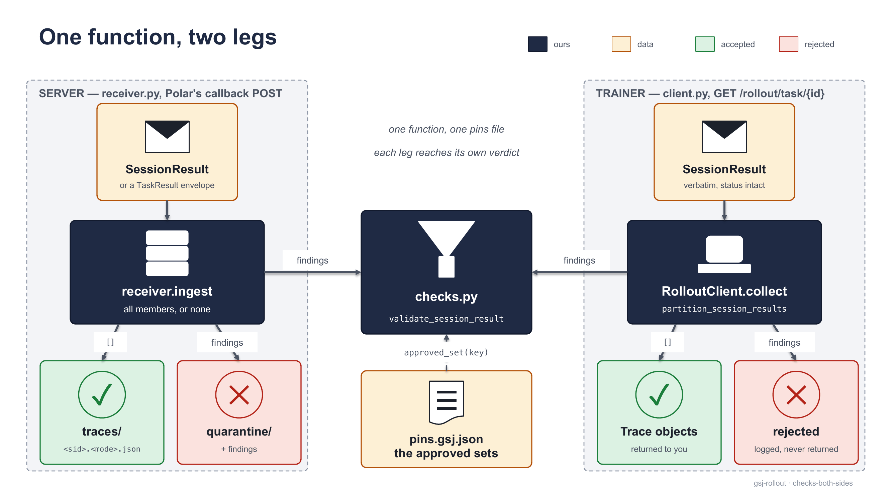
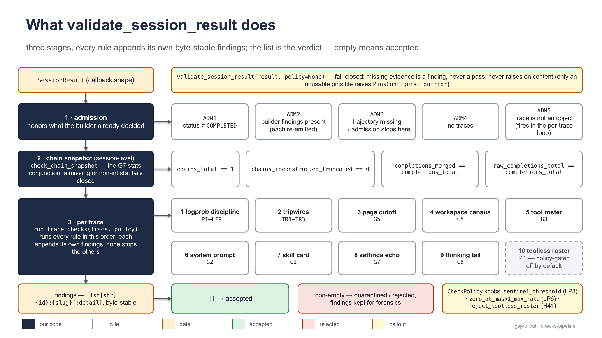
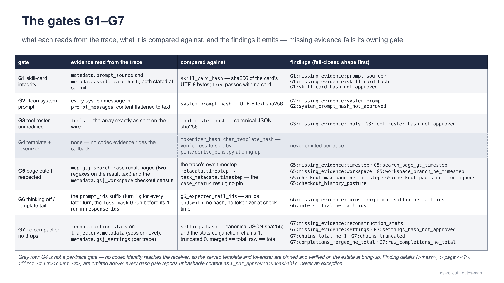
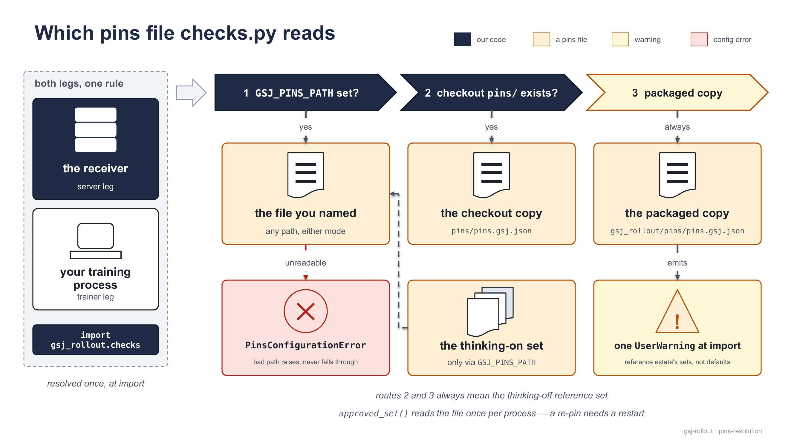
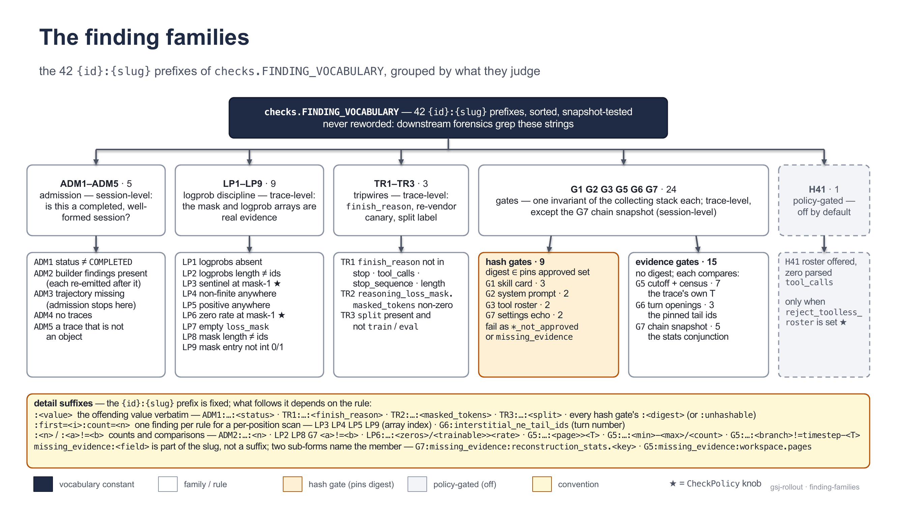

[← Documentation index](README.md)

# Validation and pins

Every trace passes `gsj_rollout.checks` twice — the receiver quarantines failures at the source, the trainer re-verifies what arrived with the same code — and every hash gate tests membership in an *approved set* read from a pins file, never a constant in code. The rule reasoning lives in [docs/checks-spec.md](https://github.com/MHGanainy/gsj-harness-rollout-server/blob/main/docs/checks-spec.md).

## One function, two legs



<sub>One funnel, fed from both sides. Both legs read the same pins file, and neither trusts the other's verdict.</sub>

```python
from gsj_rollout import checks
findings: list[str] = checks.validate_session_result(session_result)   # [] == accepted
```

| leg | caller | accepted | rejected |
|---|---|---|---|
| server | `receiver.ingest(body)` | written verbatim to `<traces_dir>/<session_id>.<pins_mode>.json` | `<quarantine_dir>/<session_id>.<pins_mode>.json` as `{"findings": [...], "session_result": …}` |
| trainer | `partition_session_results(results)` (inside `RolloutClient.collect`) | returned as `Trace` objects | logged at `WARNING` as `rejected <session_id>: [...]`, never returned |

The posture is fail-closed, everywhere:

- **Missing evidence is a finding, never a pass** — no `tools` array is `G3:missing_evidence:tools`, not "roster unknown".
- **Content never raises** — any JSON-shaped input yields a findings list; unhashable content (`NaN`, lone surrogates) becomes `*_not_approved:unhashable`.
- **Configuration does raise** — a pins file unreadable, corrupt, or mis-shaped, or a key missing, empty, or not a list, raises `PinsConfigurationError` at the first `checks.approved_set(key)` call. A pins fault must never look like an accepted trace.

Rejection is a verdict, not a delivery failure: the receiver answers Polar `200 {"accepted": n, "rejected": m}` either way; a body that is not a `SessionResult` (no `trajectory` key, an unsafe `session_id`) is `400`; a pins fault is `500` with `{"error": "pins configuration: …"}`. An envelope is atomic — every member is validated and serialized before anything touches disk. The trainer re-checks because its poll returns Polar's in-memory results, not the receiver's files — nothing upstream (a stale server pins file, a hand-edited archive) can launder a bad trace into training.

## The pipeline



<sub>Three stages append to one list, and the list is the verdict. Nothing short-circuits except a missing trajectory.</sub>

A finding is a byte-stable string `{id}:{slug}[:detail]` — e.g. `G5:search_page_gt_timestep:18>12`. The 42 `{id}:{slug}` prefixes are `checks.FINDING_VOCABULARY`, snapshot-tested: never reworded, because downstream forensics grep them. Detail shapes: `:<value>` (the offender verbatim), `:<n>` (a count), `:<a>!=<b>` (observed first), and `:first=<i>:count=<n>` — per-position scans (`LP3` `LP4` `LP5` `LP9`, `G6` interstitials) emit one finding per rule, so a broken array cannot flood the list. `validate_session_result` runs:

1. **Admission** (`ADM1`–`ADM5`, session) — honors the validating builder's verdict recorded on `trajectory.metadata.gsj_validation.findings` (re-emitted verbatim after `ADM2`); it re-derives nothing. Only `ADM3:trajectory_missing` stops the pipeline.
2. **Chain snapshot** (`G7` stats, session) — `trajectory.metadata.reconstruction_stats` must satisfy `chains_total == 1` ∧ `chains_reconstructed_truncated == 0` ∧ `completions_merged == completions_total` ∧ `raw_completions_total == completions_total`; every stat an int first. This is "no compaction, no dropped completions" as the merge saw it.
3. **Per-trace rules**, in order: logprob discipline, tripwires, page cutoff, workspace census, tool roster, system prompt, skill card, settings echo, thinking tail, toolless roster (`H41`, off by default). No rule stops the others — a rejected trace's list is the complete picture.

## The gates



<sub>Read from the trace, compare with the pin. G5 compares the trace with its own timestep and needs no pin; G4 is verified on the estate at bring-up because no codec evidence rides the callback.</sub>

| gate | evidence read from the trace | compared with | findings |
|---|---|---|---|
| **G1** skill card | `metadata.prompt_source` (`free` or `skill:<name>`) + `metadata.skill_card_hash`, stated at submit | pins `skill_card_hash` — UTF-8 sha256 of the card bytes | `G1:missing_evidence:prompt_source` · `G1:missing_evidence:skill_card_hash` · `G1:skill_card_hash_not_approved:<hash>` |
| **G2** system prompt | every `role: system` message in `prompt_messages`, flattened to text | pins `system_prompt_hash` — UTF-8 sha256; path-sensitive: changing `harness.workdir` changes every hash | `G2:missing_evidence:system_prompt` · `G2:system_prompt_hash_not_approved:<digest>` (one per message) |
| **G3** tool roster | the `tools` array exactly as sent on the wire | pins `tool_roster_hash` — canonical-JSON sha256 | `G3:missing_evidence:tools` · `G3:tool_roster_hash_not_approved:<digest>` |
| **G4** tokenizer + template | none — no codec evidence rides the callback | pins `tokenizer_hash` (git-blob OID of `tokenizer.json`) + `chat_template_hash` (sha256 of the served template file) — verified **estate-side** by `pins/derive_pins.py` at bring-up | none — `checks.py` never emits `G4:*` |
| **G5** page cutoff | every `mcp_gsj_search_case` result (the two contract regexes `"page": N` and `md/page_NNNN.md`) + the `gsj_workspace` checkout census | the trace's own timestep `T` — no pin | the seven `G5:*` strings in the table below |
| **G6** thinking tail | each assistant-turn opening: `prompt_ids` suffix for turn 1, the mask-0 interstitial before each later turn | pins `g6_expected_tail_ids` — an ids `endswith`, tokenizer-free, no hash | `G6:missing_evidence:turns` · `G6:prompt_suffix_ne_tail_ids` · `G6:interstitial_ne_tail_ids:first=<turn>:count=<n>` |
| **G7** no compaction | `metadata.gsj_settings`, the settings echo stamped by the capture layer (never caller-supplied `task_metadata`) + the chain snapshot above | pins `settings_hash` — one approved value, the hash of `{"compaction":{"enabled":false}}` | `G7:missing_evidence:settings` · `G7:settings_hash_not_approved:<digest>` + the five snapshot strings |

Notes that survive compression:

- Approval is **set membership**: a wrong pins file rejects (`*_not_approved:<digest>`, naming the digest), never admits. G1 is set membership, not name-to-card binding — any pinned card passes under any skill name.
- G5's `T` resolves `metadata.timestep` → `metadata.task_metadata.timestep` → the `"timestep"` member of an `mcp_gsj_case_status` result. The census demands branch `timestep-<T>`, pages contiguous 1..`T`, a shallow clone with zero remotes; decisions results and built-in file reads are cutoff-exempt. It detects honest misconfiguration, not a lying harness.
- Canonical JSON, byte-for-byte: `json.dumps(obj, sort_keys=True, ensure_ascii=False, separators=(",", ":"), allow_nan=False)`.
- G1's statement, G5's census, and G7's echo/stats are self-reported by our own submit path or harness: the gates raise the cost of a lie from "say nothing" to "say something consistent", no more. Also out of scope, by design: no logprob replay, no per-trace codec or sampling evidence, no cutoff channel other than retrieval + census.

## `CheckPolicy` and the YAML `checks:` section

```python
@dataclass(frozen=True)
class CheckPolicy:
    sentinel_threshold: float = -9000.0      # LP3: mask-1 logprob <= this fails
    zero_at_mask1_max_rate: float = 0.25     # LP6: allowed share of exact 0.0 at mask-1
    reject_toolless_roster: bool = False     # H41: arm "roster offered, zero tool calls"
```

```yaml
checks:                                # mirrors CheckPolicy field for field (a test enforces it)
  sentinel_threshold: -9000.0
  zero_at_mask1_max_rate: 0.25
  reject_toolless_roster: false
```

Both call sites validate with no policy argument and resolve `checks.DEFAULT_POLICY` at call time; `load_config` rebinds it as its last statement — `checks.DEFAULT_POLICY = checks.CheckPolicy(**cfg.checks.model_dump())`. An explicit `policy=` always wins; the last `load_config` in a process wins; a consumer that never loads a config gets the defaults above. Stricter ad hoc: `validate_session_result(result, policy=CheckPolicy(zero_at_mask1_max_rate=0.0))`.

> [!WARNING]
> `RolloutClient.collect` validates with `DEFAULT_POLICY` — a trainer that never calls `load_config` uses the defaults, not the estate's `checks:` section. Load the same YAML on both sides, or pass the policy explicitly.

## Pins: the `gsj-pins/1` file

Shipped as `pins/pins.gsj.json` in a checkout, `gsj_rollout/pins/pins.gsj.json` in the installed package (the checkout is the single source; the wheel copies it at build time). Shape, trimmed:

```json
{
  "format": "gsj-pins/1",
  "derived_at": "…", "host": "…",
  "pins": {
    "tokenizer_hash":       ["949e1ec83f61520a25c75426edc4a43acc36f29a"],
    "chat_template_hash":   ["1d944ff8f268b611abb296cdd24d0f51981eef1c8647ac321c3a0258f61eb6c9"],
    "settings_hash":        ["dae8948524be8253e04c4174632477e0333adc0323e791a6e54ace3b31004d20"],
    "tool_roster_hash":     ["a7a7956b4842b79f8b20448d43bc8225eebe6360c3d1d3979d41c6f9b9948e56"],
    "system_prompt_hash":   ["f56e8a6e9ea9dd1c19be89c6754a4e8d3d1c0f89e04bb21f60237aa2e8837df4"],
    "skill_card_hash":      ["d41ec6ea…", "15ae463e…"],
    "g6_expected_tail":     ["<|im_start|>assistant\n<think>\n\n</think>\n\n"],
    "g6_expected_tail_ids": [[151644, 77091, 198, 151667, 271, 151668, 271]]
  },
  "provenance":  { "<key>": { "algo": "…", "artifacts": ["…"], "notes": "…", "mac_specific": false } },
  "walk_status": { "derive": "…", "re_pin": "…", "first_episode_validate": "…" }
}
```

`pins` is the only part the validators read (`checks.approved_set(key)`; the keys `checks.py` consumes — `tool_roster_hash`, `system_prompt_hash`, `skill_card_hash`, `settings_hash`, `g6_expected_tail_ids` — must each be a non-empty list). Values are generated data, never literals in code; a dead entry is dropped because it only widens the gate. An optional top-level `mode` (`"thinking-on"`; absent means thinking-off) is stamped by the receiver into every file name it writes. `provenance` has teeth: `pins/derive_pins.py` re-reads the artifacts it names and fails if a hash no longer reproduces.

**The skeleton is not pins (since 0.1.12, CP-97, ADR-0042).** `estate.py up` writes `<run>/pins.skeleton.json` beside `rollout.yaml`: the same slots under `"format": "gsj-pins-skeleton/1"` — `tool_roster_hash` and `settings_hash` carried from the pins in force, `g6_expected_tail_ids` measured from the endpoint's own render (with the end-of-turn id, under a `measured` block that keeps every `/tokenize` request and response), `skill_card_hash` and `system_prompt_hash` **empty** because only an inspected quarantined episode supplies them, G4's two empty, `not_measured` and `coverage` stated per set. Point `GSJ_PINS_PATH` at it and the first `approved_set()` of an empty key raises `PinsConfigurationError: pins key 'system_prompt_hash' missing, empty, or not a list in …/pins.skeleton.json` — the receiver's 500, the trainer's raise, never a silent partial validation — and `up`/`update` refuse such an override before anything runs. **"First use" is the first hash gate a trace reaches, whatever the body's status.** The admission findings (ADM1–ADM4 — status, trajectory, builder findings, traces) are computed before any pins are read, so a body with no trace to check (`{}`, no `trajectory`, or an empty `traces`) validated against the skeleton comes back as findings, not a refusal — while any body that carries a trace raises, `ERROR` or `COMPLETED` (measured on the installed 0.1.15 at CP-105; CP-104 wrote "a `COMPLETED` body"); round seven's b1 tested `{}` first, read that as two broken promises for a minute, re-ran with a real accepted body and got the `PinsConfigurationError` above (CP-104). Test the refusal with a body that carries a trace. The script in [bring-your-own.md#your-pins](bring-your-own.md#your-pins) reads it and writes the `gsj-pins/1` file the gates consume.

### Resolution order



<sub>One rule on both legs, resolved once at import: the file you named (either mode), else the checkout copy, else the packaged copy with a warning. A bad override raises instead of falling through; the thinking-on set is only ever reached by naming it.</sub>

1. **`GSJ_PINS_PATH`** set → that file, unconditionally. A path that does not exist or parse is not a fallback — the first `approved_set()` call raises `PinsConfigurationError` naming the path.
2. Else **`pins/pins.gsj.json` beside the package** (checkout layout) → that file.
3. Else the **packaged copy**, plus one `UserWarning` at import:

```text
gsj_rollout.checks: …/gsj_rollout/pins/pins.gsj.json holds the REFERENCE ESTATE's approved sets,
not defaults — set GSJ_PINS_PATH to your own or every hash gate fails *_not_approved.
```

> [!WARNING]
> Resolved once at import (inspect `checks.PINS_PATH`), cached for the life of the process. Set `GSJ_PINS_PATH` in the environment of **every process that imports `gsj_rollout`**, before the first import; a re-pin needs a restart on both legs.

```bash
export GSJ_PINS_PATH=/etc/gsj/pins.gsj.json    # on BOTH legs
gsj-rollout serve --config rollout.yaml
```

### The thinking-on set

G6's tail is per-mode pins data, not a per-mode rule:

| mode | `g6_expected_tail` | `g6_expected_tail_ids` | file |
|---|---|---|---|
| thinking off (default) | `<\|im_start\|>assistant\n<think>\n\n</think>\n\n` — 41 bytes, the empty think block | `[151644, 77091, 198, 151667, 271, 151668, 271]` | `pins/pins.gsj.json` |
| thinking on | `<\|im_start\|>assistant\n` — 22 bytes, the bare generation prompt | `[151644, 77091, 198]` | `pins/thinking-on/pins.gsj.json` |

The on-ids are the off-ids' first three but **not** an `endswith` suffix of them, so each file rejects the other mode in both directions; the six non-G6 keys are byte-equal across the two files (the walk enforces it). The mode is chosen by `harness.thinking` (`off | minimal | low | medium | high | xhigh | max`, default `"off"`, `medium` the conventional ON; any other string — including YAML's bare `on` — is rejected at config load, because pi silently clamps unknown `--thinking` values to off).

> [!WARNING]
> A non-off level needs the thinking-on file on **both** legs — nothing selects it for you. With the wrong file G6 fails every episode (`G6:prompt_suffix_ne_tail_ids` plus `G6:interstitial_ne_tail_ids:…`) and the trainer collects nothing.
>
> ```bash
> # pip-only estate: the wheel carries the thinking-on set as data
> export GSJ_PINS_PATH="$(python -c 'import gsj_rollout, pathlib; print(pathlib.Path(gsj_rollout.__file__).parent / "pins/thinking-on/pins.gsj.json")')"
> ```

The receiver names files by the mode: `<session_id>.thinking-on.json` vs `<session_id>.thinking-off.json`, so a mixed archive stays attributable.

### Re-pinning

Any change to the tool roster (`harness.tools_allowlist`), `harness.workdir`, the pi version or MCP SDK, the skill cards, the harness settings, the model snapshot or served template, or the thinking mode changes a hash and needs a re-pin. `python pins/derive_pins.py` recomputes every approved value from the evidence its `provenance` names and exits 1 on any divergence (a missing tokenizer or snapshot prints `skip …` — never counted as a pass); `--record` writes the engine-provenance block into both pins files, only after a walk that reproduced everything. Overrides: `GSJ_CODEC_SNAPSHOT`, `GSJ_SERVED_SNAPSHOT` (default: the Qwen3-0.6B snapshot in `~/.cache/huggingface/hub`), `GSJ_SERVED_TEMPLATE` (default `estate/serving/qwen3_training.jinja`), `GSJ_SERVED_ENDPOINT` (asked for `/v1/models`). `pins/derive_g2.py --constant-path /workspace` derives the case-invariant system-prompt capture (`--work-root` for estates whose checkout path embeds the case id). For a foreign estate, write your own `gsj-pins/1` file and point `GSJ_PINS_PATH` at it: run one episode against the reference pins, read each computed digest from the quarantined body's `*_not_approved` findings after inspecting what actually ran, hash skill cards from raw bytes (`read_bytes().decode("utf-8")`, never `read_text()`), and tokenize your template's tail with the served tokenizer, `add_special_tokens=False`. The walk, executable end to end — scaffold, `up`, one episode against the reference pins, the inspection, the derivation, `GSJ_PINS_PATH` on both legs, the restart, one accepted episode — is [bring-your-own.md#your-pins](bring-your-own.md#your-pins): proven by a stranger on 2026-09-06 (the library's own scaffold as the foreign corpus, `qwen3.6-27b` as the foreign model) and re-walked at CP-92; the model half — the served name, the end-of-turn id and the tail from the endpoint alone — is [bring-your-own.md#your-model](bring-your-own.md#your-model).

> [!TIP]
> Before trusting any derived value, check the convention anchor: canonical-JSON sha256 of `pins/tools.captured.json` must reproduce `a7a7956b4842b79f8b20448d43bc8225eebe6360c3d1d3979d41c6f9b9948e56` — if not, your canonicalization has drifted and every canonical-JSON hash is wrong the same way. From the wheel (no `pins/tools.captured.json` ships) the same anchor is reached from the trace: the canonical-JSON sha256 of your quarantined trace's `tools` array must equal the packaged `tool_roster_hash`, that same `a7a7956b…` — one check that proves the canonicalization and the roster together (a stranger's derivation did exactly this, 2026-09-06). (`tokenizer_hash` is a git-blob OID: `sha1(b"blob <len>\0" + bytes)`.)

## The complete finding vocabulary



<sub>Five families, 42 prefixes. The gates split into hash gates (a digest against a pins set) and evidence gates (a comparison, no digest); `CheckPolicy` conditions three rules.</sub>

All 42 entries of `checks.FINDING_VOCABULARY`, with the two constructed sub-forms noted inline. Match findings by prefix, not equality — most carry a detail.

| finding | trigger | fix |
|---|---|---|
| `ADM1:status_not_completed:<status>` | `status != "COMPLETED"` | `ERROR` + `ADM2` = builder rejected it; otherwise check rollout/gateway logs |
| `ADM2:builder_findings_present:<n>` | builder findings recorded; each re-emitted verbatim after it | a collecting-stack property — fix harness/builder config, re-collect |
| `ADM3:trajectory_missing` | `trajectory` not an object — admission stops | no trajectory at all; inspect what the poll returned |
| `ADM4:no_traces` | `trajectory.traces` absent, not a list, or empty | usually rides with `ADM1:…:ERROR` — read the builder findings |
| `ADM5:malformed_trace` | a `traces` entry is not an object (once per entry) | serializer fault or edited archive — find the writer |
| `LP1:response_logprobs_absent` | array absent on a trainable trace | engine/capture fault: logprobs missing for sampled tokens |
| `LP2:response_logprobs_length_ne_response_ids:<a>!=<b>` | array length ≠ `len(response_ids)` | inconsistent writer — find it |
| `LP3:sentinel_logprob_at_mask1:first=<i>:count=<n>` | mask-1 logprob ≤ `sentinel_threshold` | vLLM's `-9999.0` = never measured; fix the engine, don't lower the knob |
| `LP4:nonfinite_logprob:first=<i>:count=<n>` | NaN, ±inf, or non-number anywhere | numerics/serialization fault — reject |
| `LP5:positive_logprob:first=<i>:count=<n>` | a value > 0 anywhere | probability above 1 — engine bug, reject |
| `LP6:zero_logprob_rate_at_mask1:<z>/<n>><rate>` | exact-`0.0` share at mask-1 above the allowance | near 100 % = placeholder array; modest = knob too tight for bf16 platforms |
| `LP7:empty_loss_mask` | empty mask, non-empty `response_ids` | builder emitted no mask; `G6:missing_evidence:turns` rides along |
| `LP8:loss_mask_length_ne_response_ids:<a>!=<b>` | mask length ≠ `len(response_ids)` | as `LP2` |
| `LP9:loss_mask_value_not_binary:first=<i>:count=<n>` | a mask entry not int `0`/`1` (bools pass) | a stringifying serializer — it blinds `LP1`/`LP3`/`LP6`, fix it first |
| `TR1:finish_reason_not_allowed:<value>` | not in `{stop, tool_calls, stop_sequence, length}` | tail abort — harness/gateway logs; `length` admitted on purpose, the CLI reports `length-terminated: K/N` |
| `TR2:reasoning_loss_mask_masked_tokens:<value>` | `metadata.reasoning_loss_mask.masked_tokens` anything but `null`/`0`/`false`/`"0"`/`""` | re-vendor canary: review the vendored builder before trusting the build |
| `TR3:split_not_train_or_eval:<value>` | `metadata.split` present, not `train`/`eval` (absent is legal) | fix the submit — `render_task_request(split=…)` takes `train`/`eval`/`None` |
| `G1:missing_evidence:prompt_source` | not `free` and not `skill:<name>` with a non-blank name | submit through `render_task_request`, which always states the source |
| `G1:missing_evidence:skill_card_hash` | `skill:<name>` without a string hash | let `render_task_request(skill_card_text=…)` compute it from raw UTF-8 bytes |
| `G1:skill_card_hash_not_approved:<hash>` | stated hash not in the approved set | card drifted or is new — fix it, or re-pin if intended |
| `G2:missing_evidence:system_prompt` | no `system` message in `prompt_messages` | agent ran promptless, or the capture lost it |
| `G2:system_prompt_hash_not_approved:<digest>` | a system message's sha256 not approved | path-sensitive: `harness.workdir`, agent version, any edit — re-pin if intended |
| `G3:missing_evidence:tools` | `tools` absent, not a list, or empty | no roster offered (deliberately not `H41`) — check the allowlist and capture |
| `G3:tool_roster_hash_not_approved:<digest>` | canonical-JSON sha256 of `tools` not approved | tool, schema, or MCP-SDK serialization change — re-pin if intended |
| `G5:missing_evidence:timestep` | no int `T` from any of the three sources | submit through `render_task_request`; no `T` fails closed |
| `G5:search_page_gt_timestep:<page>><T>` | a `search_case` result names a page above `T` (one per page) | real cutoff breach — investigate the retrieval service and the sandbox's token |
| `G5:missing_evidence:workspace` | the `gsj_workspace` echo absent or empty | unpinned harness or pre-echo trace — fails closed |
| `G5:checkout_history_posture:shallow=<v>,remotes=<v>` | not shallow, or remotes ≠ 0 | clone lost `--depth 1` or kept a remote — fix the clone step |
| `G5:missing_evidence:workspace.pages` (sub-form) | `pages.min/max/count` not all ints | the probe could not count pages — inspect the case repository |
| `G5:checkout_pages_not_contiguous:<min>-<max>/<count>` | pages do not run 1..max | mis-built case repository — fix the corpus ingest |
| `G5:workspace_branch_ne_timestep:<branch>!=timestep-<T>` | checked-out branch ≠ `timestep-<T>` | wrong branch cloned, or metadata/harness timestep mismatch |
| `G5:checkout_max_page_ne_timestep:<max>!=<T>` | the checkout's highest page ≠ `T` | that branch's page count is wrong — corpus ingest problem |
| `G6:missing_evidence:turns` | no mask-1 run in `loss_mask` | nothing trainable; rides with `LP7`/`LP9` when the mask is the problem |
| `G6:prompt_suffix_ne_tail_ids` | turn 1's opening doesn't end with a pinned tail | check the mode/pins match first; else the served template drifted — re-pin |
| `G6:interstitial_ne_tail_ids:first=<turn>:count=<n>` | later openings fail (`turn` 1-based, ≥ 2) | same causes, seen at the history re-render or stitched glue |
| `G7:missing_evidence:reconstruction_stats` (`.<key>` sub-form) | stats block absent, or a member missing/not int | body not from the prefix-merging builder — find the source |
| `G7:chains_total_ne_1:<n>` | more than one chain | compaction or edited history — repair at the builder, never on the trace |
| `G7:chains_truncated:<n>` | truncated chains ≠ 0 | a merge break dropped tail completions — reject, inspect the session |
| `G7:completions_merged_ne_total:<m>!=<t>` | completions filtered before merging | the filter or agent shape changed |
| `G7:raw_completions_ne_total:<r>!=<t>` | capture saw more calls than the builder counted | investigate the gateway capture |
| `G7:missing_evidence:settings` | the `gsj_settings` echo absent or empty | unpinned harness or pre-echo trace |
| `G7:settings_hash_not_approved:<digest>` | the document is not `{"compaction":{"enabled":false}}` | fix the rendered settings; re-pin only if a new document is intended |
| `H41:roster_offered_zero_tool_calls` | policy armed + non-empty `tools` + zero parsed `tool_calls` anywhere | one = an episode; across a collection = the engine's tool-call parsing path |

Not in the vocabulary: `G4:*` (estate-side, above), and the builder's own strings re-emitted after `ADM2` — byte-stable too, but owned by `builder.py` (e.g. `S1:empty_prompt_ids`, `S3:duplicate_consecutive_prompt`, `S6:empty_response_ids`, `S7:mid_chain_finish_length`, `S8:choices_len_ne_1`, `S9:policy_version_mixed`, `A12:non_agent_shape`, `A15:end_of_turn_token_id_not_configured`, `R11:roster_changed_across_completions`). New entries are pure additions; never rename an existing one — archives and greps depend on the spelling.

## See also

- [Bring your own](bring-your-own.md) — the walk: a foreign model's values from its endpoint (`#your-model`), a foreign corpus's pins from its first quarantine (`#your-pins`).
- [How it works](how-it-works.md) — the episode dataflow that produces these traces.
- [Troubleshooting](troubleshooting.md) — symptom → cause → fix, findings by family.
- [docs/checks-spec.md](https://github.com/MHGanainy/gsj-harness-rollout-server/blob/main/docs/checks-spec.md) — the reasoning behind every rule.
