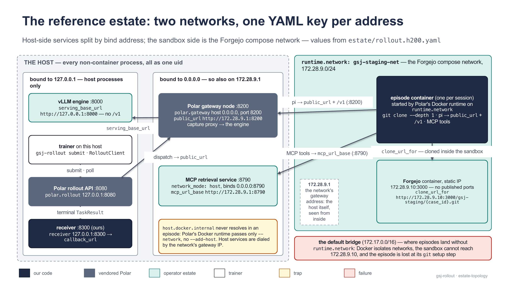
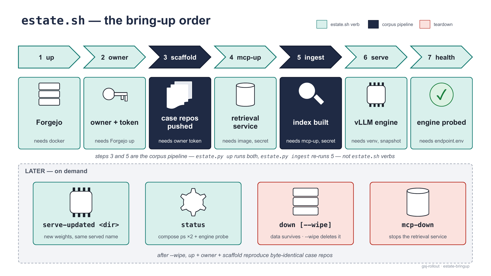

# estate/ — the reference estate
Everything here stands the **test** estate up on the host the library was measured on (a shared Linux GPU box, "the H200") — the inference engine, the git host holding one repository per case, the retrieval service, the corpus loaded into both, and the container runtime that isolates each episode: everything the rollout server needs but does not host and reads only through one YAML, `rollout.h200.yaml`; production brings its own counterpart to every piece.
`estate.sh` is the front door (`./estate.sh --help`) and only routes: every verb runs an existing script or compose file in place, and the scripts **start** services — they do not install them. Restore-from-cold (Docker, the host's firewall conventions, the vLLM venv, the model snapshot) is the predecessor's [`gsj-envloader/staging/BRINGUP.md`](https://github.com/MHGanainy/gsj-envloader/blob/v0.8.0/staging/BRINGUP.md) (archived at `v0.8.0`, accurate as written: §1 Forgejo, §3 venv + snapshot, §4 self-forwards); bring-up from a corpus — creating the git host and the retrieval service, or adopting ones that exist — is [`bringup.py`](#bringuppy--corpus-to-estate-in-one-command) (CP-59); [`gsj-rollout-demo`](https://github.com/MHGanainy/gsj-rollout-demo)'s `bootstrap.py` is its bring-your-own-corpus sibling. YAML keys and validators are [the server guide](../docs/guide/server-guide.md)'s; this file is the recipe.
## The components
| Component | Recipe here | Delta vs the predecessor's `BRINGUP.md` |
| --- | --- | --- |
| Forgejo | `forgejo/up.sh`: `docker compose up -d`, health wait ≤90 s, admin `gsj-admin`, API token → `forgejo/.token`; image `codeberg.org/forgejo/forgejo:16.0.3` (CP-62 — index `sha256:7c4e1db440be…`, both platforms measured pullable 2026-08-30; it replaces 16.0.2, whose platform manifests codeberg's registry dropped, wishlist 52 — the H200's live instance still runs its local 16.0.2 until the 16.0.3 image is `skopeo copy`'d there and the instance is `down`/`up`'d; the mirror `code.forgejo.org/forgejo/forgejo` serves both tags at the same digests), static IP `172.28.9.10:3000` on the compose network `gsj-staging-net`, no published ports, HTTP only (SSH disabled) | none — BRINGUP §1 verbatim, same instance and data directory; the image tag moved once (16.0.2 → 16.0.3, CP-62) |
| Corpus | `python3 estate/corpus/ingest_corpus.py scaffold --corpus estate/corpus/staging`, from the host checkout (`~/gsj-harness-rollout-server`) after `estate.sh owner gsj-staging` (the owner `corpus.yaml` names) and `export GSJ_FORGEJO_TOKEN_GSJ_STAGING="$(cat estate/forgejo/.token-gsj-staging)"` plus `export GSJ_FORGEJO_READ_TOKEN_GSJ_STAGING="$(cat estate/forgejo/.token-gsj-staging-read)"` (CP-59: the post-push read-back presents it, so the scaffold runs on the closed estate as is); the same command with `ingest` after `mcp-up` reindexes and waits for ready | the split-shaped v2 source tree (train/eval is the directory layout); commit identity and dates fixed in `corpus.yaml`, so the SHAs converge byte-identically |
| Retrieval service | `mcp-service/compose.yml`: image `gsj-mcp-service:0.4.0` (CP-58: the ChromaDB backend + CP-57's configurable encoder and store identity, `config.yaml` baked with the read credential — `source.auth_token_env: GSJ_FORGEJO_READ_TOKEN_GSJ_STAGING`, so `mcp-up` needs that variable exported beside the secret), `network_mode: host` on `0.0.0.0:8790`, `user: 1000:1000`, `./data` as the volume; shipped per `mcp-service/README.md` — build on the workstation, `docker save \| ssh h200-admin docker load` | 0.4.0 replaces 0.3.0: `/health` gains the `embedding` block and a pre-CP-57 store is backfilled with its identity on first start (the H200's was, at CP-58); 0.3.0 replaced 0.2.0: `/health` gained the `backend` block; a cold start rebuilds any previous-format index (`INDEX_FORMAT` is 2 and part of the corpus fingerprint) |
| vLLM | `serving/serve.sh`: Qwen/Qwen3-0.6B at the pinned revision, driven from the workstation over SSH | five deltas (script header): the symmetric template `qwen3_training.jinja`, an explicit `--generation-config` pin, GPU default 3 (not 7), no LoRA flags (`--enable-lora`, `VLLM_ALLOW_RUNTIME_LORA_UPDATING` dropped), venv + snapshot must pre-exist (BRINGUP §3) |
| Self-forwards | BRINGUP §4, as the consumer needs them | the predecessor's collector needed the bridge-IP forward; this repo's Polar gateway reads the engine host-locally and needs none |
| *Run-time state* | `forgejo/forgejo-data/` (the live instance), `forgejo/.token*` (mode 0600: the admin token, the owner's push token `.token-gsj-staging` and read token `.token-gsj-staging-read`), `mcp-service/data/` (clone cache + index), `serving/run/` (`endpoint.env`, tunnel pid per engine) | written at run time, never committed; survives `git pull` |



<sub>Which process listens where. The episode container lives on the compose network next to Forgejo and reaches host services through the network's gateway address; the engine is reached only from the host — where Polar's two processes, the receiver and submission all run as uid 1000.</sub>
## `estate.sh` — the front door
| Verb | Runs / needs |
| --- | --- |
| `bringup [args…]` | `bringup.py` — corpus → running estate + taskbank + `rollout.yaml`, creating or adopting each service; the section below. Needs the checkout's python (`PYTHON=<abs path>` or an activated `.venv`) |
| `up` | `forgejo/up.sh` — idempotent, every step checks before it creates; needs `docker` |
| `owner <name>` | `forgejo/create_owner.sh` — the owner user if absent, a push token → `forgejo/.token-<name>` and a read-scoped clone token → `forgejo/.token-<name>-read` (CP-56); prints the two export lines, `GSJ_FORGEJO_TOKEN_<NAME>` (the pipeline's pushes) and `GSJ_FORGEJO_READ_TOKEN_<NAME>` (every read under sign-in: the sandbox clone via `clone_credential_env`, the MCP index build via `auth_token_env`, verify's clone-back — owner uppercased, `-` becomes `_`); needs Forgejo up |
| `down [--wipe]` | `forgejo/down.sh` — `docker compose down --remove-orphans`; `--wipe` also deletes `forgejo-data/` and `.token` (owner tokens stay); after a wipe, `up` + `owner` + `scaffold` reproduce byte-identical case repos — `corpus/staging/corpus.lock.json` is the freeze record; the scaffold runs on the closed estate with both owner tokens exported (CP-59 — no reader is anonymous) |
| `mcp-up` / `mcp-down` | `docker compose -f mcp-service/compose.yml up -d` / `down`; `mcp-up` needs the `gsj-mcp-service` image loaded and both `GSJ_MCP_TOKEN_SECRET` and `GSJ_FORGEJO_READ_TOKEN_GSJ_STAGING` exported (CP-58: the index build clones under sign-in) — the verb refuses before compose does, and neither value lands in a file |
| `serve <0.6b\|llama31>` | `serving/serve.sh` / `serving/serve-llama31.sh`; needs the host's venv + snapshot (BRINGUP §3) |
| `serve-updated <dir>` | `serving/serve-updated.sh` — the weight-sync half; needs a trainer's HF-format export directory on the serving host |
| `health` | `serving/healthcheck.sh` — `/health`, `/v1/models` lists the pin, one full tool round trip; needs `serving/run/<dir>/endpoint.env` |
| `status` | `docker compose ps` for Forgejo and the retrieval service, then the engine probe |



<sub>The bring-up order and what each step needs. There is no corpus verb — the pipeline tool sits between `owner` and `mcp-up`. The script `cd`s to `estate/` first (invoke it from anywhere); an unknown verb, a missing argument or a missing tool exits 1 with a one-line reason.</sub>
## The networking facts — `rollout.h200.yaml` holds values, never code
- **Our harness clones inside the sandbox** (`git clone --depth 1`), so the episode container itself must reach Forgejo's static IP — and a container on Docker's default bridge cannot reach `172.28.9.10`. The cure is one value, `runtime.network: gsj-staging-net`; forgetting it costs an episode.
- **`host.docker.internal` never resolves in an episode** — Polar's Docker runtime passes only `--network`, never `--add-host`. Host-bound services (the retrieval service on `0.0.0.0:8790`, the gateway on `0.0.0.0:8200`) are addressed by the compose network's own gateway IP `172.28.9.1`, the host as seen from that network; `172.17.0.1` also answers but names the default bridge.
- **`serving_base_url` carries no `/v1` suffix** — Polar's proxy appends `/v1/chat/completions` itself, so a suffixed value requests `/v1/v1/…` and gets a 404. vLLM listens on `127.0.0.1:8000` and only the gateway dials it, from the host, so no bridge forward is needed; port `8100` stays free for BRINGUP §4's self-forward convention.

| Key | Value here | Reachable from / note |
| --- | --- | --- |
| `estate.clone_url_for` | `http://172.28.9.10:3000/gsj-staging/{case_id}.git` | inside the episode container |
| `estate.mcp_url_base` | `http://172.28.9.1:8790` | inside the episode container |
| `estate.serving_base_url` | `http://127.0.0.1:8000` | the gateway, on the host |
| `polar.gateway.public_url` | `http://172.28.9.1:8200` | the host **and** the container — one URL, both dialers |
| `polar.rollout` | `127.0.0.1:8080` | a same-host trainer |
| `receiver` | `127.0.0.1:8300` | the rollout API, on the host |
| `runtime.network` | `gsj-staging-net` | every episode joins the compose network |
| `builder.end_of_turn_token_id` | `151645` | `<\|im_end\|>` under the served tokenizer — a measurement, not an address |
| `checks.zero_at_mask1_max_rate` | `0.25` | this CUDA bf16 engine emits exact-`0.0` logprobs at ~14 % of `mask == 1` positions (34/237 measured); the default allowance covers it |
## Serving
All three serve scripts run on the workstation and drive the serving host over an SSH alias (every remote step is `bash -s`), keep the pidfile + tunnel discipline, and write `serving/run/<dir>/endpoint.env` (`GSJ_VLLM_URL`, the remote log path). Defaults: `GSJ_VLLM_SSH_HOST=h200-admin`, `GSJ_VLLM_PORT=8000` (the engine, on `127.0.0.1`), `GSJ_VLLM_LOCAL_PORT=8100` (the tunnel), `GSJ_VLLM_GPU=3` (`CUDA_VISIBLE_DEVICES`), `GSJ_VLLM_GPU_FRAC=0.30` (`--gpu-memory-utilization`), `GSJ_VLLM_REMOTE_DIR=gsj-vllm`, `GSJ_VLLM_MODEL_ENV=model-0.6b.env` (sets `GSJ_MODEL_ID` + `GSJ_MODEL_REVISION`; `healthcheck.sh` sources it too — with the Llama engine up, run `GSJ_VLLM_MODEL_ENV=serving/model-llama31-8b.env ./estate.sh health`).
- `serve.sh` (`serve 0.6b`) — `Qwen/Qwen3-0.6B` @ `c1899de2…`. Idempotent: if `/v1/models` through the tunnel already lists the pin, it rewrites `endpoint.env` and exits 0; otherwise it copies `model-0.6b.env` + the jinja to `~/gsj-vllm/`, requires the venv, resolves the pinned snapshot (`huggingface_hub`), byte-copies its `generation_config.json` into `~/gsj-vllm/genconfig/` (printing its sha256), starts `vllm serve` under `nohup` unless `run/vllm.pid` is alive (log `run/vllm.log`, local state `serving/run/gsj-vllm/`), opens the tunnel unless `run/tunnel.pid` is alive, and waits ≤900 s on `/health`. Flags: `--chat-template ~/gsj-vllm/qwen3_training.jinja`, `--tool-call-parser hermes`, `--reasoning-parser qwen3`, `--default-chat-template-kwargs '{"enable_thinking": false}'`; the generation config is pinned in the argv on purpose — pi sends no sampling parameters, and an unpinned engine samples them at `T=1.0` silently.
- `serve-updated.sh <dir>` — `serve.sh` with exactly two deltas: the model is a **local HF-format directory** on the serving host (the trainer's export; no `--revision`; refuses a directory without `config.json`), and `--served-model-name Qwen/Qwen3-0.6B` keeps the wire identity constant across the sync; the four legs — template, generation-config pin, parsers, context length — stay byte-identical, so a post-sync trace compares to a pre-sync one. Stop-then-start, not reload (SIGTERM, ≤60 s, then SIGKILL — vLLM at this pin has no in-place swap for a non-LoRA model; the stop is the drain point between collection phases), then waits ≤600 s on `/health`.
- `serve-llama31.sh` (`serve llama31`) — `unsloth/Meta-Llama-3.1-8B-Instruct` @ `a2856192…` (the origin repo is gated; the mirror carries Meta's weights and full chat template), pinned in `model-llama31-8b.env`; genconfig `~/gsj-vllm/genconfig-llama31`, byte-copied from the snapshot (temperature 0.6, top-p 0.9, eos `[128001, 128008, 128009]`). No template flag — the snapshot's own **embedded** template, its sha256 and the tokenizer's blob hash recorded from the snapshot actually served (mirrors ship different templates); `--tool-call-parser llama3_json` (under `hermes` every call stays unparsed text); neither Qwen-only flag — `enable_thinking` is a measured wire no-op on a Llama template. State `run/vllm-llama31.{pid,log}`, `serving/run/gsj-vllm-llama31/`; refuses to start while the Qwen pidfile is alive (one engine, one port); otherwise `serve.sh`'s shape plus `--max-model-len 32768`, `--enforce-eager`, DEBUG request logging.
- `qwen3_training.jinja` — HuggingFace TRL's `trl/chat_templates/qwen3_training.jinja` **byte-verbatim**: sha256 `1d944ff8f268b611abb296cdd24d0f51981eef1c8647ac321c3a0258f61eb6c9`, upstream commit `63b7c3f547d3e06d0eae72712e36b7b64e9d5a45` (2026-07-16); served via `--chat-template` (the file, not a per-request override) and pinned as `chat_template_hash` in `pins/pins.gsj.json`. Its history branch always emits the think block, so consecutive pi prompts are strict token-prefix extensions and Polar's prefix grouping merges them natively — `generation_prompt_glue_ids` deliberately unset; the `` markers are accepted by the served vLLM 0.26.0 renderer.
## Closing anonymous read (CP-56, closed on the H200 at CP-58)
An estate serving anonymous git read lets a sandbox agent that guesses `http://172.28.9.10:3000/gsj-staging/<case>.git` re-clone a repo it was never given — or its own repo at a later `timestep-` branch — and read past its cutoff over the network. The in-sandbox git-history channel is already closed (CP-11: `--depth 1`, no remote, no reflog); this is the *network* channel, and it matters for any estate someone intends to **train** from.

The cure is **mechanism (a): credentialed clone URLs + Forgejo sign-in**, and since CP-58 it is the estate's shipped state: `estate/forgejo/docker-compose.yml` sets `REQUIRE_SIGNIN_VIEW: "true"`, and every consumer presents the one read-scoped token `estate.sh owner gsj-staging` mints (`read:repository,read:user` → `estate/forgejo/.token-gsj-staging-read`, exported as `GSJ_FORGEJO_READ_TOKEN_GSJ_STAGING`): the sandbox clone through `rollout.h200.yaml`'s `clone_credential_env` (spliced at render; never in the YAML or a trace — `pi_harness` strips userinfo from the echo), the MCP index build through `config.yaml`'s `source.auth_token_env` (the compose passes the variable through), and the pipeline's verify clone-back (`ingest_corpus.py` reads the same variable; unset, it clones anonymously and names the variable in the failing finding). There is no anonymous-first phase any more for an estate whose case repos exist — the bring-up is one shot:

```bash
./estate.sh up                                   # forgejo, sign-in ON from the first start
./estate.sh owner gsj-staging                    # mints BOTH tokens; prints the exports
export GSJ_FORGEJO_TOKEN_GSJ_STAGING=$(cat estate/forgejo/.token-gsj-staging)
export GSJ_FORGEJO_READ_TOKEN_GSJ_STAGING=$(cat estate/forgejo/.token-gsj-staging-read)
export GSJ_MCP_TOKEN_SECRET=…
./estate.sh mcp-up                               # the index build clones with the read token
python3 estate/corpus/ingest_corpus.py verify --corpus estate/corpus/staging   # clones back with it too
```

**What it does not defend, still:** the model endpoint and the retrieval service stay reachable from the sandbox — the agent needs both; this is a repository defense, not an egress lockdown. **[CP-59] No reader is anonymous any more:** the scaffold's post-push `ls_remote_heads` convergence check presents the same read token (`resolve_read_auth`), a refusal lands as a `PipelineError` naming the variable ("the push itself succeeded"), and `scaffold` prints which credential it reads back with — test-pinned, and measured on a closed estate `bringup.py` created with sign-in ON from its first start (4/4 cases converged; no flip, no anonymous phase). A fresh or `--wipe`d estate scaffolds closed. **Where the read token does land in a file:** the MCP's bare clone cache — `mcp-service/data/clones/<case>.git/config` keeps the `remote.origin.url` a cold `git clone --bare` was given, credential included (a warm cache fetched by explicit URL, as the H200's was at CP-58, holds none); uid-1000-only host state, never a trace, recorded as wishlist row 47. Probes (CP-56 on the demo, CP-58 on the H200, container-faithful — `GIT_TERMINAL_PROMPT=0`, no credential helper): an ungiven repo and a later branch of one's own repo both refuse anonymously; a forged later-timestep MCP token was already refused (CP-07); one episode collects with the token absent from its trace.

## `bringup.py` — corpus to estate, in one command
`estate/bringup.py up` (or `./estate.sh bringup up`) takes a corpus in the contract's shape and leaves behind a running estate, the task table, and the one YAML the rollout server reads, under `estate/runs/<name>/` (untracked — `estate/runs/.gitignore`). It is the production sibling of the demo repo's `bootstrap.py`: the same phase order (validate → git host → owner + tokens → scaffold → retrieval service → ingest → taskbank → verify → engine probe → config), but every service is either **created** (a per-run compose file, container names `gsj-<name>-forgejo` / `gsj-<name>-mcp`, loopback-published ports picked free from 3000/8790 upward, the run's own docker network) or **adopted** by URL — a Forgejo with its admin's username + *password* (basic auth: Forgejo 16 refuses to mint another user's tokens under token auth, measured), a retrieval service with its URL + token secret. It stops at the estate: Polar's two processes and the receiver are the operator's to start, and the final block prints the exact commands.

| Prompt (each has a flag; `-y` takes every default; `--answers <yaml>` scripts it) | Default |
| --- | --- |
| corpus root | `estate/corpus/staging` — validated before anything runs |
| run name | `corpus.yaml`'s `name` |
| Forgejo owner | `corpus.yaml`'s `owner` (`gsj-staging` \| `gsj-prod`) — a re-run defaults to its record |
| Forgejo: `create` / `adopt` (+ `--forgejo-url`, `--forgejo-admin-user`, `--forgejo-admin-password-file` or `$GSJ_FORGEJO_ADMIN_PASSWORD`) | create — closed (`REQUIRE_SIGNIN_VIEW`) from the first start; `--anonymous-read` for an evaluation estate |
| Forgejo image (create): `--forgejo-image <ref>` | `codeberg.org/forgejo/forgejo:16.0.3` — a tag, with the index digest it resolved to when measured (`sha256:7c4e1db440be…`, 2026-08-30, both platforms) recorded in the script and checked after a pull (a re-cut tag draws a warning; a `docker load`ed image carries no digest and is not warned about — which is why the pin is not a digest: the H200 loads its images out-of-band). Any pullable reference routes around a registry event (CP-62, wishlist 52 — 16.0.2 lost both platform manifests on codeberg while its index was still served): another tag, the mirror `code.forgejo.org/forgejo/forgejo:<tag>` (measured digest-equal), or `name@sha256:…` to pin bytes. The pull is the script's own step, so a dead tag is a refusal naming the flag, not a compose trace; a re-run keeps its record's image, a changed answer prints a `changed:` line and recreates the container (Forgejo migrates forward, refuses a downgrade) |
| owner: `auto` / `create` / `existing` | auto — an existing owner's repos named like the case ids are compared branch-by-branch with what this corpus builds: equal → adopted; different → refused (`--overwrite-repos` pushes over, explicitly) |
| MCP: `create` / `adopt` (+ `--mcp-url`, `--mcp-secret-file` or `$GSJ_MCP_TOKEN_SECRET`) | create — image `gsj-mcp-service:0.4.0` from the checkout (the local build the H200 loads; a native `-arm64` build beside it is preferred on an arm64 daemon, said after the answer is read), `ghcr.io/mhganainy/gsj-mcp-service:0.4.0` from the wheel (the published two-platform index, CP-61); `--mcp-image` names another. Since CP-62 a registry reference that is absent is pulled once (a local build tag is not — nothing to pull from); on an arm64 daemon the amd64 build segfaults under qemu at the embed step (CP-59 finding), so the checkout's default there must be the native build or the published index |
| Polar's leg: `--polar-leg host|container` | `host` — Polar's two processes and the receiver run here: the config binds loopback and the three ports are scanned free on this host. `container` (CP-62, wishlist 51 (a)/(h)): decided before anything is pulled, and it **needs `--gateway-host`** (the address the rollout-API container and every sandbox dial the gateway on — a compose DNS name; the host-address probe measures this host, which is not where that gateway runs, so it is skipped); the rollout API and the receiver bind `0.0.0.0`, the ports are the conventional 8080/8200/8300 unscanned (explicit ones taken as given), a loopback engine URL draws a warning (inside the gateway's container it is the container itself), and the closing block names what only the consumer can re-address — `polar.rollout.public_url`, `receiver.public_url`, `receiver.traces_dir`, `harness.artifacts_dir`, and `estate.serving_base_url` as the gateway container dials it (the demo's `containerize_rollout_yaml` is the worked example); `status` says the ports are in your containers rather than probing loopback |
| `--runs-dir <dir>` (every verb) | the checkout's `estate/runs/`, the wheel's `./runs/` under the cwd (CP-62, wishlist 51 (e)); `status`/`down` take it too, so a run stood up elsewhere is found |
| embedding model + revision | the shipped MiniLM pin; another HF id needs its snapshot in the host's HF cache (mounted read-only into the container) and a chunk window that fits it (`--chunk-max-tokens/--chunk-overlap`) |
| engine URL + served model | `http://127.0.0.1:8000`, `Qwen/Qwen3-0.6B` — probed (`/v1/models`, `/tokenize`), never created; a failed probe is recorded, not refused |

**The re-run posture is the retrieval service's (CP-57), applied to the whole estate:** the same corpus and name reuse what stands — tokens verified against the API, repos converged (a re-push is a no-op by determinism), the index by fingerprint, the bank byte-identical — and report `reused:` / `backfilled:` lines; only `--rebuild` re-embeds (one start under `index.rebuild: always`, then back to `if-stale`). A model change against the run's store, or against an adopted service, is **refused** naming the stored and requested identities. A run whose `.env` is missing is refused — a re-mint would silently invalidate the running service's secret.

**Credentials for an adopted service** come from the environment (`GSJ_FORGEJO_ADMIN_PASSWORD`, `GSJ_MCP_TOKEN_SECRET`), a file (`--forgejo-admin-password-file`, `--mcp-secret-file`; a group/world-readable file draws a warning), or a `getpass` prompt — never a flag value, and an `--answers` file carries only the `*_file` paths; an adopted admin password is kept in the run's `.env` like every other secret. Adopted URLs must be bare `scheme://host[:port]` (a userinfo credential is refused: the URL is recorded). A re-run that asks for a different owner, URL, network or create/adopt mode is refused unless `--retarget` says so, and then prints `changed:` lines.

**The run directory:** `rollout.yaml` (validated — `topology.rendered.yaml` beside it), `taskbank.parquet` + `corpus.lock.json` (copied from the corpus after `verify` passes), `run.json` (created vs adopted, every URL as the host and as a sandbox reaches it, the owner, the embedding identity and fingerprint, the engine probe, timestamps, the script's commit — it **names variables, never values**, proven before it lands), `.env` (every secret as `KEY=value`, mode `0600`; `set -a; . estate/runs/<name>/.env; set +a` before `gsj-rollout` and `serve_gateway`, or `--env-file` for compose), and the created services' `compose.yaml` / `mcp-config.yaml`. The directory is `0700`: the MCP's cold `clone --bare` writes the read token into its clone cache's `config` (wishlist 47, measured here on 4/4 cases).

**Two measurements, not assumptions:** `polar.gateway.public_url`'s host is *probed* — a listener on the gateway port, a container on the run's network dialing every host IPv4 (the compose network's gateway IP first on Linux) — because on a Docker Desktop Mac the LAN interface was host-only, `host.docker.internal` container-only, and a VPN interface the one address both could dial, then not, within the hour; when nothing is dialable the warning names the cure (`127.0.0.1 host.docker.internal` in `/etc/hosts`, or `--gateway-host`). And `corpus.yaml`'s `forgejo.base_url` / `mcp.url_base` are the lock's canonical URLs, not this estate's — the pipeline runs with transport overrides, and the emitted config carries the sandbox-side addresses.

**On the H200** the shipped estate is adopted, not created: `./estate.sh bringup up --forgejo adopt --forgejo-url http://172.28.9.10:3000 --forgejo-sandbox-url http://172.28.9.10:3000 --mcp adopt --mcp-url http://127.0.0.1:8790 --mcp-sandbox-url http://172.28.9.1:8790 --network gsj-staging-net --engine-url http://127.0.0.1:8000` with `GSJ_FORGEJO_ADMIN_PASSWORD` and `GSJ_MCP_TOKEN_SECRET` exported (published ports do not work on that host, so nothing is created there). `status --name <run>` says what stands; `down --name <run> [--wipe]` stops only what the run created.

## The trainer side — what the estate did not already provide
| Need | How |
| --- | --- |
| slime v0.3.0 + Megatron + torch + Ray | the official `slimerl/slime:v0.3.0` image (24.4 GB pulled, ~55 GB on disk) — a second, entirely separate runtime; nothing in the estate's venvs is reused |
| The image, on this box | **`docker pull` fails**: dockerd's registry egress runs as root and the uid-scoped firewall (`lockdown.sh`) drops it. Fetch as uid 1000 with a static `skopeo` (`skopeo copy docker://… docker-archive:…`, needs a `~/.config/containers/policy.json`), then `docker load -i` |
| GPUs | serving on GPU 3, training on GPU 5 — disjoint, discovered free at run time |
| slime checkout + Megatron | slime: `git clone --branch v0.3.0` plus Polar's `scripts/patch/patch_slime_router_tokens.sh`, mounted into the container; Megatron: the **image's own** `/root/Megatron-LM` (`1dcf0dafa`, the Dockerfile's `MEGATRON_COMMIT`) — Polar's stated slime-v0.3.0-compatible pin `26.04-alpha.rc1` dies at import (`ModuleNotFoundError: No module named 'megatron.training.tokenizer'`). The recipe that ran: [`gsj-harness-rollout-server-examples`](https://github.com/MHGanainy/gsj-harness-rollout-server-examples)' `slime_bridge/cp17_loop/train_one_step.sh`; the loop — collect, train one step, export, `serve-updated`, collect again — is in [the trainer guide](../docs/guide/trainer-guide.md) |
## If your checkout predates `estate/`
This tree used to live at the repository root (`forgejo/`, `mcp-service/`, `corpus/`, `staging/`); `git pull` moves the **tracked** files only, so the ignored instance data stays at the old paths, and a compose up from the new location would mount an empty `./data` and start a **blank Forgejo** — it reads as data loss and is only a wrong mount. From the checkout root, before the first bring-up (move any other untracked keepsakes — venvs, caches — the same way; the compose project names are pinned as `gsj-envloader-staging` and `gsj-mcp-service`, so running containers are not renamed out from under you):
```bash
sudo mv forgejo/forgejo-data estate/forgejo/forgejo-data   # sudo: the container leaves the top dir root-owned, and a cross-parent rename rewrites its ".."
mv forgejo/.token* estate/forgejo/
mv mcp-service/data estate/mcp-service/data; mv staging/serving/run estate/serving/run
rmdir forgejo mcp-service staging/serving staging 2>/dev/null || true  # tidy the husks
```
**Done on the H200 at CP-58 (2026-08-30)** — with one more finding: the box's `~/gsj-harness-rollout-server` was never a git checkout but an rsync-era copy (0.1.0, no `estate/`), so the migration there was a fresh clone at the same absolute path (both uv venvs — `.venv`, `vendor/polar/.venv` — are path-bound and came across unchanged; `POLAR_SHA` unmoved), the four moves out of the renamed old copy, and the verification that every source was gone and every destination present at the same size. The old copy, emptied of state, stays as `~/gsj-harness-rollout-server.pre-cp58` until someone deletes it.
## Provenance
- CP-04′: this directory, the `serve.sh` deltas, the symmetric template (glue unset), the networking measurements (attempt 1 died at the default bridge, attempt 2 404'd on `/v1/v1/…`), the zero-logprob measurement · CP-50: grouped under `estate/` (until then `staging/README.md`, components at the repo root).
- CP-03: one `public_url` for both dialers · CP-09: the unpinned-engine `T=1.0` lesson · CP-09′: single-GPU collection · CP-10: the 0.25 allowance · CP-11: the hardened `--depth 1` clone · CP-14: the v2 corpus tree · CP-15: `gsj-mcp-service:0.3.0` · law 3: `BRINGUP.md` stays the predecessor's.
- CP-59: `bringup.py` + the `bringup` verb; the scaffold read-back credential (no anonymous reader left); the run directory under `estate/runs/`.
- CP-17 (`a647359`): `serve-updated.sh` + the trainer side — the same commit wrote the Megatron erratum it contradicted, which stood until CP-39 · CP-37: the embedded Llama template measured prefix-extending offline · CP-38: `serve-llama31.sh` + `model-llama31-8b.env` · CP-39: this recipe listed (audit S9 — the reproducibility claim was two files short).
## See also
[Server guide](../docs/guide/server-guide.md) · [Trainer guide](../docs/guide/trainer-guide.md) · [Troubleshooting](../docs/guide/troubleshooting.md)
