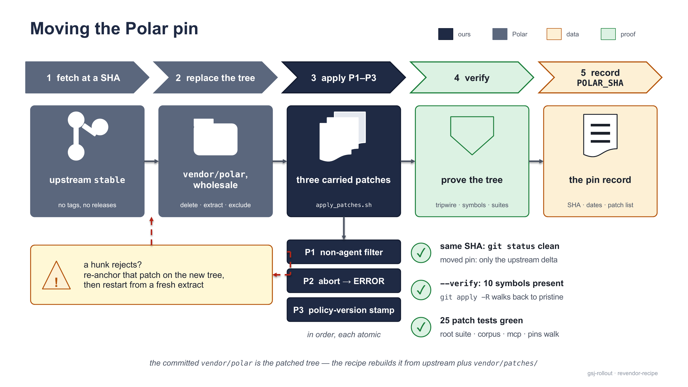

# REVENDOR — moving the Polar pin

`vendor/polar` is upstream [`NVIDIA-NeMo/ProRL-Agent-Server`](https://github.com/NVIDIA-NeMo/ProRL-Agent-Server) at the `stable`-branch commit recorded in `/POLAR_SHA`, with three carried patches applied on top — this page is the recipe for moving that pin.

Upstream has **no tags and no releases**, so the dependency is a pinned SHA, vendored as a tree with no history (4,387 of upstream's 4,406 commits are inherited OpenHands). **The committed tree is the *patched* tree**; `vendor/patches/` + `vendor/apply_patches.sh` rebuild it from a fresh upstream extract. The recipe has run twice — first vendor 2026-08-09, and a same-SHA rehearsal 2026-08-12 that reproduced the committed tree byte-for-byte. `/POLAR_SHA` at the repository root is the whole pin record: the SHA (`f0e8343a7870abf6ec2366890f685881ceab92cb` today), repo + branch, the pinned commit's subject/date/author, each execution's date and outcome, the exclusion list (exactly one entry, an 8.3 MB training-data JSONL), the three patch files in apply order, the verify command, and the pointer back to this recipe.

> [!NOTE]
> The mechanical loop — fetch → extract → patch → verify → venv rebuild → vendored suite — is **~2 minutes** on a warm `uv` cache (a cold cache adds download minutes); full verification (all four suites + the pins walk + the registry seam) **~15 minutes**. The half-day figure is *contingency* for re-anchoring patches when upstream moves under them.

## The three carried patches

| Patch | What it does |
| --- | --- |
| `P1-non-agent-filter.patch` | Adds `record_filters.py` (shape-only non-agent-completion, truncated-marker, and empty-choices filters), wires `filter_trainable_completions()` into both trajectory builders; all-filtered sessions become trajectory `ERROR`; the `prefix_merging` stats gain `raw_completions_total`. |
| `P2-abort-to-error.patch` | Any completion with `finish_reason == "abort"` anywhere in a session makes the trajectory `status="ERROR"` (`"aborted generation (weight-update cutoff)"`) in `PrefixMergingBuilder.build()` — without it a mid-chain abort merges cleanly and trains. |
| `P3-policy-version-storage.patch` | `SessionStore` stamps a live `policy_version` onto each turn's record metadata (`set_policy_version` / `get_policy_version` / `session_would_span`) and fixes metadata persistence (writer payload built from `dict(record.metadata)`); inert until a trainer declares versions. |

## The recipe



<sub>Moving the pin: upstream at a recorded SHA, a wholesale tree replacement, the three patches in order, proof before record. A rejected hunk means re-anchoring that one patch and restarting from a fresh extract.</sub>

**1 — Pick the new SHA.** Pin the `stable` HEAD; record the SHA, the date, and the reason for moving *before* touching the tree. A same-SHA re-vendor is a valid run — it proves the pin reproduces. Survey with `gh api` (the upstream web pages are robots-blocked): `stable`'s HEAD, the `polar` dev branch, tags, and whether any carried patch's subject landed upstream.

**2 — Fetch and verify the tree** (no history — the tree at the SHA is all that is vendored):

```bash
git init /tmp/polar-new && cd /tmp/polar-new
git remote add origin https://github.com/NVIDIA-NeMo/ProRL-Agent-Server
git fetch --depth 1 origin <NEW_SHA>
git checkout FETCH_HEAD
git rev-parse HEAD          # MUST print <NEW_SHA> exactly
```

**3 — Replace `vendor/polar` wholesale** — keep nothing (stale files are how vendored trees rot), re-apply the exclusion list:

```bash
rm -rf vendor/polar && mkdir -p vendor/polar
git -C /tmp/polar-new archive <NEW_SHA> | tar -x -C vendor/polar
rm vendor/polar/examples/swegym_slime_grpo/swegym_train_293.jsonl
```

**4 — Apply the patches, in order**: `bash vendor/apply_patches.sh`. `git apply` is atomic per patch — a single rejected hunk fails that whole patch loudly with a non-zero exit, never a half-applied tree. On a reject: hand-re-adapt the failing patch against the new tree (each patch header documents its origin commits, semantic anchors, and every adaptation already made — read it first), regenerate the patch file keeping the header current, and re-run from a freshly extracted tree.

> [!IMPORTANT]
> **The byte-fidelity tripwire — run immediately after the patches:** `git status --porcelain -- vendor/` (same-SHA re-vendor: MUST be empty) and `git diff HEAD --stat -- vendor/` (moved pin: exactly the upstream delta, nothing else). A single line of same-SHA output means the recipe did not reproduce the committed tree (mode flip, stale exclusion, patch drift) — stop and find out why. The stronger per-patch check: `git apply -R` P3 → P2 → P1 walks the tree back to the pristine pin.

**5 — Verify the patched tree** — three checks: the symbol verify, the vendored suite, the registry seam:

```bash
bash vendor/apply_patches.sh --verify     # 10 symbol checks, all OK
cd vendor/polar
uv venv --python 3.12 .venv && uv pip install -p .venv/bin/python -e . pytest pytest-asyncio
uv pip install -p .venv/bin/python -e ../..    # gsj_rollout — NOT optional (assumption A-14)
.venv/bin/pytest -q
.venv/bin/python -c "from gsj_rollout.builder import ValidatingPrefixMergingBuilder as V; from polar.trajectory.builder.prefix_merging import PrefixMergingBuilder as P; assert issubclass(V, P)"   # the registry seam
```

The `-e ../..` install hosts `gsj_rollout` in the polar venv: Polar's `import_path` loads our harness and builder into Polar's process — without it the venv builds fine but the seam check fails (`ModuleNotFoundError: gsj_rollout`) and the server would not start. The 25 carried-patch tests (`test_record_filters.py`, `test_builder_filter_wiring.py`, `test_prefix_merging_abort.py`, `test_storage_policy_version.py`) must be green. Pre-existing upstream failures at `f0e8343a`: three (the sglang-router proxy 500, the dashboard templates route, the sglang meta_info `KeyError: 'token_id'`), a suite split of 175 passed / 3 failed — do not chase those as regressions, do record any new ones.

**6 — Record the pin.** Update `/POLAR_SHA` (SHA, dates, the patch list if it changed) and the gap register in [`docs/CHARTER.md`](https://github.com/MHGanainy/gsj-harness-rollout-server/blob/main/docs/CHARTER.md) §7 for the rows the re-vendor touched.

## What to re-run afterwards

```bash
pytest -q                                    # the root suite: 161
(cd estate/corpus && python -m pytest -q)    # the corpus suite: 58
(cd estate/mcp-service && .venv/bin/python -m pytest -q)   # the retrieval-service suite: 89 (venv per its README)
python pins/derive_pins.py                   # the pins walk: every approved value must reproduce
```

A moved pin in the pins walk means the re-vendor changed the wire — a finding, not a formality. When the tree actually changed, add the **smoke test** — drive `vendor/polar/examples/calculator` end-to-end and re-dump the `docs/polar/` run artifacts if their shapes changed (downstream code was built against them); skip it, and say so, if step 4's tripwire proved the tree byte-identical — and the **re-vendor canary**: per [`docs/checks-spec.md`](https://github.com/MHGanainy/gsj-harness-rollout-server/blob/main/docs/checks-spec.md), a trace whose metadata carries a `reasoning_loss_mask` key with `masked_tokens > 0` must still fail (the rule is deliberately not type-narrowed); the feature that would produce that key is fork-only today.

## Known divergences

- **The `polar` dev branch carries a pending `prefix_merging` refactor** (+49/−156, ~80 unlanded commits, a new `gateway/engine.py`). Priced against a scratch tree with it landed: all three patches' source hunks apply clean — the refactored `build()` keeps a single `status="COMPLETED"` site and the stats dict keeps its shape; the only rejects are P1's two fixture-marker hunks in `test_engine_trajectory_equivalence.py` / `test_per_request_builder.py` (mechanical re-anchoring). If a future landing rejects wholesale, re-anchor on (a) the single `status="COMPLETED"` return in `build()` — P2's check sits immediately before whatever finalizes a non-empty session — and (b) the reconstruction-stats dict for P1's `raw_completions_total`. Never pin the `polar` branch itself: at `98ec8fa2` it is frozen since 2026-06-06 and three commits *behind* `stable` (it lacks #37/#43/#45). Either way the vendored suite at the new pin is the real gate — a textual apply is not a behavioral proof.
- **The refactor grew a `policy_version` consumer**: `_top_level_scheduler_metadata` promotes `{group_id, policy_version, rollout_step}` to trajectory-level metadata — still no producer (`gateway/storage.py` untouched; P3 stays ours), but if it lands, P3's stamp becomes a key upstream's own scheduler reads. Check this first at the next survey.
- **File mode**: the fork carries `prefix_merging.py` as 100755; upstream is 100644. Keep 100644 — never let a patch flip it.
- **P3's storage anchors** (`_SessionState`, `save_message`'s lock block, the writer-enqueue payload) are stable, but the same string `dict(metadata or {})` appears TWICE in `save_message` — the fix targets only the writer-payload site (20-space indent), never the record-construction site (16-space indent).
- **Upstream is Anthropic-shape-drift-prone for P1**: re-validate the filter's SDK-only key list (`context_management` / `thinking` / `output_config` / `stream`) and the pi wire dialect (assumption A-12) whenever either side moves.

## Provenance

- The pin and the mechanism — ADR-0004 / ADR-0005; the no-history commit count — CP-02; the recipe's two executions — CP-03 (first vendor, wrote it) and CP-22 (same-SHA rehearsal, byte-for-byte, corrected the steps).
- The measured time budget — CP-22; the half-day contingency — ADR-0004's estimate, CP-03's actual in `docs/reports/CP-03.md`; recording a moved pin before touching the tree — originally "a new ADR", the same-SHA case goes in the CP report instead (CP-22).
- The byte-fidelity tripwire and the smoke skip-condition — CP-22; the reverse-apply walk — CP-03's standard, both run at CP-22; the `-e ../..` omission defect the seam check guards — found at CP-22 (A-14).
- The pre-existing upstream failures — `docs/reports/CP-03.md`, reconfirmed at CP-22 (same three, same 175/3 split); the smoke reference transcript — CP-03 Step-5 in the same report; the artifact consumers — CP-06/CP-08; the canary's target — D4, fork-only (the predecessor-fork defect table, CP-02); the refactor pricing and the `policy_version`-consumer note — CP-22.

**See also:** [validation-and-pins](../docs/guide/validation-and-pins.md) · [troubleshooting](../docs/guide/troubleshooting.md) · [how-it-works](../docs/guide/how-it-works.md)
